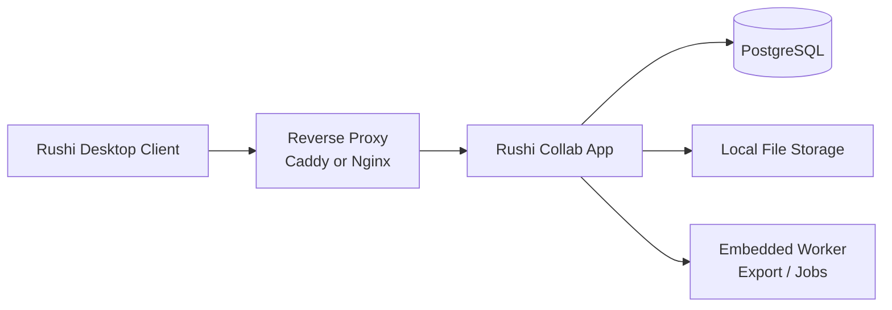

# 自购协作服务器：单节点部署草案

> **双画像**：本文件侧重 **`cloud_vps`（公有云/自购 VPS）**。局域网画像 **`lan`** 与共用约束见 [`collab-deployment-profiles.md`](./collab-deployment-profiles.md)；完整后续方案见 [`collab-dual-deploy-local-asr-plan.md`](../execution/specs/collab-dual-deploy-local-asr-plan.md)（**ASR 本机、不上云**）。

## 目标
为 Rushi 提供一种不依赖官方托管、由协作用户自行购买云服务器并部署的单节点协作方案。

该方案面向：
- 小团队
- 学校/研究组
- 编辑部
- 工作室
- 有基础运维能力的个人或组织

## 结论
最推荐的形态不是 P2P，也不是共享 SQLite，而是：

1. 一台单节点协作服务器
2. 一个 PostgreSQL
3. 一套本地文件存储
4. 一个反向代理（HTTPS）
5. 桌面端连接该服务器进行协作

理由：
- 审阅、批注、建议修改、Presence、历史记录都需要统一真源。
- Word 导出与项目包导出需要稳定的后台宿主。
- 单节点中心化比 P2P 和共享文件方案更容易保证一致性和可恢复性。

## 推荐部署拓扑

说明：
- `Rushi Collab App` 提供 HTTP API 与 WebSocket。
- `Embedded Worker` 在首期建议和应用进程同镜像、同节点部署，避免组件膨胀。
- 媒体与导出文件首期默认走文件系统目录，不强制要求 MinIO 或 S3。

## 与产品模式的映射

### 本地模式
- 不连接协作服务器。
- 本地 SQLite 仍为真源。
- 单人完成转录、编辑、导出。

### 协作模式
- 连接用户自购服务器上的协作服务。
- 服务端为协作真源。
- 可看到其他成员在线状态、当前编辑语段、最近编辑摘要、转录/审阅进度。

### 项目包模式
- 继续保留 zip 项目包作为交换与归档层。
- 可在本地模式和协作模式之间做迁移。

## 最小部署建议

### 服务器规格

首期建议：
- 3 到 10 人：2C4G，80GB SSD 起步
- 10 到 30 人：4C8G，160GB SSD 起步

如果导出 DOCX 和媒体上传较多：
- 优先增加 SSD 空间
- 再考虑将导出任务拆到独立 worker

### 操作系统
- Ubuntu 24.04 LTS
- Debian 12

优先理由：
- 文档与包管理简单
- Docker / Compose 生态稳定
- 后续自动更新与备份方案成熟

## 文件存储建议

首期建议使用文件系统后端：
- 音频
- 导出 DOCX
- 项目包 zip

理由：
- 自购服务器用户通常比起对象存储更容易理解本地磁盘目录
- 备份路径清晰
- 部署组件最少

后续可选扩展：
- S3-compatible 对象存储
- MinIO

## 网络访问建议

最推荐两种方式：

1. 公网 HTTPS 域名访问
2. Tailscale / ZeroTier 组网后内网访问

如果走公网：
- 必须启用 HTTPS
- 必须限制注册入口
- 必须配置备份

## 认证建议

首期最务实方案：
- 内置账号体系
- 邀请码或管理员创建账号

不建议第一版就强制接入复杂企业 SSO。若后续有需求，再增加：
- OIDC
- SAML

## 端口建议

- `80/443`：反向代理
- `5432`：PostgreSQL，仅内网或容器网络可见
- `8080`：Rushi 协作应用，仅容器网络或本机监听

## 数据与备份

至少备份三类数据：

1. PostgreSQL 数据库
2. 文件存储目录
3. 协作服务配置文件与 `.env`

建议策略：
- 数据库：每日逻辑备份 + 每周全量快照
- 文件目录：每日增量同步
- 升级前：强制做一次手动快照

## 安全基线

- 只暴露反向代理的 `443`
- PostgreSQL 不直接暴露公网
- 应用服务只监听内部网络
- 使用强随机 `JWT/SESSION SECRET`
- 关闭开放注册，默认邀请制
- 配置上传大小限制和磁盘告警

## 运行职责边界

这台协作服务器负责：
- 项目、语段、批注、建议修改、历史事件
- Presence 与实时协作
- Word 导出任务
- 项目包导出任务

这台协作服务器不建议首期负责：
- 重型 ASR 推理
- 大规模媒体转码集群
- 浏览器端大规模公开 SaaS 接入

ASR 更建议：
- 继续本地运行
- 或后续单独部署为另一个服务

## 部署资产

本仓提供一套部署草案目录：
- [deploy/self-hosted-collab/README.md](../../deploy/self-hosted-collab/README.md)
- [deploy/self-hosted-collab/docker-compose.example.yml](../../deploy/self-hosted-collab/docker-compose.example.yml)
- [deploy/self-hosted-collab/.env.example](../../deploy/self-hosted-collab/.env.example)
- [deploy/self-hosted-collab/caddy/Caddyfile.example](../../deploy/self-hosted-collab/caddy/Caddyfile.example)
- [deploy/self-hosted-collab/scripts/backup.sh](../../deploy/self-hosted-collab/scripts/backup.sh)

说明：
- 当前仍是部署草案，不代表仓库里已经有可运行的协作服务镜像。
- `RUSHI_COLLAB_IMAGE` 需要在未来协作服务实现后替换为真实镜像名，或改为本地构建。

## 推荐实施顺序

1. 先实现协作服务最小 API 与数据库迁移
2. 再固定镜像构建与版本号
3. 再把 compose 草案升级为正式部署包
4. 最后再补监控、升级和自动备份脚本