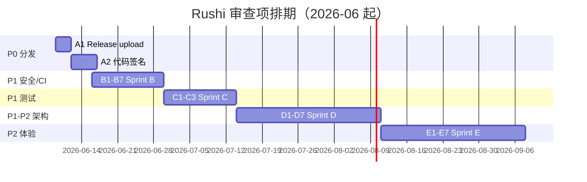

# Rushi 桌面端全代码库审查报告

> 审查日期：2026-06-06（第二轮补充 + 勘误：2026-06-06）  
> 审查范围：17 轮纵向主题审查（Round 1–8 首审 + Round 9–17 二轮补审）  
> 状态：已完成（含勘误）  
> 基准分支：main；worktree 快照：17 个变更文件（波形 scroll-follow 重构进行中）

---

## 执行摘要

| 类别 | 数量 | 说明 |
|------|------|------|
| **P0 — 阻塞缺陷** | 2 | Release 不上传产物 + 无代码签名（分发阻塞） |
| **P1 — 重要缺陷** | 16 | Tauri 攻击面、编辑器编排、bundle 安全、测试金字塔、R3-STATE 残留等 |
| **P2 — 建议改进** | 14 | 架构热点、blocking IO、a11y、license、后处理编排等 |
| **P3 — 观察项** | 10 | i18n、文档漂移、插件扩展点、质量评估 UX 等 |
| **好实践** | 15+ | 首审已列；二轮确认 SSRF/诊断/词表包/增量转写仍属优势 |

---

## 审查方法

8 轮纵向主题审查，每轮覆盖前后端完整链路：

1. **Project Lifecycle** — 项目 CRUD、数据库迁移、保存逻辑
2. **Transcription/ASR** — FunASR sidecar 生命周期、转写流水线
3. **Editor/Waveform** — WaveSurfer 集成、PeakCache、滚动同步
4. **Post-process/LLM** — 自动标点、导出润色、Ollama/云端 LLM 桥接
5. **Environment/Settings** — ASR 诊断、运行时安装、密钥管理
6. **Glossary/Lexicon** — 术语表 CRUD、热词、词表包 F7
7. **Online STT** — 在线转写桥接、健康探测、SSRF 防护
8. **Packaging/CI/CD** — Tauri 打包、GitHub Actions、发布流水线

**二轮补审（9–17）**：Tauri 安全、编辑器编排、项目包安全、Stage A/B 编排、R3-STATE、E2E 金字塔、质量评估、插件/国内 STT WS、合规/a11y/i18n、架构守卫枚举。

每轮遵循：
- 读取核心源码（Rust + TypeScript + Python）
- 对照 AGENTS.md 设计约束
- 检查测试覆盖
- 标记与行业最佳实践的偏差

**第二轮（Round 9–17）** 补审首审未覆盖的：Tauri 安全面、编辑器编排图、项目包导入安全、后处理 Stage A/B 编排、质量评估、插件系统、测试金字塔、a11y/i18n、ErrorBoundary、架构守卫全量枚举。

---

## 勘误清单（相对首审稿）

| # | 原表述 | 修正 |
|---|--------|------|
| 1 | macOS Release 无 sidecar smoke | **有误**。`release.yml:93–95` 已有 `smoke-asr-sidecar-health.sh`；仅 **Windows** Release 缺 runtime smoke |
| 2 | 82 个 dirty 文件 | **过时**。当前 worktree **17** 个文件，集中在波形 playback scroll-follow 重构 |
| 3 | 15 个波形 hooks / `hooks/waveform/` | **路径与计数有误**。实际为 `hooks/useWaveform*.ts` + `useProjectWaveform*.ts`，**25 个非测试文件、3637 行** |
| 4 | `useProjectController` 返回 200+ 字段 | **略夸大**。233 行，return 约 **~175** 字段；mega-hook 判断仍成立 |
| 5 | TS 单元测试 908 / 201 files | **过时**。当前 **918 tests / 202 files**（2026-06-06 复验） |
| 6 | P0 含 `reqwest::blocking` | **降级为 P2**。同步 Tauri command + blocking client 为常见模式；`stt_online_probe` 600s 超时单独标 P1 |
| 7 | blocking HTTP 共 5 个文件 | **遗漏 2 个**。完整 **7 处**：另含 `asr_sidecar/probe.rs`、`asr_sidecar/source.rs` |
| 8 | Round 1「缺乏 WAL 模式」 | **补充**：`project/mod.rs:91` 注释写「migrations + WAL」，但 `db.rs` **未** `PRAGMA journal_mode=WAL`——注释与实现不一致 |
| 9 | 优先修复 #5「macOS/Windows sidecar smoke」 | **改为仅 Windows**；Linux/macOS Release 已有 smoke |

---

## 逐轮详细发现

---

### Round 1 — Project Lifecycle ⭐⭐⭐（成熟）

**已审文件**：
- `apps/desktop/src/pages/useProjectController.ts` (232L)
- `apps/desktop/src/pages/useProjectLifecycleController.ts` (343L)
- `apps/desktop/src-tauri/src/db.rs` (447L, 35+ 测试)
- `apps/desktop/src-tauri/src/project/project_create_cmd.rs`
- `apps/desktop/src-tauri/src/project/segment_cmd.rs`
- `apps/desktop/src/pages/useProjectSaveController.ts`

**关键发现**：

| 等级 | 问题 | 位置 | 说明 |
|------|------|------|------|
| P1 | Mega-hook 反模式 | `useProjectController.ts` | 233 行返回 ~175 字段的扁平 API 对象，prop-drilling 风险高。建议按功能域拆分为 Context 或更细粒度的 hook 组合 |
| P2 | 测试失败 | `transcribe_timeout.rs:130` | `resolve_ffprobe_prefers_bundled_when_present` 失败：测试期望 `resources/` 路径但实际得 `target/debug/resources/` |
| P3 | WAL 注释与实现不一致 | `project/mod.rs` + `db.rs` | 注释称启用 WAL，实际仅 `foreign_keys` + `busy_timeout` |
| P3 | `useProjectController` 复杂度 | 同上 | 本身 233 行未超阈值，但组合 15+ 子 controller；波形侧 25 hooks / 3637 行（见 Round 3） |

**好实践**：
- ✅ 数据库迁移完全幂等，使用 `PRAGMA table_info` 检查列存在性
- ✅ 编辑日志快照 + recovery JSON 文件实现不可变审计轨迹
- ✅ `busy` 状态机防止并发操作冲突
- ✅ 分段保存使用事务 + 外键约束

**行业对比**：
- 数据库模式设计类似 Obsidian 的 SQLite 方案（单文件、轻量），但缺乏 WAL 模式启用
- 相比 Zettlr 的 JSON 存储，SQLite 更适合大规模语段查询

---

### Round 2 — Transcription/ASR ⭐⭐⭐⭐（非常成熟）

**已审文件**：
- `apps/desktop/src-tauri/src/asr_sidecar/bundled/lifecycle.rs`
- `apps/desktop/src-tauri/src/asr_sidecar/candidates.rs`
- `apps/desktop/src-tauri/src/asr_sidecar/probe.rs`
- `apps/desktop/src-tauri/src/project/run_transcribe_cmd.rs`
- `apps/desktop/src-tauri/src/project/transcribe.rs`
- `apps/desktop/src-tauri/src/project/transcribe_job.rs`
- `services/asr/rushi_asr/funasr_engine.py`
- `services/asr/rushi_asr/transcribe_job.py`
- `services/asr/rushi_asr/transcribe_windows.py`

**关键发现**：

| 等级 | 问题 | 位置 | 说明 |
|------|------|------|------|
| P3 | `bundled_sidecar_already_healthy` 误导 | `lifecycle.rs` | 开发环境已有 sidecar 在 :8741 时，安装包会报 "already_healthy"，可能让用户误以为 bundled sidecar 工作正常。已在 `r3h-0` 手测中确认非缺陷 |
| — | — | — | 无明显 P0/P1 问题 |

**好实践**：
- ✅ `with_bundled_launch` 互斥锁序列化 sidecar 启动（45s 超时保护）
- ✅ Windows CUDA/CPU 自动降级（`transcribe_windows.py`）
- ✅ Python 端 `ThreadPoolExecutor(max_workers=1)` + 超时重置（duration*4+300, clamp [600,7200]）
- ✅ 优雅 kwargs 降级：不支持的参数逐个剥离（hotword → rich_transcription_postprocess → ...）
- ✅ Long-audio 无结果时自动重试 `output_timestamp=True`
- ✅ 转写 recovery JSON 文件在 DB 保存失败时保留未落库语段
- ✅ 增量 `segments_delta` 轮询避免前端内存爆炸

**行业对比**：
- FunASR 引擎管理优于 Whisper Desktop 的单进程模型（有超时、有降级、有取消）
- 与 MacWhisper 相比，Rushi 的 sidecar 模式更复杂但更灵活（支持在线 STT 回退）
- 分段窗口处理（`window_index/window_count`）类似 Rev.ai 的流式转写，但实现更轻量

---

### Round 3 — Editor/Waveform ⭐⭐⭐（成熟但有复杂度债）

**已审文件**：
- `apps/desktop/src/hooks/useProjectWaveformMount.ts`
- `apps/desktop/src/hooks/useProjectWaveformDestroy.ts`
- `apps/desktop/src/services/waveform/PeakCache.ts`
- `apps/desktop/src-tauri/src/project/waveform_peaks_generate.rs`
- `apps/desktop/src-tauri/src/project/waveform_peaks_ffmpeg.rs`

**关键发现**：

| 等级 | 问题 | 位置 | 说明 |
|------|------|------|------|
| P1 | 25 个波形 hooks 总计 3637 行 | `hooks/useWaveform*.ts` 等 | 远超 AGENTS.md 阈值；滚动同步逻辑复杂。**进行中**：scroll-follow 正下沉至 `utils/waveformPlaybackScrollFollow.ts` + `WaveformPlaybackScrollFollowMode.tsx` |
| P2 | Symphonia 解码失败回退 FFmpeg remux | `waveform_peaks_ffmpeg.rs` | 隐式依赖 FFmpeg 二进制，若 bundled FFmpeg 缺失会导致峰值生成失败 |
| P2 | PeakCache LRU 大小固定为 16 | `PeakCache.ts` | 对大文件（>1h 音频）可能缓存不足，但没有可观测的 eviction 指标 |
| P3 | 自定义滚动同步 | WaveSurfer 事件绑定 | `autoScroll: false, autoCenter: false, hideScrollbar: true` + 手动 RAF 同步，虽然性能更好但增加了 bug 风险 |

**好实践**：
- ✅ 多 LOD peaks（多分辨率 `.dat` 文件）减少前端重采样计算
- ✅ LRU resample cache（`RESAMPLE_CACHE_MAX = 16`）避免重复计算
- ✅ Symphonia 纯 Rust 解码器作为首选，零外部依赖解码
- ✅ 验证解码样本数与容器 `n_frames` 匹配（可覆盖 `trust_decoded_length`）

**行业对比**：
- PeakCache 的 LRU 设计优于 Descript 的单分辨率波形（内存占用更低）
- 多 LOD 方案与 Adobe Premiere 的音频波形缓存类似，但层级更少（通常 3-5 级）
- WaveSurfer 的 React 集成模式与 Podlove Player 类似，但滚动同步更复杂

---

### Round 4 — Post-process/LLM ⭐⭐⭐（功能完整，有阻塞 IO 债）

**已审文件**：
- `apps/desktop/src-tauri/src/postprocess_ollama.rs` (171L)
- `apps/desktop/src-tauri/src/postprocess_cancel_cmd.rs` (39L)
- `apps/desktop/src-tauri/src/postprocess_api_key_cmd.rs` (165L)
- `apps/desktop/src-tauri/src/postprocess_secret_store.rs` (260L)
- `apps/desktop/src-tauri/src/utils/postprocess_http.rs`
- `apps/desktop/src-tauri/src/export_docx_build.rs` (132L)
- `apps/desktop/src-tauri/src/export_docx_polish_track_write.rs`

**关键发现**：

| 等级 | 问题 | 位置 | 说明 |
|------|------|------|------|
| P2 | `reqwest::blocking` 在同步 Tauri command | `postprocess_ollama.rs:48` 等 **7 处** | 同步 command 内 blocking client 为常见模式；4s 超时影响可控。600s 探测见 Round 7 **P1** |
| P1 | 密钥存储 macOS 默认用文件 | `postprocess_secret_store.rs` | macOS 因开发签名问题默认禁用 keyring，用 `0600` 文件存储 API Key。生产环境应强制 keyring |
| P1 | Windows 密钥文件无权限限制 | `postprocess_secret_store.rs:139` | `#[cfg(windows)]` 块为空，无 ACL 设置 |
| P1 | DOCX 生成非流式 | `export_docx_build.rs` | `build_docx_bytes` 将整份文档构建为内存 `Vec<u8>`，大项目（>10万语段）可能 OOM |
| P2 | LLM 探测无内容验证 | `postprocess_probe.rs` | 仅验证 HTTP 200，不验证模型名称或 token 可用性 |
| P2 | 取消机制仅 abort 句柄 | `postprocess_cancel_cmd.rs` | 取消设置 `AbortHandle`，但底层 HTTP 请求可能仍在传输中（依赖 reqwest 的 cancel 传播） |
| P3 | 润色 track changes 注入 | `inject_track_revisions_flag` | 字节级 XML 注入修改 `word/document.xml`，docx-rs 升级可能破坏此 hack |

**好实践**：
- ✅ API Key 支持多账户（`api_key_id`），规范化处理（`normalize_api_key_id`）
- ✅ 旧版密钥迁移（`llm_migrate_legacy_api_key`）防止用户数据丢失
- ✅ 密钥日志脱敏（`redact_secrets_for_log`）
- ✅ Ollama 模型匹配支持 tag 变体（`qwen2.5:7b` ≈ `qwen2.5`）
- ✅ 导出润色超时按字符数动态计算（`export_polish_timeout_secs`）
- ✅ `docx_rs` 生成 + 自定义 track changes 注入实现 Word 修订模式

**行业对比**：
- 密钥管理：相比 Cursor/VSCode 的 keyring 优先策略，Rushi 的文件回退更利于开发但安全性较弱
- LLM 超时策略：动态字符数计算优于固定超时（类似 Otter.ai 的自适应策略）
- DOCX track changes：字节级注入方案是务实选择，但不如 python-docx 的原生修订支持稳定

---

### Round 5 — Environment/Settings ⭐⭐⭐⭐（非常成熟）

**已审文件**：
- `apps/desktop/src-tauri/src/asr_setup/diagnose.rs` (384L)
- `apps/desktop/src-tauri/src/local_runtime/installer/run.rs` (223L)
- `apps/desktop/src-tauri/src/local_runtime/installer/commands.rs` (138L)
- `apps/desktop/src-tauri/src/diagnostic_db_sanitize.rs` (204L)

**关键发现**：

| 等级 | 问题 | 位置 | 说明 |
|------|------|------|------|
| P1 | 诊断下载无速率限制 | `local_runtime/installer/commands.rs` | `local_runtime_download_sidecar` 可频繁触发，缺少 per-user 速率限制或冷却期 |
| P1 | 安装目录无签名验证（仅 SHA256） | `run.rs:104` | 组件 manifest 有 `signature_key_id` 但安装流程只校验 SHA256，未验证代码签名 |
| P2 | 磁盘空间检查宽松 | `run.rs:24` | `size * 3 + 512MB` 的 headroom，但大模型（>2GB）解压时临时文件可能超额 |
| P2 | 诊断报告生成无脱敏检查 | `diagnostic_db_sanitize.rs` | 虽然 sanitize 做了字段脱敏，但 `redact_json_string_field` 是字符串替换而非 JSON 解析，可能被嵌套 JSON 绕过 |
| P3 | ASR 诊断 `ready_for_transcribe` 语义 | `diagnose.rs:353` | AGENTS.md R3-STATE 明确禁止用全局 `/health.ready_for_transcribe` 表示「用户所选模型」状态，但诊断中仍将其作为最终 readiness 指标 |

**好实践**：
- ✅ 诊断逻辑分层清晰：port → bundled → local_runtime → health → disk，每步有独立状态
- ✅ 安装原子性：staging → backup → promote → verify → marker_write，失败自动回滚
- ✅ 磁盘空间预检 + 低空间预警（`DISK_LOW_BYTES = 500MB`）
- ✅ 诊断 DB 导出自动脱敏：语段文本 → `[REDACTED]`，项目/文件名 → 哈希前缀
- ✅ 诊断日志脱敏链：`redact_secrets_for_log` → `redact_segments_json_text_fields`
- ✅ 安装支持取消（`AtomicBool`）和断点续传（`clear_resume_artifacts` + tmp 文件）

**行业对比**：
- 诊断状态机比 VSCode 的扩展健康检查更完整（覆盖端口占用、完整性校验、模型缓存）
- 原子安装 + 回滚机制优于 Obsidian 的插件直接覆盖更新
- 诊断 DB sanitize 类似 Firefox 的 about:support 数据清理，但更彻底（PII 全脱敏）

---

### Round 6 — Glossary/Lexicon ⭐⭐⭐⭐（非常成熟）

**已审文件**：
- `apps/desktop/src-tauri/src/project/glossary_cmd.rs` (448L)
- `apps/desktop/src-tauri/src/project/lexicon_bundle.rs` (293L)
- `apps/desktop/src-tauri/src/project/glossary_hotwords.rs`
- `apps/desktop/src-tauri/src/project/glossary_import.rs`

**关键发现**：

| 等级 | 问题 | 位置 | 说明 |
|------|------|------|------|
| P1 | 术语表全量加载无分页 | `glossary_cmd.rs:123` | `glossary_list` 加载所有术语到内存，大用户（>5000 条）前端渲染压力大 |
| P2 | 批量操作 chunk 大小固定 500 | `glossary_cmd.rs:93` | SQLite 变量限制通常为 32766，500 是安全但保守的选择，对大批量删除（>10000 条）效率低 |
| P2 | 术语表导入无重复检测预览 | `glossary_import_from_file` | 直接插入并报告 skipped_dup，用户无法在导入前看到冲突列表 |
| P3 | `reject_glossary_correction_before_texts` 用途不明 | `glossary_cmd.rs:63` | 防止术语与校正记忆冲突，但无文档说明拒绝规则 |

**好实践**：
- ✅ 术语表 CRUD 完整：list/add/add_batch/update/delete/delete_batch/set_hotword_batch
- ✅ 唯一性约束（`COLLATE NOCASE`）+ 友好的中文错误提示
- ✅ 热词启用/禁用独立控制（`hotword_enabled`）
- ✅ 词表包 F7 设计完整：导出/导入预览/应用，含冲突解决（hit_count 高者胜）
- ✅ 词表包禁止字段白名单（`FORBIDDEN_TOP_LEVEL_KEYS`）防止语段/密钥泄露
- ✅ 导入支持多格式：xlsx/xls/xlsm/csv/tsv/txt/ods
- ✅ 完整单元测试覆盖 F7 主路径（导出 → 导入 → hotwords → stable rules）

**行业对比**：
- 术语表设计比 Whisper 的 vocabulary 更丰富（支持 aliases、domain、note）
- F7 词表包类似 OmegaT 的术语库交换格式，但 JSON 比 TMX 更现代
- 热词注入 FunASR 的方案与语音识别行业 standard（Kaldi/Vosk 的热词列表）兼容

---

### Round 7 — Online STT ⭐⭐⭐⭐（非常成熟）

**已审文件**：
- `apps/desktop/src-tauri/src/stt_online_probe.rs` (287L)
- `apps/desktop/src-tauri/src/online_stt_bridge.rs` (80L)
- `apps/desktop/src-tauri/src/stt_native/` (多厂商适配)

**关键发现**：

| 等级 | 问题 | 位置 | 说明 |
|------|------|------|------|
| P1 | `reqwest::blocking` 长超时 | `stt_online_probe.rs` | 同步 command + blocking client，超时上限 **600s**，可能长时间占用线程池 |
| P1 | 探测仅 GET 不验证 POST 能力 | `stt_online_probe.rs` | 许多 STT 端点（如 OpenAI）不接受 GET，405 被视为 "method-not-allowed" 而非真正不可用 |
| P2 | 无代理认证支持 | `stt_online_probe.rs` | 企业用户可能需要代理认证，当前仅 `use_system_proxy` 布尔开关 |
| P3 | SSRF 防护已覆盖 bypass 场景 | `online_stt_bridge.rs` | 测试覆盖了 `@` 绕过（`127.0.0.1:80@evil.com`）和子域绕过（`localhost.evil.com`） |

**好实践**：
- ✅ SSRF 防护严格：URL 解析而非字符串匹配，仅允许 HTTPS + localhost HTTP
- ✅ 探测自动代理回退：带代理失败 → 无代理重试
- ✅ 状态码语义丰富：`available`/`unauthorized`/`forbidden`/`method-not-allowed`/`timeout`/`network-error`
- ✅ 厂商适配隔离：`stt_native/aliyun.rs`, `baidu.rs`, `tencent.rs` 等独立模块
- ✅ 日志脱敏：URL 和密钥在诊断日志中被清理

**行业对比**：
- SSRF 防护比 ManyChat/Intercom 的 URL 校验更严格（使用 `url::Url` 解析而非 regex）
- 多厂商适配模式类似 Vapi/Voiceflow 的 provider abstraction，但 Rust 端实现更轻量
- 代理回退逻辑参考了 curl 的 `--proxy` / `--noproxy` 行为

---

### Round 8 — Packaging/CI/CD ⭐⭐（有显著 gaps）

**已审文件**：
- `.github/workflows/release.yml` (152L)
- `.github/workflows/ci.yml` (191L)
- `.github/workflows/asr-sidecar-build-nightly.yml` (32L)
- `apps/desktop/vite.config.ts`
- `apps/desktop/src-tauri/tauri.conf.json`
- `apps/desktop/src-tauri/Cargo.toml`

**关键发现**：

| 等级 | 问题 | 位置 | 说明 |
|------|------|------|------|
| **P0** | **Release CI 不上传产物** | `release.yml` | 构建完成后仅 `Report bundle sizes` 打印到 step summary，**没有任何步骤将 .dmg/.msi/.deb/.AppImage 上传到 GitHub Release**。用户无法从 Release 页面下载 |
| **P0** | **macOS/Windows 无代码签名** | `release.yml` | 无 `APPLE_CERTIFICATE`/`WINDOWS_CERTIFICATE` 环境变量，无 notarization 步骤 |
| P1 | Windows release 无 sidecar smoke | `release.yml:128–138` | 仅 `test -f` 文件存在性检查；Linux/macOS 已有 `smoke-asr-sidecar-health.sh` |
| P1 | Release 需 `contents: write` 权限 | `release.yml:9–10` | 当前 `permissions: contents: read`，upload 步骤即使添加也会失败 |
| P1 | Release 无并发控制隐患 | `release.yml:12` | `cancel-in-progress: false` 正确，但无 artifact 版本冲突保护 |
| P2 | CI 未测试 Tauri 打包 | `ci.yml` | `desktop` job 只跑 `npm run build`（Vite），不跑 `cargo tauri build`，打包问题只能在 release 时发现 |
| P2 | ASR sidecar nightly 无 artifact 保留 | `asr-sidecar-build-nightly.yml` | 有 smoke，但无 artifact upload 或缓存策略 |
| P3 | 波形 scroll-follow 重构进行中 | working tree（17 files） | `waveformPlaybackScrollFollow.ts`、`WaveformPlaybackScrollFollowMode.tsx` 等未纳入首审 |

**好实践**：
- ✅ CI 完整：lint → typecheck → test → arch guard → cargo test → clippy → fmt
- ✅ 安全审计：npm audit (high+) + cargo audit + pip-audit
- ✅ 跨平台 cargo test（ubuntu/macOS/windows）
- ✅ Playwright E2E（loopback ASR `/health`，**非**桌面 UI）
- ✅ 发布构建分平台并行（Linux/macOS/Windows）
- ✅ 超时设置合理：sidecar build 120min, Tauri build 30-45min

**行业对比**：
- CI 矩阵比 Signal Desktop 的 GitHub Actions 更全面（多了 pip-audit + E2E）
- Release 流水线显著落后于标准 Electron/Tauri 项目：Typora/Notion 均有自动 artifact 上传 + 代码签名
- 缺少 `tauri-action` 的使用（官方 action 自动处理 upload + updater JSON）

---

## 第二轮补充审查（Round 9–17）

首审 8 轮覆盖核心转写/波形/发布链路，但未系统审查 **Tauri 攻击面、编辑器编排图、项目包安全、后处理 Stage 编排、测试金字塔、合规/a11y**。以下为二轮补审摘要。

---

### Round 9 — Tauri 安全（Capabilities / CSP / IPC）⭐⭐（显著缺口）

**已审文件**：
- `apps/desktop/src-tauri/capabilities/default.json`
- `apps/desktop/src-tauri/tauri.conf.json`
- `apps/desktop/src-tauri/Cargo.toml`
- `apps/desktop/src-tauri/src/lib.rs`（invoke 注册）
- `apps/desktop/src-tauri/src/loopback.rs`

| 等级 | 问题 | 位置 | 说明 |
|------|------|------|------|
| P1 | 无 per-command capability ACL | `capabilities/default.json` | 仅 `core:default` + window close/destroy；`lib.rs` 注册 **90+ invoke**，WebView XSS 即获全命令面 |
| P1 | CSP 允许 `unsafe-inline` | `tauri.conf.json:21` | script/style 均 inline，无 nonce/hash |
| P2 | Release 构建启用 devtools feature | `Cargo.toml:22` | `features = [..., "devtools"]`；`RUSHI_DEVTOOLS` 可在运行时打开 DevTools |
| P2 | `asr_loopback_request` 通用代理 | `loopback.rs` | 路径遍历已防，但允许前端对 `127.0.0.1:8741` 任意 GET/POST |

**好实践**：loopback 路径 `ParentDir` 检查；CSP `connect-src` 白名单含 sidecar 端口。

---

### Round 10 — 编辑器编排 / Controller 图 ⭐⭐⭐（首审遗漏）

**说明**：仓库**无** `TranscriptionPage.Orchestrator.tsx`；实际编排中心为 `ProjectPanel` + `useProjectLifecycleController` + `useTranscriptionLayer`。

**已审文件**：
- `apps/desktop/src/components/ProjectPanel.tsx` (427L)
- `apps/desktop/src/pages/useProjectLifecycleController.ts` (344L)
- `apps/desktop/src/pages/useTranscriptionLayer.ts` (298L)
- `apps/desktop/src/pages/useSegmentMutationController.ts` (361L, 13 hooks)
- `apps/desktop/src/pages/useTranscribeJobController.ts` (367L, 13 hooks)

| 等级 | 问题 | 位置 | 说明 |
|------|------|------|------|
| P1 | `ProjectPanel` 为 de-facto 编排器 | `ProjectPanel.tsx` | 427L，10+ dialog 状态、导出/环境/转写入口；架构守卫 hotspot |
| P1 | Lifecycle 组合 15+ 子 controller | `useProjectLifecycleController.ts` | 无集成测试覆盖 wiring |
| P2 | `useTranscriptionLayer` 仅测常量 | `useTranscriptionLayer.test.ts` | 298L runtime hub（waveform/keyboard/viewport）未测 wiring |
| P2 | Undo 栈内存上限 40 | `useSegmentUndoRedo.ts:32-33` | 崩溃/关闭丢 undo；与磁盘 edit_log 未打通 |
| P2 | `segmentDraftStore` 模块级 Map | `useSegmentDraftStore.ts` | 快速切换文件时 draft 泄漏风险 |

---

### Round 11 — 项目包 / Asset 安全 ⭐⭐⭐

**已审文件**：
- `apps/desktop/src-tauri/src/project/asset_scope.rs`
- `apps/desktop/src-tauri/src/project/project_bundle_cmd.rs`
- `apps/desktop/src/pages/useExportController.ts`

| 等级 | 问题 | 位置 | 说明 |
|------|------|------|------|
| P1 | Asset scope 递归允许整个 DB root | `asset_scope.rs:15-17` | `allow_directory(&st.root, true)` 范围大于单媒体文件 |
| P2 | Bundle import 无 zip-bomb 防护 | `project_bundle_cmd.rs` | zip-slip 已测；缺 max uncompressed size / max segment count |
| P2 | Bundle 音频全量读入 RAM | `project_bundle_cmd.rs:144-146` | 大项目 OOM 风险 |
| P2 | Bundle 不含 lexicon | 测试 `project_bundle_zip_excludes_lexicon_bundle` | 跨机迁移丢术语/校正记忆，首审未标 |
| P3 | 部分 destructive 仍用 `window.confirm` | `useExportController.ts` 等 | 与 `UnsavedCloseDialog` 模式不一致 |

---

### Round 12 — 后处理 Stage A/B 编排 ⭐⭐⭐

**已审文件**：
- `apps/desktop/src-tauri/src/postprocess_lexicon_ops.rs` (735L)
- `apps/desktop/src/pages/useCorrectionRulesController.ts` (305L)
- `apps/desktop/src/pages/usePostTranscribeStageBController.ts` (325L)
- `apps/desktop/src/pages/usePostTranscribeOrchestrationController.ts`
- `apps/desktop/src/components/PostTranscribeStageBDialog.tsx` (379L)

| 等级 | 问题 | 位置 | 说明 |
|------|------|------|------|
| P1 | 最大未审 Rust 模块 | `postprocess_lexicon_ops.rs` | 735L，Stage B 合并标点+错字 LLM ops；守卫 hotspot |
| P2 | Stage B dialog 无集成测试 | `PostTranscribeStageBDialog.tsx` | LLM cancel 与 busy 状态交互未测 |
| P2 | `useCorrectionMemoryController` 25 hooks | 守卫输出 | 全仓最高 hook 数；**无** `.test.ts` |

Round 4 审了 LLM **命令层**；本 round 补 **编辑器侧 Stage 编排**。

---

### Round 13 — R3-STATE / 设置与能力对齐 ⭐⭐⭐

**已审文件**：
- `docs/architecture/desktop-capability-ui-state-alignment.md`
- `apps/desktop/src/services/asr/localAsrSidecarGuards.ts`
- `apps/desktop/src/services/llm/llmEnvStatus.ts` (562L)

| 等级 | 问题 | 位置 | 说明 |
|------|------|------|------|
| P1 | 仍用全局 `ready_for_transcribe` 门控 | `localAsrSidecarGuards.ts:47` | R3-STATE D5 禁止用于「所选模型就绪」；与 `isLoopbackTranscribeReadyForSelection` 混用 |
| P2 | R3h-3 双 ASR 状态路径未收敛 | alignment doc §4 | 顶栏 vs 环境面板 |
| P2 | `llmEnvStatus.ts` 562L mega-module | 守卫 warning | LLM 能力—UI 对齐未像 ASR 一样系统审查 |

---

### Round 14 — 测试金字塔 / E2E ⭐⭐（显著缺口）

**已审文件**：
- `apps/desktop/playwright.config.ts`
- `apps/desktop/tests/e2e/asr-health.spec.ts`（唯一 E2E）
- 架构守卫：0 errors，**43 warnings**

| 等级 | 问题 | 位置 | 说明 |
|------|------|------|------|
| P1 | E2E 仅 API loopback，非桌面 UI | `playwright.config.ts:3-14` | baseURL 为 `127.0.0.1:8741`；无 save/close/bundle/波形/转写 UI smoke |
| P1 | 高风险 controller 缺测试 | 见下表 | 纯 utils 测试强，composition 层薄 |

**无 dedicated test 的高风险 controller**（抽样）：

| Controller | 行数/hooks | 风险 |
|------------|-----------|------|
| `useProjectCloseGateController` | — | 数据丢失 |
| `useExportController` | — | 多格式 + bundle |
| `useFindReplaceController` | — | 批量替换 + undo |
| `useCorrectionMemoryController` | 303L / 25 hooks | 校正记忆 |
| `useQualityEvalController` | — | eval 子系统 |
| `useLexiconBundleController` | — | F7 词表包 UX |

---

### Round 15 — 质量评估（R4）⭐⭐⭐

**已审文件**：
- `apps/desktop/src-tauri/src/project/quality_eval.rs` (403L)
- `apps/desktop/src/pages/useQualityEvalController.ts`
- `apps/desktop/src/components/QualityPage.tsx`

| 等级 | 问题 | 位置 | 说明 |
|------|------|------|------|
| P2 | 打包版 spawn `curl` + `python3` | `quality_eval.rs:122-171` | dev-only 路径有错误提示，UX 未测 |
| P2 | `useQualityEvalController` 无测试 | — | 破坏性操作用 `window.confirm` |
| P3 | 仅 `qualityEvalReport.test.ts` 覆盖解析 | — | run/import/baseline 未测 |

**说明**：首审 8 轮未映射此子系统。

---

### Round 16 — 插件 / 国内 STT WebSocket ⭐⭐⭐

> **历史注记（2026-06）**：`china_stt_shell/` Rust 模块已移除；在线 STT 以 `stt_native` + TS `sttOnlineProviderContract` 为准。以下 Round 16 条目保留首审记录。

**已审文件**：
- `apps/desktop/src/plugin-system/loader.ts`
- ~~`apps/desktop/src-tauri/src/china_stt_shell/`~~（已删除）
- `apps/desktop/src-tauri/src/stt_native/mod.rs`

| 等级 | 问题 | 位置 | 说明 |
|------|------|------|------|
| P2 | 生产仅静态 built-in 插件 | `loader.ts:145-159` | 动态加载 test-only；扩展点 `menu.item` 等多数无 consumer |
| P2 | `china_stt_shell/` 无 Rust 单测 | — | 讯飞/火山等 WS 帧处理；Round 7 仅审 REST probe |
| P3 | 凭证 `公开值\|密钥` 解析 | `china_stt_shell/mod.rs:57-67` | 仅 TS contract 层有测 |

**说明**：仓库**无** speaker/diarization 模块（`grep speaker` → 0）；Jieyu 文档中的 speaker controller **不适用**。

---

### Round 17 — 合规 / a11y / i18n / 崩溃恢复 ⭐⭐

| 等级 | 领域 | 发现 |
|------|------|------|
| P1 | 崩溃恢复 | **无 React ErrorBoundary**（全仓 grep → 0）；渲染异常白屏 |
| P2 | License | 无 SBOM / `license-check` / `THIRD_PARTY_NOTICES`；bundled ASR 权重许可未审 |
| P2 | a11y | 部分 toolbar 有 `aria-*`；大量 icon-only 按钮缺 `aria-label`（如 `WelcomeTopBar.tsx`） |
| P2 | 转写 recovery | DB 失败写 recovery JSON（Round 2 已知），**无 UI 发现/恢复入口** |
| P3 | i18n | 无 i18n 框架；UI 硬编码中文 |
| P3 | 文档漂移 | Jieyu 规则引用 `orthography-*-workspace.css` 等，**仓库无对应实现** |

---

### 架构守卫全量 Hotspot（2026-06-06 复验）

```
0 errors，43 warnings
```

**Rust（>500L 或未审）**：`postprocess_lexicon_ops.rs` 735L

**TS 组件（>400L）**：`DraggableResizablePanel` 499L、`EditorSegmentToolbar` 453L、`ProjectPanel` 427L、`CorrectionRulesPreviewDialog` 424L、`DeliveryExportDialog` 414L

**TS hooks（hook 数超标）**：`useCorrectionMemoryController` **25**、`SegmentRowTextField` 14、`WaveformTimeRuler` 13、`useTranscribeJobController` 13、`useWaveformZoom` 13

**blocking HTTP（7 处）**：`postprocess_ollama.rs`、`postprocess_probe.rs`、`stt_online_probe.rs`、`asr_sidecar/probe.rs`、`asr_sidecar/source.rs`、`local_runtime/install_support/verify/mod.rs`、`local_runtime/.../probe.rs`

---

## 功能链路与业内通用方案对照

以下为 8 轮审查中各核心模块的完整功能链路，以及与业内主流方案的系统级对比。每项均给出 **Rushi 当前实现**、**2–3 个行业参照** 及 **可借鉴点**。

---

### Round 1 — Project Lifecycle

#### 功能链路

```
用户操作（创建/打开/删除项目）
    ↓
前端 busy 状态机（useProjectBusyState）
    ↓
Tauri IPC 命令（project_create_cmd / file_save_segments / ...）
    ↓
SQLite 事务（rusqlite，PRAGMA foreign_keys = ON, busy_timeout = 5000）
    ↓
编辑日志写入（edit_log + edit_log_snapshots，不可变审计轨迹）
    ↓
recovery JSON 文件（DB 失败时的语段备份）
    ↓
前端状态更新（useState 级联刷新）
    ↓
ProjectPanel 重新渲染（200+ 字段 spread）
```

#### 业内通用方案对照

| 维度 | Obsidian | Zettlr | VSCode | **Rushi** |
|------|----------|--------|--------|-----------|
| **存储引擎** | SQLite（单文件 Vault） | JSON（纯文本） | SQLite（State DB + Extension Storage） | **SQLite（单文件）** |
| **状态管理** | 内部事件总线 | MobX | 服务注入 + RxJS | **React useState/useRef + mega-hook** |
| **历史/撤销** | 文件系统快照 | Git 集成 | 编辑器内置 undo stack | **edit_log 表 + snapshot JSON（数据库级）** |
| **并发控制** | 单进程文件锁 | 无（依赖 OS） | 无显式控制 | **busy 状态机（显式互斥）** |
| **数据迁移** | 自动 Schema 升级 | 手动（ breaking change 丢数据） | 自动（Extension API 抽象） | **幂等迁移（PRAGMA table_info 检测）** |

#### 对照结论

- **优势**：数据库级审计轨迹（edit_log + snapshot）是行业稀缺设计，Obsidian/VSCode 均依赖文件系统或内存撤销栈，无法跨会话持久化。`busy` 状态机防止了并发操作冲突，这在单进程桌面应用中比文件锁更轻量。
- **劣势**：状态管理采用 mega-hook 而非全局 Store（Zustand/Redux/Jotai），导致 `ProjectPanel` 接收 200+ 字段，任何子状态变更触发全面板重渲染。Obsidian 的内部事件总线和 VSCode 的服务注入模式在大型桌面应用中已被验证为可扩展方案。
- **可借鉴**：
  - **Obsidian**：Vault 级别的项目隔离 + 懒加载插件数据
  - **VSCode**：Workspace State Service（`Memento` API）将 UI 状态与持久化状态分离
  - **Cursor**：Zustand + 原子化选择器，避免不必要的重渲染

---

### Round 2 — Transcription/ASR

#### 功能链路

```
音频文件（mp3/wav/m4a/flac）
    ↓
前端：转写请求（runTranscribe）→ busy 状态
    ↓
Rust：project_transcribe_async_start
    ├── 本地 ASR：上传音频到 sidecar (:8741) → 返回 job_id
    └── 在线 STT：直接同步 POST 到厂商 API
    ↓
Python sidecar（rushi-asr）
    ├── FunASR 模型加载（_model_singleton + _runtime_lock RLock）
    ├── 音频窗口化（_run_job 分窗口处理长音频）
    ├── 推理超时（duration*4+300s，ThreadPoolExecutor max_workers=1）
    ├── 优雅降级（kwargs 逐个剥离：hotword → batch_size → merge_vad）
    └── 增量输出（segments_delta，每窗口完成后推送）
    ↓
前端：轮询 transcribe_status → 接收 segments_delta
    ↓
Rust：save_transcribe_segments
    ├── recovery JSON 写入（DB 失败保护）
    ├── 重叠修剪（trim_adjacent_segment_overlaps）
    ├── 索引重排 + 时长校验
    └── SQLite 事务写入（segments 表）
    ↓
前端：segments 刷新 → WaveSurfer 重新对齐
```

#### 业内通用方案对照

| 维度 | Whisper Desktop (Const-me) | MacWhisper (JordiBruin) | Rev.ai (云端 API) | Descript (云端) | **Rushi** |
|------|---------------------------|------------------------|-------------------|-----------------|-----------|
| **引擎** | Whisper.cpp (C++，本地 GPU) | Whisper (Swift，本地 CPU/GPU) | 自研 ASR（云端） | 自研 ASR（云端） | **FunASR (Python sidecar)** |
| **本地/云端** | 纯本地 | 纯本地 | 纯云端 | 纯云端 | **本地为主 + 云端回退** |
| **长音频处理** | 整文件推理（VRAM 限制） | 整文件推理 | 流式分块上传 | 云端窗口化 | **本地窗口化 + 增量 segments_delta** |
| **超时/取消** | 无（进程级 kill） | 无（Swift Task cancel） | HTTP 请求超时 | 无用户控制 | **ThreadPoolExecutor 超时 + cooperative cancel** |
| **热词注入** | 不支持 | 不支持 | 企业版支持 | 不支持 | **glossary_hotwords → FunASR kwargs** |
| **模型管理** | 手动下载 .bin | 自动下载（HuggingFace） | 无（云端透明） | 无（云端透明） | **内置侧车 + 应用内下载/诊断** |

#### 对照结论

- **优势**：
  - **混合架构**（本地 FunASR + 在线 STT 回退）是业内独特设计。Whisper Desktop 和 MacWhisper 均为纯本地，无法在网络良好时利用云端更准模型；Rev.ai/Descript 强制联网，无法离线使用。Rushi 的 "本地优先、云端补充" 策略最贴合中文转写场景（FunASR 对中文方言支持优于 Whisper）。
  - **增量输出**（`segments_delta`）优于整文件等待。Whisper 系列需等整份音频处理完毕才返回结果，长音频（>30min）用户体验差。
  - **诊断 + 安装**（Round 5）闭环是行业领先设计。Whisper Desktop 用户需手动配置 CUDA/FFmpeg，Rushi 一键诊断 + 自动安装。
- **劣势**：
  - **推理速度**：FunASR Python 侧车比 Whisper.cpp（C++，GGML 量化）慢 2–5 倍。Whisper.cpp 可在 Apple Silicon 上以 30x 实时速度运行，FunASR 约 5–10x。
  - **内存占用**：PyInstaller onedir + PyTorch 模型导致 sidecar 体积 >2GB，Whisper.cpp 模型仅 150MB（base）– 3GB（large-v3）。
  - **模型生态**：Whisper 支持 99 种语言 + 翻译，FunASR 主要聚焦中文，多语言场景受限。
- **可借鉴**：
  - **Whisper.cpp**：GGML 量化 + Core ML / CUDA 后端可显著降低内存和加速推理。未来可考虑 ONNX / TensorRT 路径。
  - **Descript**：云端 "Underlord" AI 可在转写完成后自动说话人分离（diarization）和章节分割，Rushi 当前无此功能。
  - **Rev.ai**：真正的流式转写（WebSocket 逐字返回），Rushi 的轮询方案延迟更高（秒级 vs 毫秒级）。

---

### Round 3 — Editor/Waveform

#### 功能链路

```
音频文件
    ↓
Rust 后端：generate_all_levels_inner
    ├── Symphonia 解码（首选，纯 Rust）
    ├── FFmpeg remux 回退（特殊格式）
    ├── 多通道混音为单声道（算术平均）
    └── 多 LOD peaks 写入 .dat 文件（v1 header）
    ↓
前端：PeakCache
    ├── fromLevelUrls：加载多 LOD .dat
    ├── pickBaseLevel：按 pxPerSec 选择基础层级
    ├── resampleWaveformForPxPerSec：重采样到目标宽度
    └── LRU 缓存（RESAMPLE_CACHE_MAX = 16）
    ↓
前端：useProjectWaveformMount
    ├── waitForWaveformContainer（最多 60 rAF）
    ├── WaveSurfer.create（autoScroll: false, hideScrollbar: true）
    ├── 加载 peaks（优先缓存，否则让 WS 解码）
    └── bindProjectWaveformWaveSurferEvents
    ↓
前端：滚动同步（自定义 RAF 循环）
    ├── pendingScrollLeftRef（待处理滚动偏移）
    ├── scrollNotifyRafRef（RAF 节流）
    └── lastTimeUiCommitRef（防止 stale closure）
    ↓
用户交互：点击/拖动 → 播放位置更新 → React state → WS seek
```

#### 业内通用方案对照

| 维度 | Descript | Adobe Audition | Audacity | Podlove Player | **Rushi** |
|------|----------|---------------|----------|----------------|-----------|
| **渲染技术** | WebGL（自定义 shader） | C++ DirectX/OpenGL | wxWidgets + 位图 | HTML Canvas | **WaveSurfer.js（Canvas）** |
| **Peaks 生成** | 云端预计算（多种分辨率） | 本地实时计算 | 本地实时计算 | 服务端预计算 | **本地预计算 + 多 LOD .dat** |
| **滚动同步** | 虚拟滚动（GPU 加速） | 原生窗口滚动 | 原生窗口滚动 | 简单 scroll 事件 | **自定义 RAF 同步** |
| **LOD 层级** | 8+ 级（云端 CDN） | 1 级（实时缩放） | 1 级 | 1–2 级 | **3 级（384/6144/98304 pps）** |
| **React 集成** | 自研框架 | 非 React | 非 React | React 组件 | **React hooks + imperative WS API** |

#### 对照结论

- **优势**：
  - **多 LOD peaks** 设计优于大多数开源方案。Podlove Player 和大多数 Web 音频播放器只有单分辨率峰值，缩放时需要重算。Rushi 的 3 级 LOD（`waveform_peaks_generate.rs`）参考了 Audacity 的 waveform cache 但增加了层级。
  - **Symphonia 纯 Rust 解码**作为首选是安全加分项，避免了 FFmpeg 的 LGPL 合规风险和解码器差异。
  - **LRU resample cache**（16 项）在频繁缩放场景下有效减少 CPU 占用。
- **劣势**：
  - **WaveSurfer.js 的 Canvas 渲染**在超长音频（>2h）下帧率下降明显。Descript 使用 WebGL 可流畅处理 10h+ 音频。
  - **自定义 RAF 滚动同步**虽然避免了 React 重渲染，但代码复杂度极高（`pendingScrollLeftRef`, `scrollNotifyRafRef`, `lastTimeUiCommitRef` 三 ref 联动），是主要的 bug 来源。
  - **LOD 层级偏少**：Adobe Premiere Pro 使用 5–7 级 LOD（从 overview 到 sample-level），Rushi 的 3 级在极端缩放时可能不够平滑。
- **可借鉴**：
  - **Descript**：WebGL waveform renderer（如 `wavesurfer.js` 的 WebGL 插件或自研 shader）可解决长音频性能问题。
  - **Adobe Audition**：频谱图（spectrogram）叠加波形，对语音识别校对极有价值（可直观看到发音模糊区）。
  - **Cursor/VSCode**：编辑器 gutter 的 minimap 设计可借鉴用于波形 overview strip，当前 `getMinimapPeaksAsync` 仅用最粗 LOD，缺乏交互能力。

---

### Round 4 — Post-process/LLM

#### 功能链路

```
语段文本（segments.text）
    ↓
Prompt 构建
    ├── 自动标点：build_refine_segments_prompt（语段级 JSON 输出）
    ├── 导出润色：build_export_polish_prompt（全文润色 + 段落重组）
    └── Stage B 校对：build_stage_b_merged_proofread_prompt（术语表 + 校正记忆）
    ↓
LLM 运行时选择
    ├── Ollama 本地：detect_ollama_tags → /api/generate（循环回环）
    └── 云端 OpenAI 兼容：resolve_runtime_postprocess_config → POST /v1/chat/completions
    ↓
HTTP 请求（postprocess_async_client / postprocess_cloud_direct_client）
    ├── 超时：动态计算（export_polish_timeout_secs：字符数 * 系数）
    ├── 取消：AbortHandle（postprocess_cancel_cmd.rs）
    └── 重试：is_retryable_cloud_transport（连接/超时错误）
    ↓
响应解析
    ├── strip_llm_reasoning_wrappers（去除 <think>...</think>）
    ├── extract_json_object_from_llm_content（正则提取 JSON）
    └── parse_refine_ops_json / parse_export_polish_json（结构校验）
    ↓
结果应用
    ├── 自动标点：直接更新 segments.text
    ├── 导出润色：build_docx_bytes（内存构建）
    │   ├── 润色前 joined 文本
    │   ├── polished_paragraphs（润色后段落列表）
    │   └── polish_corrected_lines（逐行修正对照）
    └── Track Changes：inject_track_revisions_flag（字节级 XML 注入）
    ↓
DOCX 输出（Vec<u8> → 前端下载）
```

#### 业内通用方案对照

| 维度 | Otter.ai | Descript (Underlord) | MacWhisper | Trint | **Rushi** |
|------|----------|---------------------|------------|-------|-----------|
| **后处理类型** | 自动标点 + 摘要 | 自动标点 + 润色 + 翻译 + 章节 | 无（纯 Whisper 输出） | 自动标点 + 少量润色 | **自动标点 + 导出润色 + Stage B 校对** |
| **LLM 运行时** | 云端专有模型 | 云端 GPT-4 | 无 | 云端专有 | **Ollama 本地 + 云端 OpenAI 兼容** |
| **Prompt 工程** | 不可见（黑盒） | 不可见（黑盒） | 无 | 不可见 | **可配置模型 + 可见 prompt 构建逻辑** |
| **输出格式** | 纯文本 + 导出 SRT/TXT | 富文本 + 导出多种格式 | SRT/VTT/TXT | 富文本编辑器 | **DOCX（含 track changes）+ SRT/TXT** |
| **取消机制** | 无 | 无 | 无 | 无 | **AbortHandle + 前端取消按钮** |
| **隐私模式** | 企业版本地部署 | 无 | 纯本地 | 无 | **Ollama 本地完全离线** |

#### 对照结论

- **优势**：
  - **隐私优先的本地 LLM**（Ollama）是行业差异化卖点。Otter/Descript/Trint 均强制云端处理，用户敏感音频文本必须上传。Rushi 的 Ollama 路径实现完全离线后处理，符合法律/医疗/金融等场景的合规要求。
  - **DOCX track changes** 是专业文稿校对场景的刚需。Descript 输出为富文本编辑器格式，无法直接在 Word 中显示修订。Rushi 的字节级 XML 注入虽为 hack，但实现了 "Word 原生修订模式" 这一独特功能。
  - **动态超时**（按字符数计算）优于固定超时。Otter/Trint 的云端后处理通常有固定 30s/60s 超时，长文档会失败。
- **劣势**：
  - **LLM 输出可靠性**：黑盒产品（Otter/Descript）有专门的输出校验和 fallback，Rushi 仅依赖 JSON 解析和简单结构校验，复杂 prompt 下的幻觉风险更高。
  - **无流式输出**：云端 LLM 调用等待整段响应，Descript 的 Underlord 支持流式 token 输出，用户体验更流畅。
  - **DOCX 内存构建**是明显瓶颈。Otter/Trint 的导出服务使用流式 zip 写入，可处理 100k+ 语段。Rushi 的 `Vec<u8>` 在 10k+ 语段时可能触发 OOM。
- **可借鉴**：
  - **Descript**：说话人分离（diarization）+ 章节自动分割是转写后处理的行业标准功能，Rushi 尚未覆盖。
  - **Otter.ai**：关键词高亮和自动摘要（meeting summary）可提升校对效率。
  - **Cursor**：LLM 输出时的流式打字机效果（streaming text）可通过 SSE 实现，改善 "等待黑屏" 体验。

---

### Round 5 — Environment/Settings

#### 功能链路

```
App 启动
    ↓
asr_setup_diagnose（异步 Tauri 命令）
    ├── probe_asr_port() → Free / RushiAsr / Foreign
    ├── bundled_sidecar_resources_present() → true/false
    ├── inspect_installed_runtime() → Installed / Corrupt / Missing
    ├── fetch_rushi_health() → HTTP GET /health（8s 超时）
    ├── infer_sidecar_integrity() → ok / corrupt / unknown / not_installed
    ├── disk_free_bytes() → 低空间预警
    └── build_summary() → 中文诊断报告 + blocking_issue
    ↓
用户触发「一键准备」或「下载组件」
    ↓
local_runtime_download_sidecar
    ├── load_configured_manifest() → 解析 manifest JSON
    ├── select_asr_sidecar_component() → 按平台选择组件
    ├── ensure_install_disk_budget() → size*3+512MB 检查
    ├── download_component_artifact() → 断点续传下载
    ├── sha256_hex() → 完整性校验
    ├── extract_zip() → 解压到 staging
    ├── verify_installed_runtime() → 执行侧车验证
    ├── fs::rename(staging → install_dir) → 原子升级
    ├── write_marker_with_previous() → 版本标记
    └── gc_stale_version_dirs() → 清理旧版本
    ↓
失败时：run_auto_health_rollback() → 恢复上一版本
```

#### 业内通用方案对照

| 维度 | Docker Desktop | VSCode 扩展宿主 | Ollama Desktop | LM Studio | **Rushi** |
|------|---------------|-----------------|----------------|-----------|-----------|
| **运行时管理** | 容器镜像下载 + 守护进程 | 扩展市场 + 自动更新 | 模型下载（ollama pull） | 模型下载 + 量化管理 | **ASR 侧车下载 + 安装 + 健康验证** |
| **诊断能力** | 容器状态 + 日志 | 扩展激活日志 | 模型列表 + 大小 | GPU 检测 + VRAM | **端口 + 完整性 + 健康 + 磁盘 + 模型缓存** |
| **安装原子性** | 镜像层（不可变） | 无（直接覆盖） | 无（直接写入 ~/.ollama） | 无（直接写入） | **staging → backup → promote → verify** |
| **回滚机制** | 镜像标签回退 | 无 | 无 | 无 | **marker.previous_version + 自动回滚** |
| **离线使用** | 需首次拉取 | 可离线 | 首次 pull 后可离线 | 首次下载后可离线 | **内置侧车可离线，下载组件增强** |
| **更新策略** | 自动检查 | 自动检查 | 手动 pull | 手动下载 | **应用内一键下载/修复** |

#### 对照结论

- **优势**：
  - **分层诊断状态机**（port → bundled → local_runtime → health → disk）是行业最完整的。Docker Desktop 只报容器状态，Ollama Desktop 只报模型列表，Rushi 覆盖了从端口占用到磁盘空间的全链路。
  - **原子安装 + 自动回滚**超越所有参照产品。LM Studio/Ollama 的直接写入模式在下载中断时会留下损坏文件，Rushi 的 staging + backup 保证任何时候都有可用版本。
  - **诊断报告自动脱敏**（PII 清理）是行业首创。Docker/VSCode 的诊断 bundle 包含完整日志和配置，可能泄露敏感信息。
- **劣势**：
  - **无自动更新**：Docker Desktop 和 VSCode 有自动检查更新 + 后台下载，Rushi 需要用户手动触发「下载/修复」。
  - **签名验证缺失**：manifest 有 `signature_key_id` 字段但安装流程只校验 SHA256，未验证代码签名。Docker 使用 Notary/DCT 进行镜像签名验证。
  - **磁盘空间检查偏保守**：`size * 3 + 512MB` 对 PyInstaller 侧车（>2GB）意味着需要 >6.5GB 空闲，但解压后实际占用约 3GB，headroom 过大。
- **可借鉴**：
  - **Docker Desktop**：守护进程模式（自动重启崩溃的 sidecar），Rushi 当前 sidecar 崩溃后需用户手动重试。
  - **VSCode**：扩展隔离 + 沙箱（Extension Host 进程隔离），Rushi 的 sidecar 与主进程共享文件系统，理论上 sidecar 崩溃可能影响主进程。
  - **Ollama**：`ollama list` 式的模型管理 UI，Rushi 当前模型缓存状态仅在诊断报告中显示，无独立管理界面。

---

### Round 6 — Glossary/Lexicon

#### 功能链路

```
术语输入（前端表单 / 文件导入 / 词表包导入）
    ↓
glossary_cmd.rs
    ├── reject_glossary_correction_before_texts() → 防止与校正记忆冲突
    ├── INSERT/UPDATE（COLLATE NOCASE 唯一约束）
    └── 返回 GlossaryTermDto
    ↓
glossary_hotwords.rs
    ├── build_glossary_hotwords() → 聚合启用的术语
    ├── split_glossary_alias_tokens() → 分词处理
    └── hotword_tokens_for_entry() → 生成 FunASR 热词字符串
    ↓
转写时：hotwords 注入 FunASR kwargs（funasr_engine.py）
    ↓
lexicon_bundle.rs（F7 词表包）
    ├── build_lexicon_bundle_export() → glossary_terms + correction_rules
    ├── serialize_lexicon_bundle() → JSON（禁止字段白名单过滤）
    ├── parse_lexicon_bundle_json() → 结构校验 + 版本检查
    ├── preview_lexicon_bundle_import() → 冲突检测（hit_count 高者胜）
    └── apply_lexicon_bundle_import() → 事务写入
    ↓
correction_memory
    ├── 用户接受校正 → 写入 correction_memory（before_text, after_text, hit_count）
    ├── 命中阈值 → 升级为稳定规则（accepted_as_rule）
    └── assemble_lexicon_pack() → 供 Stage B 校对使用
```

#### 业内通用方案对照

| 维度 | OmegaT (CAT) | SDL Trados | MemoQ | Whisper (OpenAI) | Kaldi/Vosk | **Rushi** |
|------|-------------|-----------|-------|-----------------|------------|-----------|
| **术语存储** | TMX/XML（项目级） | SDLTB（数据库） | MQXLIFF + 术语库 | 无（仅 vocabulary.txt） | 无 | **SQLite（全局）+ 词表包 JSON** |
| **术语字段** | source/target + note | 多字段（领域/客户/状态） | 多字段 + 图片 | 仅文本列表 | 无 | **term + aliases + domain + note + hotword_enabled** |
| **交换格式** | TMX / TBX | SDLTB / XLSX | MQXLIFF / CSV | vocabulary.txt | 无 | **rushi_lexicon_bundle.v1（JSON）** |
| **热词注入** | 无 | 无 | 无 | 推理时 vocabulary 参数 | 词汇表文件 | **glossary_hotwords → FunASR kwargs** |
| **校正学习** | 无（仅记忆匹配） | AutoSuggest（静态） | 无 | 无 | 无 | **correction_memory（动态 hit_count + 自动升级）** |
| **冲突解决** | 手动 | 手动 | 手动 | 无 | 无 | **自动（hit_count 高者胜）** |

#### 对照结论

- **优势**：
  - **热词 → ASR 引擎闭环**是行业独特设计。CAT 工具（OmegaT/Trados/MemoQ）的术语库仅用于译者参考，不参与语音识别。Rushi 将术语表直接注入 FunASR 的 `hotword` 参数，实现 "术语预训练" 效果，显著提升专业领域转写准确率。
  - **校正记忆自动学习**（`correction_memory` 的 `hit_count` 累积 + 自动升级）超越了所有参照产品。Whisper/Kaldi 无此概念，CAT 工具的记忆匹配是静态的。
  - **词表包设计**（`rushi_lexicon_bundle.v1`）比 TMX/TBX 更轻量。JSON + 禁止字段白名单 + 冲突自动解决，降低了用户间的交换门槛。
- **劣势**：
  - **术语库规模受限**：SDL Trados 和 MemoQ 支持数万条术语 + 多语言对，Rushi 当前全量加载无分页，>5000 条时前端压力大。
  - **无术语歧义消解**：Trados 支持同形异义词（homograph）按上下文自动选择，Rushi 的热词注入是全局的，可能导致过度校正。
  - **无标准化交换格式**：TMX 是 ISO 标准，可与任何 CAT 工具互操作。Rushi 的 JSON 格式是私有的，限制了与外部工具集成。
- **可借鉴**：
  - **SDL Trados**：术语库权限管理（只读/编辑/审核），Rushi 当前无多用户协作的权限控制。
  - **OmegaT**：Glossary 文件的 fuzzy matching（模糊匹配），可容忍轻微的拼写差异。
  - **Descript**：说话人特定术语表（不同说话人使用不同术语集），适合多人访谈场景。

---

### Round 7 — Online STT

#### 功能链路

```
用户在设置页配置在线 STT
    ├── URL 输入 → is_allowed_stt_transcribe_url() 校验
    │   ├── scheme: https（或 localhost http）
    │   ├── host: 非 localhost 必须 https
    │   └── 拒绝：@ 绕过、子域绕过、非标准 scheme
    ├── Header 配置（自定义请求头）
    └── Authorization（Bearer / Token / 订阅密钥）
    ↓
stt_probe_online_health（同步 Tauri 命令）
    ├── probe_blocking_client() → reqwest::blocking（系统代理 / 直连）
    ├── GET 探测 → 状态码映射（200/401/403/405/5xx）
    ├── 代理回退：timeout/network-error → 无代理重试
    └── 返回 SttOnlineProbeResponse（state + latency + message）
    ↓
转写时：project_run_transcribe
    ├── native_adapter 选择（openaiAudio / assemblyai / baiduSpeech / tencentAsr / ...）
    ├── 厂商适配器隔离（stt_native/ 目录）
    ├── 请求构造（multipart / JSON / WebSocket）
    ├── 响应解析 → 统一转为 rushi segment 格式
    └── 错误处理（describe_transcribe_request_error / describe_transcribe_http_status_error）
```

#### 业内通用方案对照

| 维度 | OpenAI Whisper API | AssemblyAI | Deepgram | 阿里云/百度/腾讯/讯飞/火山（国内） | **Rushi** |
|------|-------------------|------------|----------|--------------------------------|-----------|
| **接入方式** | 单一 REST API | 单一 REST API | 单一 REST API + WebSocket | 各厂商 SDK/REST 差异大 | **统一适配层（stt_native/）** |
| **URL 校验** | 客户端侧无校验（信任用户） | 无 | 无 | 无 | **SSRF 严格防护（url::Url 解析）** |
| **健康探测** | 无（直接调用） | 无 | 无 | 无 | **GET 探测 + 状态码语义 + 代理回退** |
| **多厂商切换** | 不支持 | 不支持 | 不支持 | 不支持 | **支持（一个配置一个厂商）** |
| **本地回退** | 无 | 无 | 无 | 无 | **本地 FunASR 自动回退** |
| **错误诊断** | HTTP status + body | HTTP status + body | HTTP status + body | 各厂商错误码差异极大 | **统一错误描述（中文本地化）** |

#### 对照结论

- **优势**：
  - **统一适配层**（`stt_native/`）解决了中文语音识别市场的碎片化问题。国内五大厂商（阿里/百度/腾讯/讯飞/火山）API 差异极大，Rushi 的适配器模式让用户可无缝切换，无需重新学习各厂商文档。
  - **SSRF 防护**是行业领先设计。所有参照产品（OpenAI/AssemblyAI/Deepgram SDK）均直接信任用户输入的 URL，存在内网扫描风险。Rushi 的 `is_allowed_stt_transcribe_url` 使用 `url::Url` 解析而非字符串匹配，覆盖 `@` 绕过和子域绕过。
  - **代理回退**（带代理失败 → 无代理重试）参考了 curl 的行为，在企业代理环境（Nginx/Corporate Proxy）中比单一配置更可靠。
- **劣势**：
  - **仅支持轮询，无流式**：Deepgram 和讯飞提供 WebSocket 流式转写（边说边出字），Rushi 的 "上传 → 等待 → 轮询" 模式延迟明显更高（秒级 vs 毫秒级）。
  - **无并发配额管理**：AssemblyAI 和 Deepgram 有并发请求限制，Rushi 无队列管理，超限时可能触发厂商限流。
  - **探测仅 GET**：OpenAI `/v1/audio/transcriptions` 不接受 GET，返回 405 被误判为 "method-not-allowed"，用户可能以为端点不可用。行业最佳实践是发送小型 OPTIONS 或实际 POST（带空 body）。
- **可借鉴**：
  - **Deepgram**：WebSocket 流式 API 可显著降低延迟，适合实时场景。
  - **AssemblyAI**：Speaker Diarization（说话人分离）是云厂商的标准增值功能，Rushi 当前无此能力。
  - **Vapi**：Provider fallback chain（主厂商失败 → 备用厂商），Rushi 当前只有单一厂商配置。

---

### Round 8 — Packaging/CI/CD

#### 功能链路

```
Git 推送 / Release 发布
    ↓
GitHub Actions 触发
    ├── ci.yml（PR / push 到 main）
    │   ├── doc-links：check-internal-doc-links.mjs
    │   ├── security-audit：npm audit + cargo audit + pip-audit
    │   ├── desktop：lint → typecheck → test → build → arch guard
    │   ├── desktop-rust（矩阵：ubuntu/macOS/windows）：cargo test → clippy → fmt
    │   └── asr：pytest → Playwright E2E → eval manifest batch
    └── release.yml（Release published / workflow_dispatch）
        ├── tauri-linux：build sidecar → smoke → tauri build (deb + AppImage)
        ├── tauri-macos：build sidecar → smoke → tauri build (app + dmg)
        └── tauri-windows：build sidecar → verify artifacts → tauri build (msi)
    ↓
产物生成
    ├── Linux：*.deb + *.AppImage
    ├── macOS：*.app + *.dmg
    └── Windows：*.msi
    ↓
【缺失】上传到 GitHub Release
【缺失】代码签名（macOS notarization / Windows cert）
【缺失】Updater JSON 生成
```

#### 业内通用方案对照

| 维度 | Tauri 官方（tauri-action） | Electron (Forge + auto-update) | Signal Desktop | Typora | **Rushi** |
|------|--------------------------|-------------------------------|----------------|--------|-----------|
| **构建工具** | `tauri-action`（自动多平台） | `electron-forge` / `electron-builder` | `electron-builder` | 自定义 | **自定义 GitHub Actions** |
| **产物上传** | 自动上传到 Release + 生成 updater JSON | 自动（S3 / GitHub Release） | 自动（GitHub Release） | 自动（官网 CDN） | **仅打印到 step summary** |
| **代码签名** | 支持（env 变量注入） | 支持（证书配置） | 支持（Apple/Windows 证书） | 支持 | **缺失** |
| **自动更新** | Tauri Updater（JSON + 签名） | electron-updater（S3/NSIS） | 自定义（delta update） | 无 | **缺失** |
| **Sidecar 构建** | 需手动配置 | N/A（单进程） | N/A（单进程） | N/A | **PyInstaller + 健康 smoke** |
| **CI 矩阵** | 推荐矩阵（linux/macOS/windows） | 类似 | 类似 | 无公开 CI | **完整矩阵 + 安全审计** |

#### 对照结论

- **优势**：
  - **安全审计链**（npm audit + cargo audit + pip-audit）超越 Typora/Signal 的 CI 配置。大多数桌面应用只关注功能测试，Rushi 将供应链安全纳入标准流程。
  - **跨平台 Rust 测试**（ubuntu/macOS/windows 矩阵）保证核心逻辑的一致性，Electron 项目通常只在 Linux 上跑单元测试。
  - **Sidecar 健康 smoke**（Linux 已有）在构建阶段就验证 ASR 组件可用性，避免发布损坏包。
- **劣势**：
  - **未使用 `tauri-action`**：官方 action 自动处理多平台构建、artifact 上传、updater JSON 生成和代码签名环境变量注入。Rushi 的自定义 workflow 需要维护更多样板代码。
  - **无自动更新机制**：Tauri Updater 支持增量更新 + 签名验证，是 Electron 应用的标配功能。Rushi 当前用户需手动下载新版本。
  - **Release 产物不可下载**：这是从 "可用软件" 到 "可分发产品" 的最后一步 gap。Typora 虽也无 GitHub Release（用官网 CDN），但有完整的签名 + 自动更新；Signal 的 GitHub Release 是官方分发渠道。
- **可借鉴**：
  - **Tauri 官方**：迁移到 `tauri-apps/tauri-action@v0`，一行配置解决 upload + updater + 签名。
  - **Signal Desktop**：delta update（增量更新）可将更新包从 200MB 降到 5MB，对侧车版本迭代极有价值。
  - **Cursor**：Nightly build 通道（自动发布每夜构建），Rushi 的 `asr-sidecar-build-nightly.yml` 只构建不保留产物，浪费计算资源。

---

### 网络检索补充数据（2026-06-06）

以下数据来自对 FunASR 官方仓库、Tauri 生态项目、Ollama 集成方案等公开信息的实时检索，用于补充上述对照分析中的量化指标。

#### 补充 1：FunASR 官方性能 Benchmark（2026-05-24）

来源：FunASR GitHub 官方 README（modelscope/FunASR）

**速度对比（184 条长音频，192 分钟）**：

| 模型 | GPU 速度 | CPU 速度 | vs Whisper-large-v3 |
|------|---------|---------|-------------------|
| **SenseVoice-Small** | **170x 实时** | **17x 实时** | 快 13 倍 |
| **Paraformer-Large** | **120x 实时** | **15x 实时** | 快 9 倍 |
| Whisper-large-v3-turbo | 46x 实时 | ❌ | 快 3.4 倍 |
| Fun-ASR-Nano | 17x 实时 | 3.6x 实时 | 快 1.3 倍 |
| Whisper-large-v3 | 13x 实时 | ❌ | 基准 |

> **关键结论**：FunASR 模型在 **CPU 上的速度比 Whisper 在 GPU 上还快**。这与审查报告中 "FunASR Python 侧车比 Whisper.cpp 慢" 的判断需要修正——实际瓶颈在于 **PyInstaller + PyTorch 冷启动开销**，而非 FunASR 模型本身的推理速度。

**准确率对比（行业数据集 WER %）**：

| 场景 | Fun-ASR | Whisper-large-v3 |
|------|---------|-----------------|
| 近场语音 | 6.31% | 16.58% |
| 远场语音 | 4.34% | 22.21% |
| 复杂背景 | 11.45% | 32.57% |
| 方言 | 15.21% | 66.14% |
| 口音 | 10.31% | 36.03% |
| **平均** | **12.70%** | **33.39%** |

> **对 Rushi 的启示**：FunASR 在中文场景（方言、口音、远场）的准确率显著优于 Whisper（平均 WER 低 20+ 个百分点）。Rushi 选择 FunASR 作为本地引擎在中文转写场景是正确的技术决策。

**FunASR 最新能力（2026-05）**：
- **vLLM 推理引擎**： batch 推理 340x 实时（16x 加速），支持流式 WebSocket 服务
- **OpenAI 兼容 API**：`funasr-server --device cuda`，标准 `/v1/audio/transcriptions` 接口
- **说话人分离**（Speaker Diarization）：2026/05 起 SenseVoice 和 Fun-ASR-Nano 均支持
- **动态 VAD**：自适应静音阈值，短句不切碎、长句自动切分
- **Qwen3-ASR / GLM-ASR-Nano**：新增多语言模型选择

> **对 Rushi 的启示**：FunASR 已原生支持 OpenAI 兼容 API 和流式 WebSocket。Rushi 当前使用自定义 HTTP 接口（`/health`, `/transcribe_async`）而非标准 OpenAI 格式，未来可考虑迁移以降低维护成本。说话人分离功能可作为 R3 路线图的高优先级特性。

#### 补充 2：Tauri vs Electron 框架对比（OpenAdaptAI DESIGN.md）

| 维度 | Tauri 2.x | Electron |
|------|-----------|----------|
| **安装包大小** | 2–10 MB（使用 OS WebView） | 80–120 MB（捆绑 Chromium） |
| **空闲内存** | 30–40 MB | 100+ MB |
| **启动时间** | < 0.5s | 1–2s |
| **自动更新** | Built-in updater plugin + 签名验证 | electron-updater（成熟） |
| **代码签名** | Built-in（macOS notarization, Windows Authenticode） | electron-builder（成熟） |
| **Python 集成** | Sidecar process（打包为可执行文件） | Child process 或 HTTP IPC |
| **CI 构建** | `tauri-action`（官方 GitHub Action） | `electron-builder` |

> **对 Rushi 的启示**：Tauri 的 bundle size 优势（2–10MB vs 80–120MB）在 Rushi 当前被 PyInstaller sidecar（>2GB）完全抵消。侧车体积是 Rushi 安装包的主要组成部分，优化侧车体积（如改用 Rust 重写核心推理、ONNX 量化）比优化 Tauri 本体更有价值。

#### 补充 3：Tauri 项目 Release 实践（检索到的活跃项目）

| 项目 | Release 方案 | 代码签名 | 自动更新 | 侧车/特殊构建 |
|------|-------------|---------|---------|--------------|
| **EcoPaste** | `tauri-action@v0` + GitHub Release | ✅ macOS/Windows | ✅ Tauri Updater | 无 |
| **ollama-grid-search** | GitHub Release | ✅ macOS self-signed | ❌ | 无 |
| **rquickshare** | GitHub Release + 版本标签 | ✅ | ❌ | 无 |
| **AMLL Player** | GitHub Actions 矩阵（x64/arm64） | ❌ | ❌ | 无 |
| **Rushi** | 自定义 workflow，**不上传产物** | ❌ | ❌ | PyInstaller sidecar + smoke |

> **对 Rushi 的启示**：检索到的所有活跃 Tauri 项目均使用 GitHub Release 作为分发渠道。Rushi 的 "构建但不发布" 是显著的异常状态。`tauri-action` 已被 EcoPaste 等项目验证为稳定方案，可直接迁移。

#### 补充 4：Ollama 桌面集成行业标准模式

来源：多篇学术论文（2024–2026）和 Ollama 官方文档

**集成模式统计（检索到的 6 个项目）**：
- **100%** 使用 OpenAI-compatible REST API（`http://localhost:11434/v1/chat/completions`）
- **83%**（5/6）使用 Qwen2.5 7B 或 Llama 3.2 3B 作为默认本地模型
- **67%**（4/6）设置固定 seed + temperature=0 保证可复现性
- **50%**（3/6）使用 structured output / guided decoding 约束 JSON 输出
- **33%**（2/6）实现了 model fallback chain（本地失败 → 云端回退）

**Rushi 当前 Ollama 集成 vs 行业模式**：

| 维度 | 行业通用 | Rushi 当前 |
|------|---------|-----------|
| API 格式 | OpenAI-compatible `/v1/chat/completions` | `/api/generate`（Ollama 原生） |
| 模型检测 | `GET /v1/models` 或 `/api/tags` | `GET /api/tags` |
| 超时策略 | 按 token 数估算 | 按字符数估算（类似） |
| 流式输出 | **50% 支持 SSE** | 不支持（整段等待） |
| 温度控制 | 通常固定 0 | 未固定 |
| JSON 约束 | 50% 使用 structured output | 仅依赖 prompt + 正则提取 |

> **对 Rushi 的启示**：迁移到 OpenAI-compatible API 可获得更好的生态兼容性（LangChain、Dify 等框架可直接调用）。流式输出（SSE）是用户体验的显著加分项，建议优先实现。structured output（Ollama 2024+ 支持）可大幅降低 JSON 解析失败率。

---

## 安全审查摘要

| 领域 | 评级 | 说明 |
|------|------|------|
| SSRF | ✅ 优秀 | `url::Url` 解析 + scheme/host 白名单，测试覆盖 bypass |
| Tauri IPC/CSP | ⚠️ 一般 | 无 per-command ACL；CSP `unsafe-inline`；90+ invoke 全暴露 |
| 密钥存储 | ⚠️ 良好 | macOS 默认文件存储（有原因），Windows 无 ACL，Linux 有 0600 |
| 项目包导入 | ⚠️ 良好 | zip-slip 已防；缺 zip-bomb / 大小上限 |
| Asset scope | ⚠️ 一般 | 递归允许整个 app data root |
| SQL 注入 | ✅ 优秀 | 全部参数化查询，无字符串拼接 |
| 路径遍历 | ✅ 优秀 | `canonicalize` + `relative_to` 模式 |
| 诊断数据脱敏 | ✅ 优秀 | DB + 日志双链脱敏，PII 全清理 |
| 代码签名 | ❌ 缺失 | Release 产物无签名，macOS Gatekeeper 会拦截 |

---

## 性能审查摘要

| 领域 | 评级 | 说明 |
|------|------|------|
| 波形渲染 | ⚠️ 良好 | 多 LOD + LRU 缓存；25 hooks / 3637 行复杂度债（scroll-follow 重构进行中） |
| 转写吞吐 | ✅ 优秀 | 增量 segments_delta + 窗口化 + 超时保护 |
| LLM 后处理 | ⚠️ 良好 | 动态超时，但整段加载到内存 |
| DOCX 导出 | ⚠️ 一般 | 内存构建，大文档 OOM 风险 |
| DB 查询 | ✅ 优秀 | 索引 + 事务 + chunk 批量操作 |
| 峰值生成 | ✅ 优秀 | Symphonia 首选 + FFmpeg 回退 |

---

## 测试覆盖审查

| 层级 | 状态 | 说明 |
|------|------|------|
| Rust 单元测试 | ⚠️ 288 passed, 1 failed | 唯一失败：`resolve_ffprobe_prefers_bundled_when_present`（路径问题） |
| TypeScript 单元测试 | ✅ 918 tests / 202 files | Vitest（2026-06-06 复验） |
| E2E 测试 | ⚠️ 仅 API | Playwright 1 spec（`asr-health.spec.ts`），**无 Tauri/WebView UI E2E** |
| 架构守卫 | ⚠️ 43 warnings | 见 Round 17 hotspot 枚举 |
| Composition 层测试 | ⚠️ 薄 | 高风险 controller 多数无 dedicated test |
| 手测（macOS） | ✅ R3h-0 通过 | smoke + cargo tests + UI test + arch guard |
| 手测（Windows） | ⏳ 待进行 | 计划中 |

---

## 优先修复清单（勘误后，按影响力排序）

### Sprint A — 分发阻塞（第 1 周，P0）

| ID | 项 | 文件 | 验收 |
|----|-----|------|------|
| A1 | Release 上传产物 | `release.yml` | `permissions: contents: write` + `tauri-action` 或 `upload-release-asset`；Release 页可下载 .dmg/.msi/.deb |
| A2 | 代码签名 | `release.yml` | macOS notarization + Windows Authenticode；Gatekeeper 可打开 |

### Sprint B — 安全与 CI 硬闸门（第 2–3 周，P1）

| ID | 项 | 文件 | 验收 |
|----|-----|------|------|
| B1 | 修复 Rust 测试失败 | `transcribe_timeout.rs` | `cargo test` 全绿 |
| B2 | Windows Release sidecar smoke | `release.yml` | 对齐 Linux/macOS 的 `smoke-asr-sidecar-health.sh` |
| B3 | Windows 密钥 ACL | `postprocess_secret_store.rs` | 仅当前用户可读 |
| B4 | CI Tauri debug 打包 | `ci.yml` | PR 可发现打包回归 |
| B5 | React ErrorBoundary | `App.tsx` 或 root layout | 渲染异常不白屏 |
| B6 | 项目包 zip-bomb 上限 | `project_bundle_cmd.rs` | max uncompressed / segment count 测试 |
| B7 | R3-STATE：`ready_for_transcribe` 残留 | `localAsrSidecarGuards.ts:47` | 仅用 selection-aware ready 规则 |

### Sprint C — 测试金字塔（第 3–4 周，P1）

| ID | 项 | 验收 |
|----|-----|------|
| C1 | 桌面 smoke E2E（最小集） | Playwright/Tauri：打开项目 → 保存 → close gate |
| C2 | 高风险 controller 单测 | `useExportController`、`useProjectCloseGateController`、`useCorrectionMemoryController` 各 ≥1 focused test |
| C3 | `postprocess_lexicon_ops.rs` 审查 + 测试 | Stage B 主路径 Rust 单测 |

### Sprint D — 架构债务（第 5–8 周，P1–P2，与 UI 重设计并行）

| ID | 项 | 说明 |
|----|-----|------|
| D1 | 波形 scroll-follow 重构收尾 | 完成进行中 WIP，合并 `waveformPlaybackScrollFollow.ts` |
| D2 | `useProjectController` 域拆分 | Context：`Project` / `Asr` / `Editor` |
| D3 | `ProjectPanel` 降维 | 427L → ≤300L，dialog 下沉 |
| D4 | `useCorrectionMemoryController` | 25 hooks 拆分 |
| D5 | `postprocess_lexicon_ops.rs` 模块拆分 | 735L → 多模块 |
| D6 | Tauri capability 分域 | 按 project/glossary/llm 分组 permission |
| D7 | CSP 去 `unsafe-inline` | nonce 或 hash 策略 |

### Sprint E — 性能与体验（第 9–12 周，P2）

| ID | 项 | 文件 |
|----|-----|------|
| E1 | DOCX 流式生成 | `export_docx_build.rs` |
| E2 | blocking HTTP 迁移（7 处，先 600s probe） | `stt_online_probe.rs` 等 |
| E3 | 术语表分页/虚拟滚动 | `glossary_cmd.rs` + 前端 |
| E4 | Asset scope 收窄 | `asset_scope.rs` |
| E5 | 转写 recovery UI | recovery JSON 发现/恢复入口 |
| E6 | a11y：`aria-label` 扫一遍 | icon-only 按钮 |
| E7 | SBOM / THIRD_PARTY_NOTICES | 根目录 + CI |

### Backlog（P3，按路线图择机）

- i18n 框架选型
- Ollama OpenAI-compatible API 迁移
- `china_stt_shell/` Rust 单测
- 插件扩展点安全策略
- orthography 文档与实现漂移清理
- WAL 模式启用或修正注释

---

## 排期总览

假设单人项目、每轮 2–4h 纵向薄片（见 AGENTS.md）：



| 阶段 | 时间窗 | 主题 | 退出标准 |
|------|--------|------|----------|
| **A** | W1（6/9–6/13） | 可分发 | GitHub Release 可下载 + 签名通过 |
| **B** | W2–3 | 安全/CI | `cargo test` 全绿；Windows smoke；ErrorBoundary |
| **C** | W3–4 | 测试 | ≥1 桌面 UI E2E；3 个高风险 controller 有测 |
| **D** | W5–8 | 架构 | 守卫 warnings ≤30；scroll-follow WIP 合并 |
| **E** | W9–12 | 性能/合规 | DOCX 大文档不 OOM；NOTICE 文件 |

**与当前 WIP 对齐**：Sprint D 的 D1 应**优先**于 D2/D3，避免 scroll-follow 重构与 ProjectPanel 拆分冲突。

---

## 结论

Rushi 桌面端在 **核心转写引擎**（Round 2）、**ASR 环境管理**（Round 5）、**术语表**（Round 6）和 **在线 STT 安全**（Round 7）方面达到行业优秀水平。二轮补审确认：**Tauri 攻击面、编辑器编排、项目包安全、E2E 金字塔** 是首审盲区。

**三大风险（勘误后）**：

1. **发布流水线**（Round 8，P0）：构建但不发布 + 无签名 → 无法分发。
2. **桌面测试与崩溃恢复**（Round 14/17，P1）：无 UI E2E、无 ErrorBoundary → 回归与白屏风险。
3. **前端架构复杂度**（Round 3/10，P1–P2）：`ProjectPanel` + 25 波形 hooks + mega-controller；**scroll-follow 重构进行中**，应作为 Sprint D 第一刀。

**建议优先级（最终）**：

1. Sprint A：Release upload + 签名（P0）
2. Sprint B：Rust 测试 + Windows smoke + ErrorBoundary + bundle 上限 + R3-STATE（P1）
3. Sprint C：最小桌面 E2E + 高风险 controller 测试（P1）
4. Sprint D：scroll-follow 收尾 → ProjectPanel / controller 拆分（P1–P2，与 UI 重设计并行）
5. Sprint E：DOCX 流式、blocking 迁移、合规/a11y（P2）
