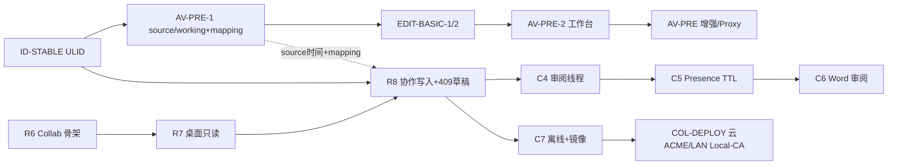

# Rushi 第二阶段路线图（个人 v1 之后）

> **地位**：个人单机 v1 / R9 之后的 **阶段排期真源**（细节薄片仍写各自 intent/plan/acceptance）。  
> **基线状态**：**✅ 已归档基线**（2026-07-18 终审绿灯；开编码前遵守 §8.1–§8.2）  
> **第一阶段真源**：[`rushi-execution-roadmap.md`](./rushi-execution-roadmap.md)（§1.6 个人单机 v1 · §4 R3 · §5 R9）。  
> **基线日期**：2026-07-18  
> **前提**：R9（REL-1）签收或产品书面宣布「进入第二阶段」；**默认不阻塞 v1**。

| 元数据 | 值 |
|--------|-----|
| 适用节奏 | 单人、每轮 2～4h、一轮一纵向薄片 |
| 规划跨度 | 对外约 **10～16 周**；单人串行内部建议按 **13～18 周** 排（见 [审核](../specs/phase-2-roadmap-audit-2026-07-18.md) §4） |
| 硬约束 | **ASR 本机不上云**；本地 SQLite `local` 项目不降级；协作 = 单节点中心化（云或 LAN） |
| 技术路径调研 | [`phase-1-2-tech-stack-paths-research.md`](../specs/phase-1-2-tech-stack-paths-research.md)（栈选型 · 业内坑 · 规避） |
| 评估吸收 | [`phase-2-external-review-absorb-2026-07-18.md`](../specs/phase-2-external-review-absorb-2026-07-18.md)（区间映射 · ID · 409 · LAN CA · 编码前微调） |

---

## 0. 一句话

第二阶段做两件大事：  
1）**理素材**——预处理 + 基础媒体剪辑，再转写/校对；  
2）**小团队协作**——本机 ASR + 自建 Collab（云 VPS 或局域网），审阅与双部署收口。

---

## 1. 与第一阶段的关系

| | 第一阶段（个人单机 v1） | 第二阶段（本文） |
|--|------------------------|------------------|
| 用户 | 一人一机、离线优先 | 一人理素材 + 小团队联机（可选） |
| 真源 | SQLite | `local` 仍 SQLite；`collaborative` → PG |
| ASR | 本机 FunASR | **仍本机**（云/LAN 协作节点不跑 ASR） |
| 媒体 | 导入复制 + 容器 normalize | `source`/`working` + 预处理 + Trim/删/切 |
| 协作 | 非目标 | R6–R8 → C4–C7 → COL-DEPLOY |
| 发版门禁 | R9 | 各 Wave 独立签收；无单一「Phase2 大包」硬门禁 |

```text
[Phase 1] R0…R4 → R9 个人 v1
                ↓
[Phase 2] Wave M 媒体 → Wave C 协作（含 C4–C6 审阅）→ Wave D 部署
          （可选并行：R5 MCP · LLM-LOC Gate）
```

---

## 2. 三大支柱

| 支柱 | ID 前缀 | 目标 | 详规 |
|------|---------|------|------|
| **M · 媒体成熟** | AV-PRE / EDIT-BASIC | 预处理三入口 + 基础必要剪辑；转写读 working | [调研](../specs/av-preprocess-import-flow-research.md) · [plan](../specs/av-preprocess-edit-basic-plan.md) |
| **C · 协作核心** | R6–R8 / C4–C6 | 服务真源、桌面双轨、写入、审阅、Presence、Word 审阅导出 | [foundation](./collaboration-foundation-plan.md) · [ADR-0002](../../adr/0002-local-collab-dual-source-review-mode.md) |
| **D · 部署与恢复** | C7 / COL-DEPLOY | 离线缓存；`cloud_vps` + `lan` 部署签收 | [双部署 plan](../specs/collab-dual-deploy-local-asr-plan.md) · [画像](../../architecture/collab-deployment-profiles.md) |

**可选并行（不占主序阻塞）**

| ID | 主题 | 说明 |
|----|------|------|
| R5 | MCP 只读 | 见主路线图 §6 |
| LLM-LOC | 本机 LLM Spike→Gate | 未过 Gate 不编码 |

---

## 3. 硬约束与非目标（阶段级）

### 3.1 必须遵守

1. ASR **仅桌面本机**；Collab 镜像无 FunASR/GPU。  
2. 母带 `source` **只读**；预处理与剪辑只改 `working`。  
3. 协作 = **单节点中心化**（禁止 P2P / 共享 SQLite 当真源）。  
4. 部署画像 **`cloud_vps` | `lan`**，同一套服务。  
5. 编排层不堆业务：媒体编辑 / 协作客户端逻辑下沉 service/controller。  
6. 中等薄片必须 research → intent/plan/acceptance（能力—UI 矩阵）。

### 3.2 本阶段明确不做

| 不做 | 归宿 |
|------|------|
| 云端 ASR / 转写 farm | 另 ADR |
| Descript 式删字即剪媒体 | EDIT-TEXT 远期 |
| 多轨 NLE / B-roll / 转场 | 不做 |
| 全文 CRDT / 浏览器完整编辑器 | 协作更远期 |
| 官方 SaaS 托管优先 | 自建优先 |
| CAT / 企业采购套件 | 主路线图 §8 |

---

## 4. 依赖与推荐顺序



**推荐主序（默认）**

1. **先 Wave M**（媒体）：个人立刻受益，且 `source`/`working` 供协作上传复用。  
2. **再 Wave C**（R6→R8→C4→C5→C6）。  
3. **最后 Wave D**（C7 + COL-DEPLOY）。  

**允许分叉**：若产品书面要求「先出协作 demo」，可 **R6→R7 提前**，但 **EDIT-BASIC 不应永久搁置**（理素材是主路径缺口）。

---

## 5. Wave 排期表

> 周次为单人串行粗估；薄片可按 2～4h 轮次切开。

### Wave M — 媒体成熟（约 4～5.5 周）

| 序 | ID | 交付 | 验收要点 | 文档 |
|----|-----|------|----------|------|
| M0 | **ID-STABLE** | 对外 ID：**ULID 字符串**（双库 `TEXT`/`VARCHAR(26)`；禁 PG `UUID` 类型；废止协作路径依赖 `INTEGER AUTOINCREMENT`） | 建议多轮：**M0a 新建只写 ULID** → **M0b 存量迁移**；见 [审核](../specs/phase-2-roadmap-audit-2026-07-18.md) §3 | [吸收记录](../specs/phase-2-external-review-absorb-2026-07-18.md) §2.3 · §8.2 ID-TEXT |
| M1 | **AV-PRE-1** | `source`/`working`；任务进度；L-prep-0/1；入口 A/B；恒等 **interval mapping** | 视频可抽轨；映射恒等 | [edit-basic plan](../specs/av-preprocess-edit-basic-plan.md) · [mapping](../../architecture/media-timeline-interval-mapping.md) |
| M2 | **EDIT-BASIC-1** | Trim + Ripple + peaks 重生 + **映射更新** + `media_dirty` | 建议多轮：**M2a Trim** → **M2b Ripple+死区**；语段 source 投影正确 | mapping 文 · plan · [审核](../specs/phase-2-roadmap-audit-2026-07-18.md) §3 |
| M3 | **EDIT-BASIC-2** | Split→第二 File；重置 working（映射回恒等） | 母带不丢；撤销成本低 | 同上 |
| M4 | **AV-PRE-2** | 入口 C 工作台→建项/加入/仅导出 | 三去向可手测 | plan |
| M5 | **AV-PRE-3** | 可选响度 | 默认关或显式勾选 | research |
| M6 | **AV-PRE-4** | 降噪 spike→Gate→可选 | Gate 不过则不上默认 | ACC L0 |
| M7 | **EDIT-BASIC-3** | 可选压长静音 | 可跳过 | research |
| M8 | **AV-PRE-5** | **Proxy 低码率听音轨**（禁 2h 全量 Web AudioBuffer） | peaks 仍走现有管线；弱机可 scrub | 吸收记录 §2.6 |

**Wave M 退出（核心）**：**M0–M3** 闭合即可签收——导入→（可选预处理 M1）→Trim/删废段（映射正确）→本机转写（写 source 时间）→校对；硬闸门绿。  
**可选不挡退出**：**M4–M8**（工作台/响度/降噪/静音/Proxy）；其中 **3h+ 手测强烈建议穿插 M8**，勿拖到 Wave 末才发现听音卡顿。

### Wave C — 协作核心（约 5.5～7 周）

| 序 | ID | 交付 | 验收要点 | 文档 |
|----|-----|------|----------|------|
| C1 | **R6 COL-1** | `services/collab` + PG + 最小 API（建议子签收：health→迁移→projects→segments；**含邀请制认证雏形**） | Compose 起服；建项读语段 | [foundation](./collaboration-foundation-plan.md) §3 Phase1 · [审核](../specs/phase-2-roadmap-audit-2026-07-18.md) §5-E |
| C2 | **R7 COL-2** | `ProjectSource`；协作只读；连接 UI（云/LAN 预设；§8.2 LAN-RUST 挂钩点） | 不污染 local SQLite 写路径 | 主路线图 R7 |
| C3 | **R8 COL-3** | 语段写 + version + revision_events；**409→冲突草稿 UI**（不静默覆盖） | 建议多轮：**R8a CAS 写路径** → **R8b 409 草稿+§8.2 C-409** | 主路线图 R8 · 吸收记录 §2.4 |
| C4 | **C4** | 批注线程 / 建议修改；`review` 模式 | 转录模式隐藏批注 | [domain API](../../architecture/collaboration-review-domain-api.md) |
| C5 | **C5** | Presence WS + 活动流；**心跳 3–5s / TTL≈10s** | 无僵尸在线 | 同上 · 吸收记录 §2.5 |
| C6 | **C6** | Word 审阅导出 | ≠ 单机 EXP-WORD | [collab Word spec](../specs/collaboration-review-word-export.md) |

**协作媒体约定**：语段时间 = **source 绝对时间**；上传可附 mapping 或完整母带；音频优先 `working`/proxy；ASR 仍各人本机。  
**硬前置**：M0 **ID-STABLE** 必须先于 R8。

**Wave C 退出**：两客户端可编辑同一协作项目；409 不丢草稿；review 可批注；硬闸门绿。

### Wave D — 部署与恢复（约 1.5～2.5 周）

| 序 | ID | 交付 | 验收要点 | 文档 |
|----|-----|------|----------|------|
| D1 | **C7** | 协作离线缓存/草稿恢复；正式镜像与版本号 | 断线重连可恢复；与 409 草稿空间衔接 | foundation Phase7 |
| D2 | **COL-DEPLOY-A** | `cloud_vps` Compose+Caddy ACME + pg_dump 备份 | HTTPS；PG 不暴露 | [dual-deploy plan](../specs/collab-dual-deploy-local-asr-plan.md) |
| D3 | **COL-DEPLOY-B** | `lan`：**Caddy `tls internal`** + 导出 `root.crt` 分发信任；桌面 HTTPS/WSS | 内网 TLS 可连；文档含 Win/mac 信任步骤 | 同上 · 吸收记录 §2.7 |
| D4 | **COL-DEPLOY-B′** | （可选）桌面对 RFC1918 **降级接受自签** / 明文 HTTP 调试开关 | 仅 LAN 预设；默认仍推 Local-CA | Tauri/reqwest 策略 |
| D5 | **COL-DEPLOY-C** | 可选 OSS（云） | 同地域内网读 | 可选 |
| D6 | **COL-DEPLOY-D** | 可选 mDNS spike | 失败则手动 URL | 可选 |

**Wave D 退出**：云 ACME、LAN Local-CA 各至少一次手测；`backup.sh`（pg_dump）演练一次。

---

## 6. 端到端用户故事（阶段验收叙事）

### 6.1 个人理素材（Wave M）

1. 欢迎页或 Hub 导入长录音/视频。  
2. 可选预处理（抽轨/容器修复/响度）。  
3. 波形 Trim 头尾、删废段。  
4. 本机 ASR → 语段校对 → 导出 Word。  

### 6.2 局域网小团队（Wave C+D）

1. 一台内网主机 Compose 起 Collab（`lan`）。  
2. 成员桌面填 Base URL，登录。  
3. 甲本机转写并推送语段（+ working 音频可选）。  
4. 乙只读/共写；review 批注。  
5. 导出带批注 Word。  

### 6.3 云上小团队（Wave C+D）

同 6.2，画像换 `cloud_vps` + HTTPS；长音频可用 OSS。

---

## 7. 文档索引（第二阶段）

| 主题 | 路径 |
|------|------|
| **本文（阶段真源）** | `docs/execution/plans/rushi-phase-2-roadmap.md` |
| **技术路径 / 栈 / 坑** | [`phase-1-2-tech-stack-paths-research.md`](../specs/phase-1-2-tech-stack-paths-research.md) |
| **评估吸收 2026-07-18** | [`phase-2-external-review-absorb-2026-07-18.md`](../specs/phase-2-external-review-absorb-2026-07-18.md) |
| **排期/切片审核** | [`phase-2-roadmap-audit-2026-07-18.md`](../specs/phase-2-roadmap-audit-2026-07-18.md) |
| **区间映射** | [`media-timeline-interval-mapping.md`](../../architecture/media-timeline-interval-mapping.md) |
| 第一阶段 / v1 | [`rushi-execution-roadmap.md`](./rushi-execution-roadmap.md) |
| 媒体调研 | [`av-preprocess-import-flow-research.md`](../specs/av-preprocess-import-flow-research.md) |
| 媒体 plan | [`av-preprocess-edit-basic-plan.md`](../specs/av-preprocess-edit-basic-plan.md) |
| 协作 foundation | [`collaboration-foundation-plan.md`](./collaboration-foundation-plan.md) |
| 双部署调研/plan | [`collab-dual-deploy-local-asr-research.md`](../specs/collab-dual-deploy-local-asr-research.md) · [`collab-dual-deploy-local-asr-plan.md`](../specs/collab-dual-deploy-local-asr-plan.md) |
| 部署画像 | [`collab-deployment-profiles.md`](../../architecture/collab-deployment-profiles.md) |
| ADR-0002 | [`0002-local-collab-dual-source-review-mode.md`](../../adr/0002-local-collab-dual-source-review-mode.md) |
| 存储 / API | [`collaboration-storage-schema.md`](../../architecture/collaboration-storage-schema.md) · [`collaboration-review-domain-api.md`](../../architecture/collaboration-review-domain-api.md) |
| 部署包 | [`deploy/self-hosted-collab/`](../../../deploy/self-hosted-collab/) |

---

## 8. 启动与变更

| 条件 | 动作 |
|------|------|
| 进入第二阶段 | R9 签收 **或** 产品书面「启动 Phase 2」 |
| 改主序（先协作后媒体） | 更新本文 §4 + 主路线图 §6 一行说明 |
| 引入云 ASR | **新 ADR**，不得静默改本文硬约束 |
| 薄片开编码 | 该薄片 intent/plan/acceptance 齐全且链到对应 research |
| **R8 前置** | **ID-STABLE（M0）必须 ✅** |
| **LAN 部署签收** | 必须演示 Local-CA 或书面接受 B′ 降级路径 |

### 8.1 已冻结的工程纪律（架构防御）

1. 语段时间 = Source；Working 仅经 [interval mapping](../../architecture/media-timeline-interval-mapping.md)。  
2. 剪辑置 `media_dirty`；禁止 2h 全量 Web AudioBuffer。  
3. 409 → 冲突草稿空间，禁止静默刷掉输入。  
4. Presence = 心跳 + TTL，禁止永驻内存无过期。  
5. LAN 主路径 = Caddy `tls internal` + 根证书信任；非「假装和公网同一套 ACME」。

### 8.2 开编码前冻结（React 19 / SQLite↔PG / Tauri 落地警示）

> 须写入相关薄片的 **intent / plan / acceptance**；违反视为未过门禁。

| # | 薄片 | 纪律 |
|---|------|------|
| **C-409** | R8 / C3 | 若用 React 19 `useActionState` / Form Actions：捕获 409 时须把**失败 payload（用户最新文本）**写入 `errorState` 或 Zustand/草稿机，**禁止**依赖 Action 默认 rollback 清空输入。验收：409 后输入框内容仍在，直至用户显式选择覆盖/采纳服务器。 |
| **ID-TEXT** | M0 ID-STABLE | 桌面生成 **ULID 字符串**（建议 Crockford 26 字符）。SQLite 与 PostgreSQL **一律 `TEXT` / `VARCHAR(26)`** 存储。**禁止**云端用 PG 原生 `UUID` 类型（避免连字符/大小写/类型转换漂移）。 |
| **LAN-RUST** | COL-DEPLOY-B′ / R7 连接 | 「忽略局域网自签 / 明文 HTTP」开关必须在 **Rust `reqwest`（或 Tauri http 插件客户端）** 层按 RFC1918 + 用户开关设置 `danger_accept_invalid_certs`；**禁止**只改前端 `fetch` 以为生效。 |

**变更记录**

| 日期 | 说明 |
|------|------|
| 2026-07-18 | 初版：汇合 AV-PRE/EDIT-BASIC + 协作双部署 + foundation 为第二阶段 |
| 2026-07-18 | 吸收外部评估：M0 ID-STABLE、区间映射、media_dirty、409 草稿、Presence TTL、LAN Local-CA |
| 2026-07-18 | **终审归档基线**；§8.2 编码前冻结（React 19 Action×409、ULID 双库 TEXT、Tauri Rust 降级） |
| 2026-07-18 | 全面审核：修正 Wave R 笔误、M 退出可选片、M0/M2/R8 多轮建议、工期注记；见 audit 文 |
