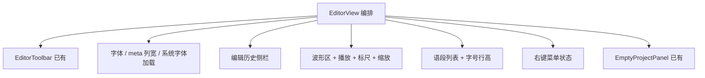

# 架构拆分方案（盘点 + 设计）

> 日期：2026-05-21  
> 依据：架构守卫、`AI_QUICKSTART.md` 热点、[reviews/issues.md](../reviews/issues.md)、[file-container-refactor.md](./file-container-refactor.md)

## 1. 结论摘要

| 类别 | 数量 | 建议 |
|------|------|------|
| **必须拆**（守卫 / >500 行 .rs / >400 行 TS 组件） | 3 | `project_cmd.rs`、`EditorView.tsx`、优先排期 |
| **建议拆**（接近阈值或 hook 超标） | 4 | lifecycle 脏检查抽出、`SegmentTextListRow`、`EnvOnlineSttPanel`、`transcribe.rs` / `export_cmd.rs` |
| **可暂缓**（未超线或已拆过） | 若干 | `WelcomeSidebar`、`useProjectWaveform`、`useProjectCrudController.test.ts` |

功能类问题（R2/R1/R5）已修；本方案只谈 **可维护性 / 守卫 / 编排层纪律**，不新增产品行为。

---

## 2. 当前守卫与阈值对照

```
架构守卫（2026-05-21）：0 错误，6 警告
```

| 文件 | 行数 | Hook 数 | 阈值 | 判定 |
|------|------|---------|------|------|
| `project_cmd.rs` | **953**（含测试 ~280） | — | .rs >500 | **必须拆** |
| `EditorView.tsx` | **762** | ~15+ | ≤300 行 | **必须拆** |
| `useProjectLifecycleController.ts` | 358 | **14** | ≤300 / ≤12 | **建议拆** |
| `EnvOnlineSttPanel.tsx` | 349 | — | ≤300 | **建议拆** |
| `useProjectCrudController.test.ts` | 317 | — | ≤300 | 低优（测试） |
| `export_cmd.rs` | 580 | — | >500 | **建议拆** |
| `transcribe.rs` | 478 | — | >500 临近 | **建议拆** |
| `SegmentTextListRow.tsx` | 228 | **17** | ≤12 | **建议拆** |
| `useProjectWaveform.ts` | 275 | 13 | ≤12 临近 | 观察 / 第三期 |
| `WelcomeSidebar.tsx` | 289 | — | ≤300 临近 | 观察 |

**已完成的拆分（不再作为 P1）**

- `useProjectLifecycleController` 已抽出：`useProjectBusyState`、`useProjectListState`、`useProjectEditorState`（122 行）
- 转写 / 保存 / 导出：已 `file_id` 对齐（R8-001 功能面关闭，模块命名仍可优化）

---

## 3. Rust：`project_cmd.rs` 盘点（952 行生产 + 测试）

### 3.1 职责块（按行号区间）

| 块 | 约行 | 内容 | Tauri commands |
|----|------|------|----------------|
| A | 34–113 | 语段保存事务 | `file_save_segments` |
| B | 115–134 | 文件选择器 | `pick_audio_path`, `pick_text_path` |
| C | 136–468 | 项目/文件**创建与导入** + `parse_srt` / `parse_txt` | `project_create_from_audio`, `create_empty_project`, `create_project_from_text`, `create_empty_text_file`, `import_*` |
| D | 469–533 | 项目**读**与编辑日志 | `project_list`, `project_load`, `project_list_edit_log` |
| E | 535–582 | 项目**删除** | `project_delete`（`project_delete_inner`） |
| F | 584–683 | 文件 **CRUD** | `list_files`, `load_file`, `rename_file`, `delete_file` |
| G | 685–952 | **单元测试** | — |

### 3.2 目标模块（与 file-container 命名对齐）

```
apps/desktop/src-tauri/src/project/
  segment_cmd.rs      # A：file_save_segments_inner + command
  picker_cmd.rs       # B：pick_*（可选，并入 create 模块）
  import_parse.rs     # C 纯函数：parse_srt / parse_txt
  project_create_cmd.rs  # C 命令：create / import
  project_query_cmd.rs   # D：list / load / edit_log
  project_delete_cmd.rs  # E：delete_inner + command
  file_cmd.rs         # F：list / load / rename / delete
  project_cmd.rs      # 仅 `mod` 重导出 + `pub use`（或删除，改 mod.rs re-export）
```

**约束**

- `lib.rs` 的 `generate_handler![...]` **命令名不变**（前端零改动）
- `project/mod.rs` 增加 `pub use xxx::*`，保持 `project::pick_audio_path` 路径
- 测试按模块搬迁：`import_parse` 测 parser；`file_cmd` / `delete` 测 DB+FS

**预估**：单 PR 6–8 文件，纯搬家 + `mod`，约 2–4h；`cargo test` + clippy 门禁。

---

## 4. Rust：`export_cmd.rs` / `transcribe.rs`

### 4.1 `export_cmd.rs`（580 行）

| 块 | 内容 |
|----|------|
| bundle | `export_project_bundle_*` / `import_project_bundle_*` + manifest 类型 |
| desktop IO | `export_text_file`, `open_app_data_folder`, `reveal_path` |
| tests | round_trip、unsafe path、多文件 audio |

**建议**

- `project_bundle_cmd.rs` — zip 导入导出 + 测试
- `export_cmd.rs` — 保留小命令 + re-export

### 4.2 `transcribe.rs`（478 行）

| 块 | 内容 |
|----|------|
| 共享 | `glossary_hotwords_joined`, `post_transcribe_multipart` |
| 在线 | `transcribe_openai_native`, `transcribe_assemblyai_native`, … |

**建议**

- `transcribe_http.rs` — multipart + ASR HTTP
- `transcribe_native_online.rs` — OpenAI / AssemblyAI 等（或并入现有 `stt_native` 仅留 dispatch）
- 优先级 **低于** `project_cmd`（未触发守卫，但 AI_QUICKSTART 已标记）

---

## 5. 前端：`EditorView.tsx` 盘点（762 行）

### 5.1 内聚块（逻辑，非文件）



| 块 | 约行 | 状态类型 | 建议落位 |
|----|------|----------|----------|
| 字体与 meta 列宽 | 134–276 | 8× useState + 3× useCallback | `useEditorTranscriptAppearance.ts` |
| 编辑历史 | 144–297 | historyOpen/rows/busy | `useEditorEditHistory.ts` |
| 无文件顶栏 | 301–332 | 纯 JSX | `EditorProjectChrome.tsx`（可选） |
| 波形时间轴 | 347–520 | 依赖 `tx` | `EditorWaveformSection.tsx` |
| 语段列表 + 字体工具条 | 520–710 | 列表 map + 字体 UI | `EditorSegmentListSection.tsx` |
| Footer + SegmentContextMenu | 731–758 | 局部 | 保留在 Section 或 `EditorFooter.tsx` |

### 5.2 目标结构

```
apps/desktop/src/components/editor/
  EditorView.tsx              # ≤150 行：组装 props，无业务写库
  EditorWaveformSection.tsx   # ≤200 行
  EditorSegmentListSection.tsx
  useEditorTranscriptAppearance.ts
  useEditorEditHistory.ts
```

**约束**

- `ProjectPanel` 仍只 import `EditorView`（对外 API 不变）
- 样式继续 token，不新增第 3 层 panel border
- 拆分后各文件 `<300` 行，守卫清零 `EditorView` 警告

**预估**：2 PR（先 hooks + SegmentListSection，再 WaveformSection）或 1 PR 纵向薄片，每片 2–4h + 手测主路径。

---

## 6. 前端：Hook / 组件接近阈值

### 6.1 `useProjectLifecycleController.ts`（358 行 / 14 hooks）

**仍留在编排层的合理部分**：`loadProject`、`runTranscribe`、`saveSegments`、export 委托、CRUD 委托。

**应再抽出**

| 新模块 | 职责 | 大约行 |
|--------|------|--------|
| `useSegmentDirtyState.ts` | `savedSegmentsRef`、`markSaved`、`confirmDiscard` | ~60 |
| （可选）`useProjectTranscribeActions.ts` | `runTranscribe` 单职责 | ~50 |

抽出后 lifecycle **目标 ≤250 行、≤10 hooks**，并补 **focused test**（mock tauri invoke）。

### 6.2 `SegmentTextListRow.tsx`（228 行 / 17 hooks）

行数未超标，**hook 数超标**。

**建议**

- 纯展示：`SegmentTimestampColumn.tsx`（时间 + 拖拽 handle）
- 交互：`SegmentTextarea.tsx`（local focus/resize 状态）
- Row 只做 memo 组装（≤8 hooks）

### 6.3 `EnvOnlineSttPanel.tsx`（349 行）

按 **Provider 区块** 或 **表单 / 高级选项** 切成 2 组件，父组件只传 env 与 callback（无新持久化逻辑）。

### 6.4 `useProjectWaveform.ts`（275 / 13 hooks）— 第三期

- `useWaveformPlayback.ts` — play/pause/time
- `useWaveformRegions.ts` — regions 同步、拖拽创建

仅在继续加波形功能时再拆，避免「薄 hook 平移」。

---

## 7. 实施顺序（推荐）

| 阶段 | 范围 | PR 策略 | 验证 |
|------|------|---------|------|
| **S1** | Rust `project_cmd` → 6 模块 | 单 PR，零命令改名 | `cargo test` + clippy |
| **S2** | `useSegmentDirtyState` 抽出 + lifecycle 单测 | 单 PR | `npm test` + 守卫 hook 数 |
| **S3** | `EditorView` 纵向拆 2 section + 2 hooks | 1–2 PR | 手测：打开文件 / 波形 / 语段 / 字体 / 历史 |
| **S4** | `SegmentTextListRow` 子组件 | 单 PR | 守卫 + 语段编辑手测 |
| **S5** | `export_cmd` / `transcribe` / `EnvOnlineSttPanel` | 按需 | 导出、转写、在线 STT 手测 |

**不建议同一 PR 同时改 S1 + S3**（Rust 与 UI 回归面正交，审查成本高）。

---

## 8. 守卫与文档更新

每阶段合并后：

```bash
npm run typecheck && npm run test && node scripts/check-architecture-guard.mjs
cargo test --manifest-path apps/desktop/src-tauri/Cargo.toml
cargo clippy --all-targets -- -D warnings
```

更新：

- [reviews/issues.md](../reviews/issues.md)：`R1-001`、`R7-001`、`R3-002/003`、`R4-001` 标为 fixed 或登记例外
- `AI_QUICKSTART.md` 热点列表

---

## 9. 明确不纳入本轮

| 项 | 原因 |
|----|------|
| `china_stt_shell/*` 单文件 90–270 行 | 按厂商隔离，清晰 |
| `WelcomeSidebar` 289 行 | 未超线；交互债单独 UX PR |
| `useProjectCrudController.test.ts` 317 行 | 测试辅助函数抽取即可，非功能债 |
| 协作 / 联机 schema 草案 | 未实现，不拆 |
| bundle v2 多文件清单 | 产品扩展，非拆分 |

---

## 10. 决策点（实施前确认）

1. **S1 是否保留 `project_cmd.rs` 文件名** 仅作 re-export 壳（推荐：是，减少 `lib.rs` diff）。
2. **Editor 子目录** 用 `components/editor/` 还是 flat `EditorXxx.tsx`（推荐：子目录，与 `ProjectPanel` 并列清晰）。
3. **lifecycle 单测** 是否在 S2 必做（推荐：是，弥补编排层无测试缺口）。

确认后可按 S1→S2→S3 开工；需要我先落 S1 的 `mod` 骨架（空文件 + re-export）再逐步搬函数，也可以。
