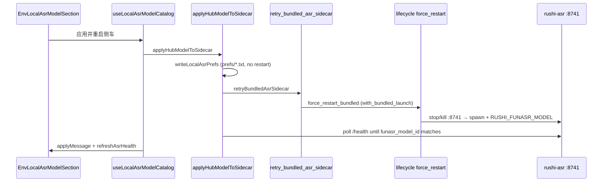

# 侧车启动 · 模型切换 · 应用 — 链路审计（2026-05）

> **状态**：已编码修复（与本文同步）  
> **相关**：[`asr-sidecar-runtime-audit-2026-05-27.md`](./asr-sidecar-runtime-audit-2026-05-27.md)、[`asr-setup-idempotency-audit-2026-05-27.md`](./asr-setup-idempotency-audit-2026-05-27.md)

## 1. 端到端链路（真源）

| 阶段 | 落位 | 说明 |
|------|------|------|
| 应用启动 | `lib.rs` → `try_start_bundled` | `with_bundled_launch` 串行；`RUSHI_SKIP_BUNDLED_ASR=1` 时跳过 |
| 写模型偏好 | `prefs/funasr_hub_model_id.txt` | `set_local_asr_hub_model_pref` **默认不重启** |
| 写语言偏好 | `prefs/funasr_language.txt` | 同上 |
| 显式重启 | `retry_bundled_asr_sidecar` → `force_restart_bundled` | 杀 8741 → `spawn_sidecar` + `apply_asr_model_env` |
| 健康轮询 | `localAsrSidecarRestart.waitForSidecarConfig` | 匹配 `funasr_model_id` + 语言，**不要求** `funasr_ready`（切换后模型可能仍在加载权重） |
| 环回 HTTP | `loopbackFetch` → `asr_loopback_request` | 带 `x-rushi-local-token`（bundled 随机 token） |

## 2. 已修复问题（本轮）

| # | 现象 | 根因 | 修复 |
|---|------|------|------|
| P1 | 点应用无反应 / 一直「正在应用」 | `with_asr_lifecycle` 包住 45s health 轮询，阻塞 Tauri 命令 | health 轮询移出；`with_bundled_launch` 单独串行 |
| P2 | 应用后 8741 无监听 | dev 路径 `killLoopbackAsrListeners` 杀 Python 侧车 | dev **不再杀进程**，只写 prefs + 提示重启 `desktop:dev` |
| P3 | 401 invalid_local_token | 复用带 token 旧侧车，桌面无 token | token 不匹配时非 dev 自动 refresh；`desktop-dev.sh` 检测 `local_token_required` |
| P4 | 偏好已是 Paraformer 但不重启 | `set_local_asr` 在 `prev==hub` 时跳过 restart | 重启统一走 `retryBundledAsrSidecar`；写 prefs `restartSidecar: false` |
| P5 | 点击成功无提示 | `ok: true` 且 message 为空 | 所有分支返回可读 `message` |
| P6 | 内存仍 SenseVoice 却 skip | `shouldSkip` 只看 `funasr_model_id` | 增加 `funasr_loaded_model_id` 不一致则强制重启 |
| P7 | 并行启动互抢 8741 | 启动与 apply 同时 `try_start_bundled_inner` | `with_bundled_launch` Mutex |

## 3. 运行模式矩阵

| 模式 | `app_manages_bundled` | 应用模型行为 | 用户操作 |
|------|----------------------|--------------|----------|
| `npm run desktop:dev` | false | 只写 prefs；提示重启终端 | Ctrl+C → 再 `desktop:dev` |
| 安装包 / `tauri dev`（无 SKIP） | true | 写 prefs → 重启 bundled → 轮询 | 点「应用并重启侧车」 |
| `VITE_ASR_BASE_URL` 非 8741 | — | 只写 prefs；提示 `asr:dev` | 手动重启侧车 |

## 4. 手测清单（签收）

1. **desktop:dev**：8741 有 ASR → 选 Paraformer → 保存偏好 → 黄条提示重启终端；**8741 仍可用**（不红字断连）。
2. **desktop:dev 重启后**：`/health` 的 `funasr_model_id` 为 Paraformer。
3. **安装包**：SenseVoice → Paraformer → 应用 → 90s 内黄条「已切换」；底部「侧车运行中」为 Paraformer。
4. **重试内置侧车**：8741 死后可恢复 `/health`。
5. **转写**：切换后拉取语段无 401。

## 5. 代码索引（维护用）

- TS 应用编排：`apps/desktop/src/services/asr/localAsrSetupModelStep.ts`
- TS 重启工具：`apps/desktop/src/services/asr/localAsrSidecarRestart.ts`
- UI：`apps/desktop/src/components/envLocalAsr/LocalAsrModelSection.tsx`
- Rust 生命周期：`apps/desktop/src-tauri/src/asr_sidecar/bundled/lifecycle.rs`
- Rust prefs：`local_asr_model.rs`、`local_asr_language.rs`

## 6. 仍不做什么

- 不在 dev 模式从桌面壳自动 `exec npm run asr:dev`（避免误杀/多终端竞态）。
- 不以 `funasr_ready` 作为「模型切换完成」唯一条件（与「可转写」语义分离）。
