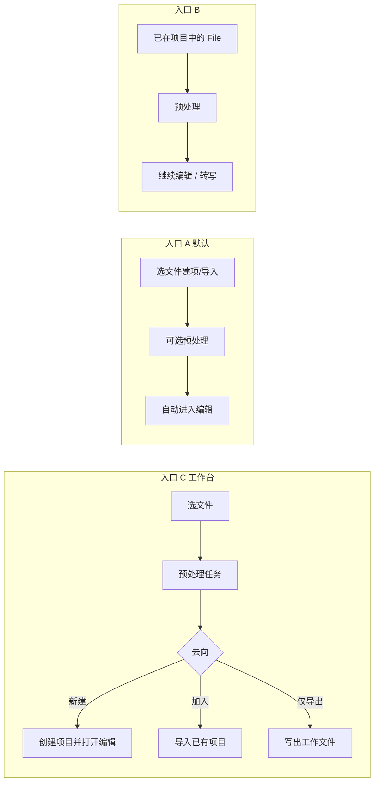
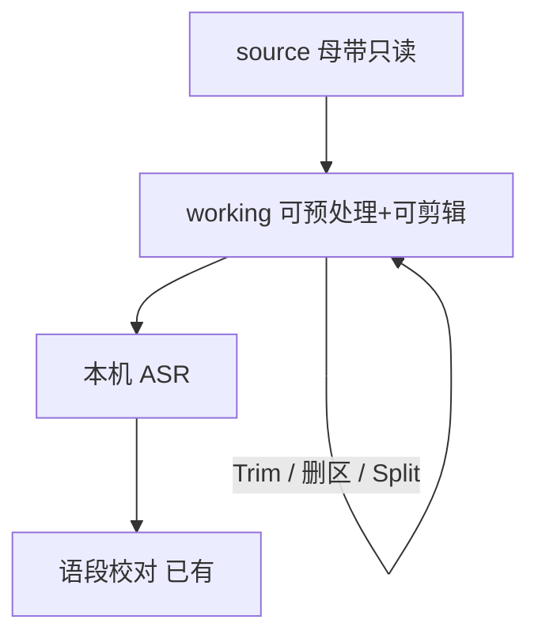

# 调研：音视频预处理 + 基础必要剪辑与「进项目」产品路径

> **状态**：已采纳调研；**plan 已定稿**（薄片 acceptance 编码前补）  
> **关联路线图**：[`rushi-phase-2-roadmap.md`](../plans/rushi-phase-2-roadmap.md) Wave M · [`rushi-execution-roadmap.md`](../plans/rushi-execution-roadmap.md) §6  
> **关联 plan**：[`av-preprocess-edit-basic-plan.md`](./av-preprocess-edit-basic-plan.md)  
> **关联既有**：[`audio-import-container-normalize-research.md`](./audio-import-container-normalize-research.md) · [`desktop-project-file-lifecycle.md`](../../architecture/desktop-project-file-lifecycle.md) · ACC L0  
> **门禁**：薄片编码前须有该薄片 acceptance，并链接本文 + plan

---

## 1. 问题陈述

| 项 | 内容 |
|----|------|
| 用户场景 | 口述史/采访等长音视频：① **预处理**（容器修复、抽音轨、响度、降噪、代理轨）；② **基础必要剪辑**（去头尾、删废段、切分、必要时压静音），再进入转写/校对。入口：先处理再进项目、先导入再处理、或导入后直接剪。 |
| 本仓现状 | **语段层编辑已强**（改字、说话人、段界拖拽、拆合段、波形 seek）；**媒体层剪辑几乎没有**（不重写工作音频时间线、无 in/out trim、无删区间）。导入侧仅容器 normalize + ASR 16k；无预处理队列/工作台/代理轨。 |
| 成功标准 | 调研收口：预处理业内路径 + **基础剪辑最小集** + 与现有语段编辑的边界；后续 plan 可拆薄片，**母带不可默默覆盖**，不第二套媒体真源。 |

### 1.1 本仓现状链路（摘要）

```text
选文件 → project_create_from_audio / import_audio_to_project
  → 复制到 {media_base}/projects/{id}/
  → normalize_project_audio_in_place（容器容错，非响度/降噪）
  → 打开 File → peaks / 播放
  → 转写时侧车再 ffmpeg → 16k mono → FunASR
```

| 环节 | 关键路径 |
|------|----------|
| 导入编排 | `useProjectImportDuplicateController.ts` · `projectBatchImport.ts` |
| 建项/导入 | `project_create_cmd.rs` · `picker_cmd.rs` |
| 容器 normalize | `audio_container_normalize.rs` |
| 生命周期文档 | `docs/architecture/desktop-project-file-lifecycle.md` |
| ASR 工作格式 | `services/asr/rushi_asr/ffmpeg_audio.py` |

**缺口**：

- 预处理：无任务队列/工作台；无用户可控响度/降噪/抽轨/代理；视频 demux 未产品化。  
- 剪辑：**无工作音频时间线手术**（trim / 删区间 / 拼接后重写 peaks 与语段时间轴）；与 Descript「删字即剪媒体」尚有代差。

---

## 2. 业内成熟路线（预处理 + 剪辑）

### 2.0 总表 — 预处理时序

| # | 路线 | 代表产品 | 核心机制 | 时序特征 | 链接 / 证据 |
|---|------|----------|----------|----------|-------------|
| **A** | **导入即处理（Ingest 内建）** | Descript；Premiere Ingest/Proxy | 进项目（或账号默认）时自动响度/代理；可关 | **先有项目上下文 → 导入时处理 → 编辑** | [Descript Auto Leveling](https://www.descript.com/blog/article/new-in-descript-automatic-volume-leveling-timeline-editing-improvements)；Premiere Ingest Settings |
| **B** | **先入库再优化（Media Pool → Proxy）** | DaVinci Resolve；Premiere Create Proxies | 媒体池先挂源片，再 Generate Proxy / Optimized Media；播放 Prefer Proxy，导出可回链母带 | **先导入 → 再预处理 → 编辑** | [Resolve Proxy vs Optimized](https://www.steakunderwater.com/VFXPedia/__man/Resolve18-6/DaVinciResolve18_Manual_files/part270.htm) |
| **C** | **项目外增强站（Enhance → 再进编辑/转写）** | Adobe Podcast Enhance Speech；部分 Whisper 指南推荐「先 Enhance 再转写」 | 独立 Web/工具清洗人声，导出新文件，再导入 NLE/转写器 | **先预处理 → 再导入项目** | [Adobe Podcast 评测综述](https://aitoolfinder.org/tools/adobe-podcast/)；社区 Whisper+Enhance 工作流 |
| **D** | **后期精修站（Edit 后 Master）** | Auphonic | 响度 LUFS、speaker leveling、轻降噪；常接在剪辑之后；也可挂 ASR 出 shownotes | **先编辑/转写 → 再预处理（交付向）** | [Auphonic Speech Recognition](https://auphonic.com/help/algorithms/speech_recognition.html) · [Auphonic 产品定位](https://aiaudiogear.com/auphonic-review/) |
| **E** | **时间线非破坏效果** | CapCut Normalize loudness；Premiere Audio Gain | 导入后挂效果，**不改源文件**；导出时烘焙 | **先导入 → 编辑中处理** | [CapCut Loudness Normalization](https://www.capcut.com/tools/loudness-normalization) |

### 2.0b 总表 — 基础剪辑路径

| # | 路线 | 代表产品 | 核心机制 | 「必要」剪辑长什么样 | 链接 / 证据 |
|---|------|----------|----------|---------------------|-------------|
| **F** | **文本驱动剪媒体** | Descript | 删/剪贴字 → 同步删移音视频；批量去 filler / 压 gap | 口述内容向：去废话、调顺序 | [Edit like a doc](https://help.descript.com/hc/en-us/articles/15726742913933-Edit-like-a-doc) |
| **G** | **波形/剃刀时间线** | Audacity；Premiere Razor；Resolve | in/out、Split、Delete/Ripple、淡入淡出 | 录音向：去头尾、掐废段、切条 | 传统 NLE/DAW 基线 |
| **H** | **转写器轻量：只改字+导出** | MacWhisper 类 | 强转写、弱/无时间线剪媒体 | **不**覆盖「进项目前理素材」 | 产品对照：转写 ≠ 剪辑 |

Rushi 当前更接近 **H + 强语段校对**；用户要求补上的「基础必要剪辑」应对齐 **G 的最小子集**，并预留日后向 **F** 升级（文本删→媒体删）的数据模型，但 **MVP 不做完整 Descript**。

### 2.1 预处理路径 A — 导入即处理（Descript / Premiere Ingest）

- **Descript**：账号/项目开关「Automatic volume levels」→ 新 clip 导入时约 **-16 dB 响度**；导出另有 Normalize，可叠加。  
- **Premiere**：Ingest Settings 可在**导入时**转码/生成 Proxy，同时媒体进项目。  
- **产品含义**：用户心智是「丢进工程就开始干活」；处理与建项原子化或紧耦合。  
- **对 Rushi**：最接近现状「选音频 → 建项/导入 → 打开编辑」；可把「可选预处理配置」挂在导入确认步。

### 2.2 预处理路径 B — 先导入再预处理（Resolve / Premiere Proxy）

- Media Pool **先挂母带**，再批量 Generate Proxy；编辑 Prefer Proxy，交付 relink 母带。  
- **产品含义**：长素材、弱机器、协作换机时，**母带与工作副本分离**。  
- **对 Rushi**：对应「Hub 已有 File → 选预处理 → 生成 `working`/`proxy` 轨 → 转写/播放走工作轨」；与协作草案 `source_audio` / `proxy_audio` 对齐。

### 2.3 预处理路径 C — 项目外先增强（Adobe Podcast Enhance）

- 独立站：上传 → Enhance → 下载干净语音 → **再**进编辑器或 Whisper。  
- 社区常见：**噪声大时先 Enhance 再转写**，提 CER；干净录音可跳过。  
- **产品含义**：重算力/试验性算法与主编辑器解耦；用户接受「多一步文件」。  
- **对 Rushi**：可做成 **欢迎页/Inbox「预处理工作台」**：处理后 **一键建项并打开编辑**，或「仅导出到文件夹」。**不要**做成强制云上传（本机优先）。

### 2.4 预处理路径 D — 编辑后精修（Auphonic）

- 定位是 **finishing**：剪完/大致定稿后再 LUFS、leveling。  
- 也可在 Production 里挂 ASR，但是「制作流水线」而非「进 Rushi 校对前的必经」。  
- **对 Rushi**：与 **导出前可选响度**（交付向）更相关；**不宜**作为「进项目编辑」的默认前置（会颠倒口述史「先听清再改字」的主路径）。

### 2.5 预处理路径 E — 时间线非破坏（CapCut / Premiere Gain）

- 效果挂在 clip 上，源文件不变。  
- **对 Rushi**：短期可做「播放增益/简单 EQ」；但 **ASR 输入**若仍读未处理文件，则「听感改善 ≠ 转写改善」。转写向预处理必须产出**可指给 ASR 的工作文件**（或明确「仅听感」开关）。

### 2.6 剪辑路径 F — 文本驱动（Descript）

- 删字/剪贴段落 = 删移媒体；另有 Remove filler、Shorten gaps。  
- **强依赖**：稳定词级时间轴 + 媒体合成管线。  
- **对 Rushi**：中长期可做；**MVP 不做**（词级对齐与重编码成本高）。数据上预留「编辑决策列表」（EDL）便于日后文本驱动回放同一套 apply。

### 2.7 剪辑路径 G — 波形剃刀最小集（Audacity / NLE）

口述史进转写前真正「必要」的通常只有：

| 能力 | 说明 | MVP |
|------|------|-----|
| **Trim 头尾** | 去掉倒计时/闲聊头尾 | ✅ 必要 |
| **选区删除（Ripple）** | 删废段后后段前移 | ✅ 必要 |
| **播放头切开（Split）** | 一切为二，便于分别处理/转写 | ✅ 必要 |
| **恢复/撤销** | 至少一步撤销或从母带重生 working | ✅ 必要 |
| **选区导出/另存** | 可选 | 可后置 |
| **压长静音** | 阈值阈值缩短 gap（非删字） | 建议第二片 |
| **多轨 / 转场 / B-roll** | 完整 NLE | ❌ 不做 |

- **对 Rushi**：所有媒体手术写在 **`working` 副本**；`source` 只读；语段时间戳在 apply 后 **批量重映射或提示「需重转写」**（见 §4.3）。

### 2.8 剪辑路径 H — 转写器轻量（MacWhisper 类）

- 只服务转写精度与文本导出，**不**承担理素材。  
- Rushi 已超过纯 H（有波形+语段校对）；用户要的是 **H + G 最小集**，不是一夜变成 Descript。

---

## 3. 可复用评估

| 路线 | 复用度 | 可直接用的部分 | 与 Rushi 约束冲突 | 进度 / 内存 / 运维 |
|------|--------|----------------|-------------------|---------------------|
| A 导入即处理 | **高** | 现有 create/import 入口；容器 normalize 已是 ingest 一步 | 勿默认重型降噪拖死 3h 导入 | 导入确认勾选「预处理配置」；长文件后台任务 + 进度 |
| B 先导入再处理 | **高** | Hub File 列表；`media_assets` 草案 kind；peaks 懒生成模式可复用为任务态 | 禁止第二套平行真源路径 | 适合已进项目的长视频/再跑一遍增强 |
| C 项目外增强站 | **中** | 欢迎页空闲区可挂「工作台」；处理后调现有 `project_create_from_audio` | 云 Enhance 与「本机/隐私」冲突 → **本机 ffmpeg/侧车任务** | 用户多一步，但重处理可取消/不绑项目 |
| D 编辑后 Master | **中** | 导出 DOCX/音频前可选 | 若当作进编辑前置会错位 | 放到 EXP / 交付薄片，非 AV-PRE MVP |
| E 非破坏时间线 | **低～中** | 播放增益简单 | ASR 与听感分裂 | MVP 不做完整效果栈 |
| F 文本驱动剪媒体 | **低（MVP）/ 中（远期）** | 语段 uid、时间轴、REV-LOC 撤销思路 | 缺词级对齐真源；重编码与 peaks 全量刷新 | 作 EDIT-TEXT 远期，不挡 EDIT-BASIC |
| G 波形剃刀最小集 | **高** | 波形选区/播放头、ffmpeg concat/trim、peaks 重生 API | 切后语段时钟必须有明确策略 | 3h 文件注意后台任务与磁盘双副本 |
| H 仅转写 | **已具备** | 现 Editor | 不满足「理素材」 | 保留为底盘，其上加 G |

**本仓已有可复用模块**（扩展，禁止 fork 第二套 VAD/导入栈）：

- `audio_container_normalize.rs` — 容器容错（L-prep-0）
- `waveform_peaks_*` / ASR `ffmpeg_audio.py` — ffmpeg 与 peaks 重生
- 语段 mutation controllers（拆合段、改字、段界）— **语段层**继续用；媒体层新建 `media_edit` / preprocess 服务，**禁止**把重编码塞进 mega-hook
- `useProjectImportDuplicateController` / Hub 批量导入 — 入口编排
- ACC L0、协作 `source`/`proxy` 命名 — working 轨单机先落地
- REV-LOC — 媒体编辑撤销需单独设计（文件级快照或 edit decision 重放）

---

## 4. 决策摘要（调研结论）

| 问题 | 结论 |
|------|------|
| 选定方案 | **预处理三入口（A/B/C）+ 基础剪辑走路径 G 最小集**；同一 `source`（只读母带）/ `working`（可预处理+可剪辑）模型。默认流程：导入（可选预处理）→ **必要剪辑** → 转写 → 语段校对。 |
| 不做什么 | 云 Enhance；完整 NLE（多轨/转场/B-roll）；MVP 不做 Descript 式删字即剪；默默覆盖母带；Auphonic 作进编辑默认；第二套导入/VAD |
| 与 ADR / architecture | 本地媒体生命周期；ACC L0；容器修复 research；剪辑结果只落 working + 元数据 |
| 风险与 spike | （1）降噪 vs CER；（2）长文件重编码内存；（3）切媒体后语段重映射 vs 强制重转写 UX；（4）撤销粒度 |

### 4.1 推荐产品时序（三种都要支持）



| 入口 | 用户说法 | 业内对标 | Rushi 落点（预告） |
|------|----------|----------|-------------------|
| A | 「导入时顺手处理好再改」 | Descript / Premiere Ingest | Create/Import 确认 → 任务 → `loadProjectAfterImport` |
| B | 「先丢进项目，再慢慢处理」 | Resolve Proxy | Hub/File 菜单「预处理…」 |
| C | 「先洗音频，再决定进哪个项目」 | Adobe Enhance 站 | Welcome「预处理」工作台 → 完成后三选一 |

### 4.2 预处理能力分层（建议）

| 层 | 内容 | MVP | 备注 |
|----|------|-----|------|
| L-prep-0 | 容器修复 / 合法 remux（已有） | ✅ 已有 | 始终可跑 |
| L-prep-1 | 视频 demux 出工作音频；统一采样率/声道策略（播放轨 vs ASR 轨可分） | 建议首片 | 对齐 picker 已收视频格式 |
| L-prep-2 | 响度（EBU R128 / 简单 loudnorm） | 可选 | 对标 Descript -16；默认关或「仅播放」 |
| L-prep-3 | 轻降噪 / 去嘶声（ffmpeg `afftdn` 等） | 可选 + spike | ACC L0；默认关 |
| L-prep-4 | 长素材 proxy/工作轨（低码率） | 可后置 | 对齐协作 `proxy_audio`；本机先受益 |

### 4.3 基础必要剪辑（EDIT-BASIC，纳入本轨）

**两层编辑，禁止混谈：**

| 层 | 已有 / 缺口 | 产品含义 |
|----|-------------|----------|
| **语段层** | ✅ 改字、说话人、段界、拆合段、列表/波形联动 | 「校对转写」——继续增强，但不代替媒体手术 |
| **媒体层** | ❌ 缺 trim / 删区 / 切开写回 working | 「理素材」——本轨要补的基础剪辑 |

**MVP 必要集（路径 G）：**

1. **标记入点/出点 → Trim**：working 只保留区间，重生 peaks。  
2. **选区删除（Ripple）**：去掉废段，后续时间前移。  
3. **播放头 Split**：working 一切为二 → 可变成两个 File，或同 File 内两段 clip 列表（首期建议：**切成两个 File** 更简单，避免多 clip 时间线）。  
4. **从母带重置 working**：丢弃剪辑/预处理结果。  
5. **与转写关系（冻结 · 2026-07-18 修订）**：  
   - 语段持久化为 **Source 绝对时间**；Working↔Source 用 [区间映射](../../architecture/media-timeline-interval-mapping.md)。  
   - 剪辑更新映射 + `media_dirty`，**不**批量改写语段行。  
   - 重转写为可选（覆盖）；非唯一策略。

**明确非 MVP：** 多轨混音、转场、B-roll、字幕烧录、删字即删媒体（F）、实时协作联机剪辑。



**ASR 输入策略（冻结）**：转写读 `working`（若有）否则 `source`；听感-only 效果不得静默改变 ASR 输入。

---

## 5. 落位预告（非最终实现）

| 层 | 文件 / 模块 | 变更类型 |
|----|-------------|----------|
| 产品/文档 | 本 research → `av-preprocess-*` + `edit-basic-*` 三件套（可合并 plan） | 薄片 |
| Rust | `media_preprocess/` + `media_edit/`（trim/ripple/split）；`files` 区分 source/working 路径 | 新命令 |
| Python ASR | 不塞进剪辑；仍读桌面给出的工作文件 | 慎改 |
| UI | 工作台；Import 勾选；波形选区工具条（Trim/删/切）；任务进度 | controller 下沉 |
| 测试 | 容器回归；trim 后时长；ripple 后 peaks；切文件；重置 working | focused |

**建议薄片顺序（编码期）**

1. **AV-PRE-1**：`source`/`working` 模型 + 任务进度 + L-prep-0/1 + 入口 A/B  
2. **EDIT-BASIC-1**：Trim 头尾 + 选区 Ripple 删除 + peaks 重生 + 无语段时流畅；有语段时「建议重转」  
3. **EDIT-BASIC-2**：播放头 Split → 第二 File（或等价）+ 撤销/重置 working  
4. **AV-PRE-2**：入口 C 工作台 +「处理完创建并打开」  
5. **AV-PRE-3/4**：响度 / 降噪（默认关）  
6. **EDIT-BASIC-3**：可选压长静音  
7. **AV-PRE-5**：proxy 轨  
8. **EDIT-TEXT（远期）**：Descript 式文本驱动，另开调研/ADR  

---

## 6. 与协作 / 本机 ASR 的边界

| 项 | 口径 |
|----|------|
| ASR | **仍本机**；预处理与媒体剪辑也本机 |
| 协作 | 单机先落地 `source`/`working`；上传协作时推 working（或母带+proxy） |
| 云 Enhance / 云剪辑 | **本轨不做** |

---

## 7. 签收

- [x] 调研 brief 完成（预处理 A–E + 剪辑 F–H + 本仓缺口 + 三入口 + EDIT-BASIC 最小集）
- [x] plan 已链接：[`av-preprocess-edit-basic-plan.md`](./av-preprocess-edit-basic-plan.md)；阶段：[`rushi-phase-2-roadmap.md`](../plans/rushi-phase-2-roadmap.md)
- [ ] 各薄片 intent/acceptance（编码前）
- [ ] 产品书面确认启动 Phase 2 Wave M

**变更记录**

| 日期 | 说明 |
|------|------|
| 2026-07-18 | 初版：音视频预处理 × 进项目时序 |
| 2026-07-18 | **修订**：纳入基础必要剪辑（路径 G MVP；F 远期）；语段层 vs 媒体层分界 |
| 2026-07-18 | 挂入第二阶段路线图 + edit-basic plan |
