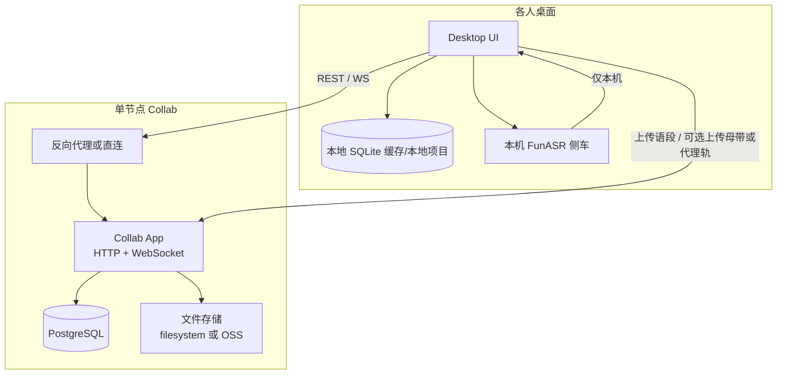

# Plan：协作双部署画像（云自建 + 局域网）· 本机 ASR

> **调研 brief**（必读）：[`collab-dual-deploy-local-asr-research.md`](./collab-dual-deploy-local-asr-research.md)  
> **技术栈 / 坑规避**：[`phase-1-2-tech-stack-paths-research.md`](./phase-1-2-tech-stack-paths-research.md) §4  
> **排期**：[`rushi-phase-2-roadmap.md`](../plans/rushi-phase-2-roadmap.md) Wave C/D · 主路线图 §6；本文件为 **COL-DEPLOY** 细节真源  
> **既有骨架**：[`collaboration-foundation-plan.md`](../plans/collaboration-foundation-plan.md) Phase 1–7 不变；本文件补「部署画像 + 本机 ASR 媒体流」  
> **架构说明**：[`collab-deployment-profiles.md`](../../architecture/collab-deployment-profiles.md)

---

## 0. 一句话

同一套协作服务与桌面契约，提供两种运维画像——**云上自购单节点**与**局域网单节点**；**ASR 永远在各人桌面本机**，协作节点只做项目真源、文件、Presence、导出。

---

## 1. 目标与非目标

### 1.1 目标

1. 小团队可任选（或先后使用）`cloud_vps` / `lan`，无需两套业务代码。
2. 协作项目以服务端为正式真源；本地 SQLite 项目能力不降级。
3. 任一人本机完成 ASR 后，语段与（可选）媒体进入协作真源，他人可见、可审阅。
4. 部署包可按画像一键起：Compose + PG + 文件存储 +（云）反向代理。

### 1.2 非目标（本轨明确不做）

| 不做 | 原因 |
|------|------|
| 云端 ASR / 转写 farm | 产品硬约束；路线图 v1 非目标 |
| P2P、共享 SQLite、共享盘实时同步 | ADR-0002 |
| 全文 CRDT、浏览器完整编辑器 | 协作远期 |
| 协作节点内嵌重型推理 | 小机规格与职责边界 |
| 官方 SaaS 托管优先 | 仍以用户自建为准 |

---

## 2. 共享架构（两画像同一内核）



### 2.1 不变契约

| 维度 | 取值 | 说明 |
|------|------|------|
| `ProjectSource` | `local` / `collaborative` | ADR-0002 |
| `WorkflowMode` | `transcription` / `review` | 批注仅 review |
| 冲突 | 语段级乐观并发 `version` → 409 | 见 domain API |
| 角色 | `owner` / `editor` / `reviewer` / `viewer` | 首期项目级 |

API / schema 真源：

- [`collaboration-review-domain-api.md`](../../architecture/collaboration-review-domain-api.md)
- [`collaboration-storage-schema.md`](../../architecture/collaboration-storage-schema.md)

### 2.2 本机 ASR 与协作的职责切分

| 组件 | 负责 | 不负责 |
|------|------|--------|
| 桌面 ASR 侧车 | 声学转写、分段、本机进度 | 多人同步、审计真源 |
| 桌面协作客户端 | 登录、拉推语段、媒体上传/缓存、Presence | 重型推理 |
| Collab App | 项目/语段/批注/revision/导出任务 | ASR 推理 |
| PG | 结构化真源 + `revision_events` | 大文件 |
| 文件存储 | `source_audio` / `proxy_audio` / DOCX / zip | 业务规则 |

**强制规则**：Collab 容器镜像与 Compose **不得**依赖 FunASR/Sherpa/GPU；健康检查不得要求 ASR。

---

## 3. 画像 A：`cloud_vps`（公有云 / 自购 VPS）

### 3.1 拓扑

```
Internet → Caddy:443 → rushi-collab:8080 → postgres
                              ↓
                     filesystem 和/或 OSS
```

- 主机：阿里云/腾讯云轻量等，起步 **2C4G / ≥80GB**（长音频多则盘或 OSS 扩容）。
- OS：Ubuntu 24.04 / Debian 12。
- 资产：复用并演进 [`deploy/self-hosted-collab/`](../../../deploy/self-hosted-collab/)。

### 3.2 配置要点

| 变量/项 | 建议 |
|---------|------|
| `RUSHI_DEPLOY_PROFILE` | `cloud_vps` |
| `RUSHI_PUBLIC_BASE_URL` | `https://collab.example.com` |
| TLS | Caddy 自动证书 |
| 注册 | 关闭开放注册；邀请码/管理员建号 |
| 存储 | 默认 `filesystem`；长音频多则 `oss`（同地域、内网 endpoint） |
| 暴露 | 仅 80/443；PG 不进公网 |

### 3.3 媒体策略（本机 ASR）

1. **上传方**本机持有母带 → 本机 ASR → 语段 `POST` 到 Collab。
2. 母带可上传为 `source_audio`（团队共享听音/归档）；他人听音优先 **流式** 或拉取 **`proxy_audio`**。
3. 他人若要**自己再跑 ASR**：从服务端拉工作集到本机缓存（允许临时落盘），跑完可删缓存；**不要求**云端推理。
4. 公网下行贵：UI 明确区分「缓存以转写」vs「仅流式听音」。

### 3.4 成本粗算（量级，非报价）

| 档 | 组成 | 月费粗算 |
|----|------|----------|
| 轻 | 2C4G + 盘内文件、流量少 | ~20–80 元 |
| 长音频 + OSS | 2C4G + OSS 200–500GB + 控制下行 | ~80–250 元 |
| 多人常整文件下母带 | 同上 + 高流出 | 明显升高（应靠 proxy/缓存策略避免） |

### 3.5 备份与安全

- 日备：`pg_dump` + 文件目录或 OSS 清单 + `.env`
- 升级前手动快照
- 强 `JWT`/`SESSION` secret；上传大小限制；磁盘告警

---

## 4. 画像 B：`lan`（局域网 / 内网）

### 4.1 拓扑

```
桌面 × N  --局域网-->  rushi-collab:8080 → postgres
                            ↓
                       本机磁盘 volume
```

- 宿主：工作室小主机、NAS Docker、闲置 PC；规格同起步 **2C4G / 大硬盘优先**。
- **默认可不经公网**；跨场地用 Tailscale/ZeroTier/WireGuard 叠成虚拟 LAN（仍是中心化节点，不是 P2P 应用协议）。
- 资产：与云共用 Compose；提供 `docker-compose.lan.yml` 或 `.env.lan` 覆盖（无公网 Caddy 亦可；可选内网自签/mkcert）。

### 4.2 配置要点

| 变量/项 | 建议 |
|---------|------|
| `RUSHI_DEPLOY_PROFILE` | `lan` |
| `RUSHI_PUBLIC_BASE_URL` | **`https://192.168.x.x`**（推荐）或 `https://rushi-server.local` |
| TLS | **主路径：Caddy `tls internal`（Local CA）**；导出 `root.crt` 给成员信任（Win「受信任的根证书颁发机构」/ mac 钥匙串「始终信任」） |
| TLS 降级（可选 B′） | 明文 `http://` 或客户端对 RFC1918 `danger_accept_invalid_certs`——**仅 LAN 调试**；默认仍推 Local-CA |
| 发现 | **首期**：桌面手动填写 Base URL；**可选 spike**：mDNS |
| 存储 | **仅 filesystem**（NAS 盘）；不强制 OSS |
| 暴露 | 仅局域网网卡；防火墙拒 WAN |

**为何不能照搬公网 ACME**：内网 IP 无法完成 Let's Encrypt HTTP-01；若强行 HTTP，Tauri/WebView 常拦截非加密 `ws://`。Local-CA 自闭环见 [`deploy/self-hosted-collab/README.md`](../../../deploy/self-hosted-collab/README.md)「局域网 Local-CA」与吸收记录 §2.7。

### 4.3 媒体策略（本机 ASR）

与云相同职责切分；差异：

- LAN 拉取母带/工作集 **几乎零流量费**，可默认「转写前自动缓存到本机，完成后可保留或清理」。
- 母带「正式副本」仍建议在协作节点，避免 U 盘多真源。
- 适合「数据不出大楼」的学校/编辑部。

### 4.4 运维注意

- 固定 DHCP 租约或静态 IP；桌面保存服务器书签。
- 备份仍必须（停电/坏盘）；脚本与云共用 `backup.sh`，目标盘用外置/另一 NAS。
- 协作机关机 = 全体无法同步（本地 `local` 项目不受影响）。

---

## 5. 桌面端产品行为

### 5.1 连接与画像预设

设置 / 欢迎页「协作服务器」：

| UI | 行为 |
|----|------|
| 部署类型 | `云服务器` / `局域网`（写入 profile 提示：TLS、发现、存储说明） |
| 服务器地址 | Base URL |
| 账号 | 邀请制登录 |
| 测试连接 | `GET /health` + 版本协商 |

两画像共用同一客户端；仅默认值与文案不同。

### 5.2 项目列表

- `local`：现有 SQLite 路径，无服务器。
- `collaborative`：来自已连接服务器的项目列表。
- 禁止打开协作项目时走本地 `project_load` 唯一真源写路径（R7 验收）。

### 5.3 推荐工作流（本机 ASR）

```
1. 创建/加入协作项目
2. 本机导入或从服务器缓存音频工作集
3. 本机 ASR → 得到 segments[]
4. 推送语段（及可选 source/proxy 音频）到 Collab
5. 他人拉取语段；transcription 模式校对；review 模式批注
6. 导出：干净稿 / 批注稿（C6）由服务端或桌面投影
```

### 5.4 离线与冲突

- 协作项目本地缓存 + 离线草稿（foundation Phase 7 / C7）。
- 写冲突：409 + 展示服务端版本与最近修改者。
- `local` 项目始终可完全离线。

---

## 6. 与 foundation Phase / 路线图映射

| 阶段 | 路线图 | 本方案交付增量 |
|------|--------|----------------|
| Phase 0 | ADR-0002 | 已完成；本 research/plan 收口双画像 |
| Phase 1 | **R6 COL-1** | `services/collab` + PG 迁移；`RUSHI_DEPLOY_PROFILE` 配置位；filesystem 存储 |
| Phase 2 | **R7 COL-2** | 桌面连接 UI（云/LAN 预设）；协作只读 |
| Phase 3 | **R8 COL-3** | 语段写路径；本机 ASR 结果上传 |
| Phase 4 | **C4** | 审阅线程 / 建议修改 |
| Phase 5 | **C5** | Presence / 活动流 |
| Phase 6 | **C6** | Word 审阅导出 |
| Phase 7 | **C7** | 离线恢复 + **COL-DEPLOY**：云 Compose 正式化 + **LAN Compose/文档** + OSS 可选 + 备份/升级 |

**建议薄片 ID（C7 内或紧接）**

| ID | 内容 |
|----|------|
| **COL-DEPLOY-A** | `cloud_vps` 部署包签收（镜像、HTTPS、备份脚本） |
| **COL-DEPLOY-B** | `lan` 部署包签收（无公网、静态 IP 文档、桌面预设） |
| **COL-DEPLOY-C** | 可选：OSS 后端（仅 cloud）；内网 endpoint 验收 |
| **COL-DEPLOY-D** | 可选 spike：LAN mDNS 发现（失败则保持手动 URL） |

编码启动顺序仍遵守 foundation：**先服务真源，再桌面，再审阅 UI，最后部署包打磨**。双画像的 Compose 差异可在 R6 用 env 预留，正式签收放 C7。

---

## 7. 存储后端抽象（避免第二真源）

```
Collab App
  └─ StorageBackend
        ├─ FilesystemBackend   // lan 默认；cloud 默认可
        └─ ObjectStorageBackend // S3 兼容：阿里云 OSS / MinIO（cloud 可选）
```

- DB 只存 `storage_key` / checksum / kind（已有 `media_assets` 草案）。
- **禁止**为 LAN 再发明一套「盘符路径协议」绕过 API。

---

## 8. 安全对照

| 项 | cloud_vps | lan |
|----|-----------|-----|
| 传输 | HTTPS 必须 | HTTPS 推荐；受信 LAN 可 HTTP（须文档风险） |
| 认证 | 邀请制 | 同左 |
| 端口 | 仅 443 | 仅内网 8080/443 |
| 数据驻留 | 云厂商地域 | 物理现场 |
| ASR 音频 | 本机；上传母带可选 | 本机；LAN 缓存常见 |

---

## 9. 验收标准（后续 acceptance 须覆盖）

### 9.1 共享

- [ ] Collab 镜像无 ASR 依赖；`/health` 不含模型就绪语义冒充「用户所选 ASR」
- [ ] 两客户端可连同一服务器；语段乐观并发 409 可提示
- [ ] `local` 项目无网可完整转写/编辑/导出
- [ ] 本机 ASR 完成后语段可推送并在他机可见

### 9.2 cloud_vps

- [ ] Compose + Caddy 公网 HTTPS 可达
- [ ] PG 不可公网直连
- [ ] `backup.sh` 可恢复演练一次
- [ ] （若启用 OSS）上传后他机可流式或代理轨听音

### 9.3 lan

- [ ] 仅局域网 IP 可达；WAN 侧不可达（防火墙验收）
- [ ] 桌面用「局域网」预设填入 `http://<host>:8080` 可完成登录与只读打开
- [ ] 本机 ASR → 上传语段 → 第二台 LAN 机器可见
- [ ] 协作机关机时 `local` 项目仍可用

---

## 10. 文档与代码落位清单

| 路径 | 动作 |
|------|------|
| `docs/execution/specs/collab-dual-deploy-local-asr-research.md` | 调研 ✅ |
| `docs/execution/specs/collab-dual-deploy-local-asr-plan.md` | 本 plan |
| `docs/architecture/collab-deployment-profiles.md` | 架构短文（画像对照） |
| `docs/architecture/self-hosted-collab-deployment.md` | 增加双画像入口链接 |
| `docs/execution/plans/collaboration-foundation-plan.md` | 链接本 plan |
| `docs/execution/plans/rushi-execution-roadmap.md` §6 | 登记 COL-DEPLOY |
| `deploy/self-hosted-collab/` | R6+ 演进；增加 lan 覆盖文件（实施期） |
| `services/collab/` | R6 新建（实施期） |

编码前另写薄片级 `*-intent.md` / `*-acceptance.md`，顶部链接本 research。

---

## 11. 风险与决策冻结

| 风险 | 缓解 |
|------|------|
| 未建服务就做双份部署文档空转 | R6 前只维护画像与 env 契约；镜像签收放 C7 |
| 「母带绝不落个人盘」与本机 ASR 冲突 | 产品文案：转写需要本机工作集；正式母带可只在服务器 |
| LAN HTTP 被误暴露到公网 | 文档 + 默认绑定内网；云画像强制 HTTPS |
| 两套分叉代码 | 单一服务；仅 Compose/环境/桌面预设分叉 |

**冻结**：在新增 ADR 之前，不把云端 ASR 并入本轨；不把 LAN 做成 P2P。

---

## 12. 变更记录

| 日期 | 说明 |
|------|------|
| 2026-07-18 | 初版：双画像完整方案，挂后续功能 COL-DEPLOY |
