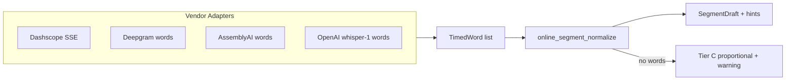

# 在线 STT 统一分段 — Intent

> **Research**：[`online-stt-segmentation-nlp-stack-research.md`](./online-stt-segmentation-nlp-stack-research.md)  
> **Plan**：[`online-stt-segment-unify-plan.md`](./online-stt-segment-unify-plan.md)  
> **Acceptance**：[`online-stt-segment-unify-acceptance.md`](./online-stt-segment-unify-acceptance.md)  
> **Hand-test**：[`online-stt-segment-unify-hand-test-checklist.md`](./online-stt-segment-unify-hand-test-checklist.md)

---

## 1. 背景与问题

### 1.1 用户场景

口述史 / 访谈类项目依赖 **可编辑的多段转写**（时间轴、分段合并拆分、导出 DOCX 按段）。当前在线 STT 路径存在：

| 现象 | 影响 |
|------|------|
| 百炼 Fun-ASR **同步非 SSE** 常只返回 **单句** | 整轨一条 segment，无法按句编辑 |
| AssemblyAI / Deepgram 各自 **重复 gap 切句逻辑** | 行为漂移、难统一调参 |
| OpenAI `gpt-4o-*-transcribe` **无词级轴** | capabilities 标 `segmentTimestamps: true` 与真实能力不符 |
| 无词级时 **silent 单段** 或隐式比例切 | 违背 [`recording-transcribe-llm-pipeline.md`](../../architecture/recording-transcribe-llm-pipeline.md)「声学真源」诚实性 |

手测已确认：百炼 Key + 小音频转写 **成功**，但 `parse/save` 后 **仅 1 segment**（根因：适配器 `X-DashScope-SSE: disable` + 单 `output.sentence`）。

### 1.2 本仓现状（链路）

```
run_transcribe_cmd (online)
  → stt_native/* 或 project/transcribe.rs 适配器
  → rushi_value / TranscribeResponse
  → parse → save segments
```

- 重复切句：`assemblyai_words_to_segments`（`transcribe.rs`）、Deepgram 内联 gap 逻辑（`deepgram.rs`）
- 兜底：`stt_native/mod.rs` `rushi_value` 在无分句时 **单段 + warning**「厂商未返回分句时间戳…」
- 百炼：`stt_native/dashscope_asr.rs` 同步 REST，未消费 SSE `sentence_end`
- TS 契约：`definitions.ts` 中 dashscope `segmentTimestamps: false`（准确）；OpenAI 等为 `true`（部分夸大）

---

## 2. 目标（Outcome）

建立 **Tier A 优先** 的在线统一分段管道：

1. **共享真源**：`TimedWord[]` → 统一 gap / 标点切句 → `SegmentDraft[]`（Rust 单模块）
2. **百炼 SSE**：启用 `X-DashScope-SSE: enable`，按 `sentence_end` 事件组装 **多段 + ms 时间戳**
3. **厂商对齐**：AssemblyAI / Deepgram 迁入共享切句；OpenAI 在需要剪辑轴时走 **`whisper-1` + `timestamp_granularities=word`**
4. **诚实降级**：仅当无词级/句级轴时启用 **Tier C 比例切分**，并 emit `online_segmentation_proportional` hint（不得 silent 冒充精确）
5. **能力—UI 对齐**：拆分 / 校正 `wordTimestamps` 与 `segmentTimestamps` 声明，与 [`desktop-capability-ui-state-alignment.md`](../../architecture/desktop-capability-ui-state-alignment.md) 一致

**成功判据（产品）**：同一 ~3–5 分钟访谈音频，百炼 / Deepgram / AssemblyAI 在线转写后 **≥2 个可编辑 segment**（有自然停顿或句界时），且句首时间戳在波形上 **语段级可用**（验收见 acceptance §4）。

---

## 3. 非目标（Explicit Out of Scope）

| 不做 | 理由 |
|------|------|
| Sidecar forced alignment（stable-ts / Qwen3-FA / MFA）作默认路径 | 调研 Tier B；另开 R3g-B-Align spike，本薄片不交付 |
| LLM 文本→时间 作主分段真源 | 违反 architecture L2 声学真源 |
| Fun-ASR 异步 `file_urls` 长音频 Job | 可后续薄片；本薄片聚焦同步/SSE + 已有 async 厂商 |
| 本机 Paraformer / `segmentation.py` 行为变更 | 在线为并行薄层，不 fork 第二套本机 VAD |
| 无 warning 的比例切分 | 不可接受的产品诚信 |
| 宣称 `gpt-4o-transcribe` 自带词级轴 | OpenAI 文档明确限制；须 whisper-1 或 align |

---

## 4. 方案概要（与调研决策对齐）

调研结论：**统一办法 = Adapter 抽 TimedWord → 共享切句 → 厂商原生优先 → 可选 align（未来）→ Tier C 兜底 + warning**。

本薄片实施范围 = **Tier A + 百炼 SSE**（用户已确认方向）：



**精度 Tier（验收口径）**

| Tier | 来源 | 产品承诺 |
|------|------|----------|
| A | API words / SSE sentence_end | 可剪辑、caption 级 |
| C | 标点 + 字符比例 | 仅草稿；hint 明示 |

---

## 5. 约束与对齐

- **Architecture**：[`recording-transcribe-llm-pipeline.md`](../../architecture/recording-transcribe-llm-pipeline.md) — 分段时间以声学/API 为准
- **在线 Provider 文档**：实施后更新 [`stt-online-providers.md`](../../architecture/stt-online-providers.md) Tier 表
- **ACC-STT-ALI**：百炼词汇表 / 热词路径不变（[`acc-stt-ali-acceptance.md`](./acc-stt-ali-acceptance.md)）
- **代码纪律**：新逻辑落 `project/online_segment_normalize.rs` + adapter 薄改；choke point 在 `run_transcribe_cmd`；禁止页面层编排

---

## 6. 风险与缓解

| 风险 | 缓解 |
|------|------|
| 百炼 SSE 与同步 payload 大小限制（~20MB data-uri） | 保持现有大小 guard；大文件错误信息不变；长音频 follow-up 薄片 |
| SSE 解析中断 / 半包 | Rust 流式缓冲 + 单测 fixture；失败降级 Tier C + error hint |
| OpenAI 双模型（gpt-4o 文本 + whisper-1 时间） | Plan Phase 4 可选；默认在线模型策略在 plan 写清 |
| 共享 gap 阈值与厂商 utterance 不一致 | 单测 golden + 手测波形抽样；阈值集中常量 |
| `cargo test --lib` 既有 postprocess 重复 import | 本任务不扩 scope；acceptance 跑定向 `stt` / transcribe 测试 |

---

## 7. 交付物

| 交付 | 说明 |
|------|------|
| Rust | `online_segment_normalize.rs`；`dashscope_asr.rs` SSE；`transcribe.rs` / `deepgram.rs`  refactor；`run_transcribe_cmd.rs` 入口 |
| TS | `definitions.ts` capabilities；`asrTranscribeHints` 新 hint |
| 测试 | Rust unit（切句 / SSE parse）；既有 vitest 不回归 |
| 文档 | `stt-online-providers.md`；本三件套 + hand-test |
| 验证 | `npm run typecheck && npm run test && node scripts/check-architecture-guard.mjs` + hand-test checklist |

---

## 8. 分期与优先级

| 期 | 主题 | 用户可见价值 |
|----|------|--------------|
| **P1** | 共享 normalize + choke point + AssemblyAI/Deepgram 迁入 | 行为一致、可单点调参 |
| **P2** | 百炼 SSE 多句 | 解决当前「整轨一段」主痛点 |
| **P3** | OpenAI whisper-1 word 轴 + capabilities 拆分 | 全球 OpenAI 用户剪辑可信 |
| **P4** | Tier C fallback + hints + 文档 | 边界诚实、无 silent 单段 |

Plan 文件含文件级任务清单与验证命令；**编码在 Plan 与用户确认后开始**。

---

## 9. 开放问题（Plan 前默认）

| # | 问题 | Intent 默认 |
|---|------|-------------|
| Q1 | OpenAI 在线默认模型是否一律切 whisper-1 取词级？ | 仅当 UI 选「需时间轴」或 provider 配置 `needsWordTimestamps`；gpt-4o 仍可用于纯文本 |
| Q2 | gap 阈值 ms | 与现 AssemblyAI 默认对齐（Plan 写死常量并单测） |
| Q3 | 百炼 SSE 失败是否 retry 同步？ | 否；一次 SSE，失败 → Tier C + hint（避免双倍计费） |

---

## 10. 签收

- [x] Intent 定稿（2026-06-07）
- [ ] 用户确认 Intent + Plan 后进入 Implement
- [ ] Acceptance 全部 PASS 后关闭本薄片

**变更记录**

| 日期 | 说明 |
|------|------|
| 2026-06-07 | 初版：Tier A + 百炼 SSE；链路透；非目标与分期 |
