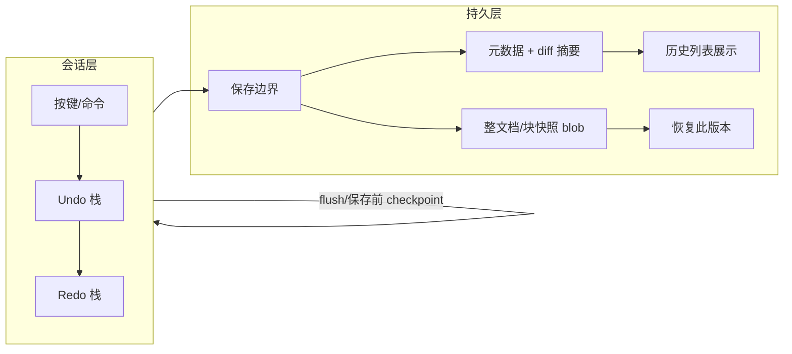

# 调研：REV-LOC — 撤销栈对齐 + 编辑历史恢复（单机）

> **状态**：已采纳（2026-05-31）· 切片 A/B 已编码（2026-06）· §2 业内对照补全（2026-06-03）  
> **关联**：[Acceptance](./rev-loc-undo-edit-history-acceptance.md) · [Plan](./rev-loc-undo-edit-history-plan.md)  
> **Backlog**：[`personal-solo-v1-backlog.md`](./personal-solo-v1-backlog.md) §3.3  
> **现状真源**：[`useSegmentUndoRedo.ts`](../../../apps/desktop/src/pages/useSegmentUndoRedo.ts)、[`segment_cmd.rs`](../../../apps/desktop/src-tauri/src/project/segment_cmd.rs)、[`edit_log_detail.rs`](../../../apps/desktop/src-tauri/src/project/edit_log_detail.rs)、[`edit_log_snapshot.rs`](../../../apps/desktop/src-tauri/src/project/edit_log_snapshot.rs)

---

## 1. 问题陈述

| 项 | 内容 |
|----|------|
| **用户场景** | ① 长时间改稿（含自动保存）后 ⌘Z 行为不符合预期；② 编辑历史只能看到 `save_segments` 元数据，无法回到某一保存时的正文。 |
| **本仓现状** | **撤销**：切片 A 已在 `flush` 前 `pushUndo`；**历史**：`edit_log` + `edit_log_snapshots` + 恢复 API/UI（切片 B）；`text_changes` 须在 **事务更新 segments 前** 读库 baseline（见 §2.4）。 |
| **成功标准** | 手测：纯 draft 编辑 + 自动保存后仍可撤销到改前；选一条含正文 diff 的历史记录可恢复语段正文并与列表一致。 |

---

## 2. 业内成熟路线（≥2）

| # | 路线 | 代表 | 核心机制 | 可验证参考 |
|---|------|------|----------|------------|
| A | **操作栈 + 检查点** | VS Code、多数桌面编辑器 | 每次可撤销事务入栈；保存前可选 checkpoint | [VS Code Undo](https://code.visualstudio.com/docs/editor/codebasics#_undo-and-redo) |
| B | **版本历史（里程碑）** | Google Docs、Notion、Descript | 持久化版本列表；选中即恢复整文档/项目快照 | Docs「版本历史」；Descript 项目历史 |
| C | **事件溯源 / revision** | Figma、协作文稿 R8 规划 | `revision_events` 追加式事件，可回放 | 本仓 [`collaboration-storage-schema.md`](../../architecture/collaboration-storage-schema.md) |
| D | **仅诊断日志** | 早期 IDE Local History 文件级 | 按文件时间戳恢复，非操作级 | 与本仓 `edit_log` 接近但缺 blob |

### 2.1 两层能力模型（业内通用拆分）

几乎所有「能改又能回溯」的产品都会把 **会话撤销** 与 **持久版本历史** 分开，**不用同一套结构包办**：

| 层 | 用户感知 | 典型粒度 | 持久化 | 代表 |
|----|----------|----------|--------|------|
| **会话撤销 / 重做** | ⌘Z / ⇧⌘Z | 操作或短窗口合并（输入合并） | 多数仅内存；部分桌面端会落盘 | VS Code、Zed、Word |
| **版本 / 历史** | 「版本历史」「本地历史」「恢复此版本」 | **保存点 / 里程碑**（非逐键） | 必持久化 | Google Docs、Notion、IDE Local History |

Rushi：**切片 A** = 会话层对齐；**切片 B** = 持久层里程碑（与 P1「追溯 = 保存批次」一致）。

### 2.2 四条路线的实现要点

| 路线 | 业内典型实现 | 恢复 / 展示 |
|------|----------------|-------------|
| **A 操作栈 + 检查点** | 内存 undo/redo；在持久化边界打 checkpoint（保存、flush、大块替换前） | 列表不负责「整篇回到昨天」；⌘Z 管会话内 |
| **B 里程碑快照** | 每次有意义 `save` 写 revision 行 + **整状态 blob**；可选 op log，打开历史时「最近快照 + 少量重放」 | UI 选中版本 → 整状态替换或生成 revert ops |
| **C OT / CRDT / revision** | append-only 操作流；周期性 snapshot 裁剪 log | 协作 scale；单机 v1 成本过高 |
| **D 文件级 Local History** | 磁盘按时间戳复制文件（VS Code Timeline、IntelliJ Local History） | 适合单文件文本；不适合多语段 uid + 时间轴工程 |

**补充参考（可验证）**：

- VS Code：[Undo and redo](https://code.visualstudio.com/docs/editor/codebasics#_undo-and-redo)（会话栈；Timeline 为另一套文件备份）
- Zed：本地 SQLite 持久化 **整段 undo 历史** BLOB，重启可恢复；`mtime` 校验防外改文件后错套历史（[zed#51357](https://github.com/zed-industries/zed/pull/51357)）
- Notion 类：**operation log + page snapshot**；浏览版本 = 最近快照 + 必要时重放；恢复 = 以快照状态写入新一轮变更（公开设计材料常见表述，如 [Notion system design 综述](https://www.educative.io/blog/notion-system-design)）
- OT 系（Google Docs 等）：中心 transform + **周期性 snapshot 裁剪**长 log（[OT 与快照](https://sujeet.pro/articles/operational-transformation)）

### 2.3 历史列表如何展示「具体改动」

| 做法 | 谁常用 | 要点 |
|------|--------|------|
| **保存时 diff** | Notion 式摘要、Rushi `edit_log_detail` | 在 **UPDATE 之前** 读取旧正文，与即将持久化的新正文对比；保存后再读库则 diff **恒为空** |
| **快照间 diff** | 部分版本历史 UI | 浏览时对相邻两个 blob 现场 diff（成本在打开历史时支付） |
| **操作 log 聚合** | OT/CRDT | 将 insert/delete 聚合成「语段 N：A→B」 |
| **仅元数据** | 粗粒度自动保存 | 「保存 N 条语段」——无正文变更或 diff 算错时出现 |

业内列表普遍：**主行 = 聚合摘要**，**次行 = 逐条 diff（ capped ）**；Rushi 的 `summarizeHistoryHeadline` / `formatHistorySubLines` 属同一模式。

### 2.4 实现纪律：保存前 baseline（本仓踩坑记录）

**业内约束**：`text_changes` / `summary` 必须用 **开启写库事务之前** 的 segments 正文作为 `before`。

**本仓曾犯错误**：在 `file_save_segments_inner` 事务内 **已 UPDATE segments 之后** 再调用 `build_save_segments_edit_detail` 读库 → `before` 与 `after` 相同 → 列表仅显示「保存语段（N 条）」。

**修复**（2026-06）：事务前 `load_segment_text_by_uid`，经 `build_save_segments_edit_detail_from_baseline` 写 `edit_log`；恢复记录在 `file_restore_segments_from_edit_log` 路径上对 **当前库内正文 vs 快照** 同样先 diff 再写入。

**数据说明**：修复前已落库的 `edit_log` 行无法 retroactive 补全 diff；仅 **修复后新产生的保存/恢复** 条目展示具体改动。

---

## 3. 可复用评估

| 路线 | 复用度 | 可直接用 | 冲突 / 成本 |
|------|--------|----------|-------------|
| A 检查点对齐 flush | **高** | 扩展 `flushSegmentTextDrafts` / `saveSegments` 前 `pushUndoForTextEdit` | 自动保存频繁 → 栈消耗快；需与 1.2s 合并策略一致 |
| B 版本历史 MVP | **中** | 每次 `save_segments` 后存 **file 级 segments 快照** + `edit_log_id` 关联 | 长项目 blob 体积；需保留策略（条数/总 MB） |
| C revision_events | **低** | 协议可借鉴 | 与 R8 重复建设；v1 不做 |
| D 仅增强 detail 文本 | **中** | 已有 `text_changes` | **无法整篇恢复**，仅适合阅读 |
| A+B 组合（Rushi v1） | **高** | 会话栈 + `edit_log` + `edit_log_snapshots` | 无 op log；长项目靠条数上限（30/file） |
| Zed 式持久化 undo | **低**（v1） | 可借鉴 BLOB + mtime 校验 | 与「追溯=保存批次」产品口径不同；可作后续薄片 |

**本仓已有（须扩展，禁止第二套真源）**：

- `useSegmentUndoRedo` — 会话撤销
- `edit_log` + `edit_log_detail` — 保存批次摘要
- `file_save_segments` — 语段真源 SQLite
- `discardEditingSession` / `flush` 包装 — 撤销与草稿协调

---

## 4. 决策摘要

| 问题 | 结论 |
|------|------|
| **切片 A（撤销）** | `flushSegmentTextDrafts` 对每个将变更的 `idx` 先 `pushUndoForTextEdit(idx)`，再 `setSegments`；与 `undo` 现有 flush→pop 顺序兼容。 |
| **切片 B（恢复）** | 每次成功 `save_segments` 后写入 **file 级快照**（新表 `edit_log_snapshots` 或等价），`edit_log.id` 外键；UI「恢复此版本」调用 `file_restore_segments_from_edit_log`。 |
| **不做什么** | CRDT/协作 revision、Word Track Changes、逐键 audit、跨项目恢复、无确认的一键覆盖 |
| **与 ADR** | 对齐 P1 放宽口径（撤销=会话；追溯=保存批次）；不引入 R8 `revision_events` |
| **风险** | 快照体积；自动保存过密 → 快照保留条数上限 + UI 合并展示「无 diff 条目」 |
| **与业内对齐** | 属路线 **B（里程碑）+ A（检查点）** 单机子集；非 OT/CRDT 全量方案 |

### 4.1 与 Rushi 落码对照

| 能力 | 业内常见 | Rushi 落位 |
|------|----------|------------|
| 会话撤销 | 内存栈，输入合并 | `useSegmentUndoRedo`（全量 segments，40 帧，1.2s 同语段合并） |
| 自动保存与撤销对齐 | 持久化前 checkpoint | 切片 A：`flushSegmentTextDrafts` → `pushUndoForTextEdit` → `setSegments` |
| 版本列表 | revision / edit_log | `edit_log` + `project_list_edit_log`（`has_snapshot`） |
| 可恢复 | 里程碑 blob | `edit_log_snapshots.segments_json` |
| 恢复动作 | 确认后整状态替换 | `file_restore_segments_from_edit_log` + `RestoreEditLogConfirmDialog` |
| 恢复行可读 | 恢复前后 diff + 源版本摘要 | `build_restore_from_edit_log_detail` |
| 保留策略 | 条数 / 总大小 | `SNAPSHOTS_PER_FILE = 30` |
| **v1 不做** | 逐键 audit、协作 merge、跨项目恢复 | acceptance §不做 |

**相对 Docs/Notion**：更轻（无中心 op log、无 transform）。**相对 VS Code Local History**：更重（快照在 SQLite，绑定语段模型）。**相对 Zed**：未持久化整段 undo 栈，仅持久化保存批次快照。

### 4.2 后续可选（非 v1 承诺）

1. **浏览时再 diff**：列表只存 id/summary，点开时对相邻 snapshot 现场 diff，降低对单次保存 diff 的依赖。  
2. **合并无正文变更的自动保存**：连续 `save_segments` 无 `text_changes` 时合并列表项，减少「保存 N 条语段」刷屏。  
3. **持久化 undo**（Zed 路线）：重启后仍可 ⌘Z，与里程碑恢复互补。  
4. **R8**：`revision_events` + OT/CRDT，避免与当前 `edit_log` 双轨。

---

## 5. 落位预告

| 层 | 文件（已落 / 预计） |
|----|---------------------|
| Rust | `edit_log_snapshot.rs`、`edit_log_detail.rs`（`from_baseline`）、`segment_cmd.rs`、`project_query_cmd.rs` |
| TS | `flushSegmentTextDrafts.ts`、`useSegmentMutationController.ts`、`useEditorEditHistory.ts`、`EditorSegmentToolbar.tsx`、`RestoreEditLogConfirmDialog.tsx`、`useProjectLifecycleController.ts`（`restoreEditorFromEditLog`） |
| 测试 | `segment_cmd_tests::file_save_segments_edit_log_records_text_changes`、`file_restore_segments_from_edit_log_*`、`useEditorEditHistory.test.ts` |
| 手测 | [rev-loc-slice-a-hand-test-checklist.md](./rev-loc-slice-a-hand-test-checklist.md)、[rev-loc-slice-b-hand-test-checklist.md](./rev-loc-slice-b-hand-test-checklist.md) |
