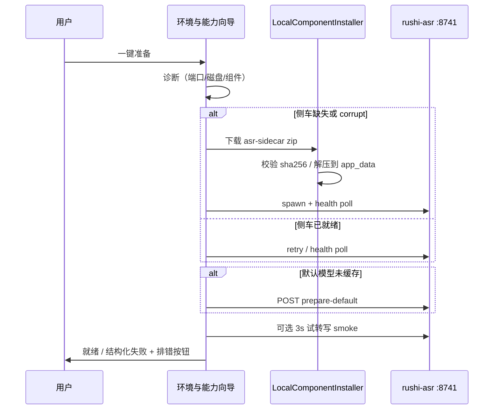

# 调研与整改方案：本地运行时目录（Local Runtime Catalog）

> **状态**：规划真源（**v1.2**，2026-05-27 — release-system 编码闭环与 rollback 三分法）  
> **v1.1**：2026-05-26 审查吸收  
> **目标读者**：产品 / 架构 / 实施  
> **审查**：[`rushi-local-runtime-catalog-remediation-plan-review.md`](./rushi-local-runtime-catalog-remediation-plan-review.md)（2026-05-26）  
> **排期索引**：[`rushi-execution-roadmap.md`](../plans/rushi-execution-roadmap.md) **§4.1.1**（R3 唯一实施顺序；epic **R3h**）+ **§4.1.4**（`R3h-I` 工业成熟度对齐收口轨）
> **关联**：[`asr-sidecar-funasr-policy.md`](../../architecture/asr-sidecar-funasr-policy.md)、[`r3f-asr-setup-wizard-acceptance.md`](./r3f-asr-setup-wizard-acceptance.md)、[`r3-provider-configuration-research.md`](./r3-provider-configuration-research.md)、[`postprocess-remote-boundary.md`](../../architecture/postprocess-remote-boundary.md)

---

## 0. 决策摘要

| 议题 | 结论 |
|------|------|
| 发行用户是否应使用命令行？ | **否**。诊断、引导、下载、安装、测试、排错均在应用内完成。 |
| 「一体化」指什么？ | **统一的组件目录 + 下载器 + 就绪状态机 + UI**；不是把 FunASR 与 LLM 打进同一个 PyInstaller。 |
| 侧车与模型的关系？ | **侧车 = 推理运行时**（~2GB）；**权重 = 独立 artifact**（`models/`）；二者分开下载、分开验收。 |
| 应用内 pip / PyInstaller？ | **不作为主路径**；仅「高级 / 开发者」兜底（原 R3f-C 升格为 R3h-E）。 |
| 未来本机大模型？ | **第二类组件**（`llm-runtime` + `llm-model`），与 ASR 侧车并列；**仍不进** `rushi-asr` Python 侧车。 |
| 与 Ollama / LocalAI 关系？ | **不嵌入**为 ASR 引擎；LLM 可选 **检测外部 Ollama** 或 **自管 llama-server catalog**（Phase 4）。 |
| FunASR 侧车是否长期唯一引擎？ | **方案 A 已锁定（2026-05-26）**：Phase 0–3 **继续 FunASR + LRC**；**R3h-3.5 Sherpa Spike** 后再决定是否迁移。见 [ADR-0003](../../adr/0003-asr-engine-funasr-first-sherpa-spike-gate.md)。 |
| ~2.5GB Python 侧车风险？ | Spike 未通过则在 policy **明示接受**；通过则另 ADR 规划迁移。 |
| **Sherpa 直接上（方案 B）？** | **否** — 不跳过 R3h-0/1；不推迟发行止血。 |

### 0.1 引擎路线（方案 A，已确认）

```text
现在 ──► R3h-0/1（FunASR 构建 + LRC 下载）──► R3f / R3e-A / R3g-A / R3h-2/3
                                              │
                                              ▼
                                    R3h-3.5 Sherpa Spike（1 周）
                                              │
                         ┌────────────────────┴────────────────────┐
                         ▼                                         ▼
                   Spike 通过                                  Spike 不通过
              规划 sherpa 迁移 ADR                          加固 FunASR + LRC
              （保留 HTTP 或薄兼容层）                      policy 明示体积约束
```

**LRC 不变**：无论 runtime 是 FunASR zip 还是未来 Sherpa/ONNX 包，manifest、installer、就绪 UI 同一套。

---

## 1. 背景与问题陈述

### 1.1 产品目标（发行版）

用户打开 Rushi 后，在 **环境与能力** 中即可完成：

1. **诊断** — 看清缺的是运行时、权重、端口、磁盘还是云 API。  
2. **引导** — 按步骤说明与预估时间/流量。  
3. **下载** — 侧车包、语音模型、（远期）本机 LLM 运行时与权重。  
4. **安装** — 解压/校验到应用数据，可选升级。  
5. **测试** — 应用内 smoke（health、短试转写、LLM ping）。  
6. **排错** — 重试、重下、清缓存、导出诊断包；**零必需 shell**。

### 1.2 现状缺口（2026-05-26 代码对照）

| 现象 | 根因 | 影响 |
|------|------|------|
| dev 显示「有侧车」但 `/health` 500 | PyInstaller 未收集 `funasr` 包数据（如 `version.txt`）；`bundledAvailable` 仅检查 exe 存在 | 一键准备失败，用户误以为已装好 |
| 无侧车时需 `npm run asr:build-sidecar-unix` | 侧车只读 `resources/bundled-asr/`，无应用数据安装位、无联网下载 | 非开发者无法自助 |
| R3f 一键准备只 `retry_bundled` + prepare | 无法修复**损坏/残缺**安装包 | 排错停留在文案层 |
| LLM 后处理与 ASR 分通道（正确） | 无统一「就绪」外壳 | 未来本机 LLM 易再长成第三套 UX |
| R3c 已做缓存/manifest 展示 | 未覆盖**侧车运行时**分发 | 模型与运行时概念易混 |

### 1.3 已知事故（须纳入整改验收）

- 构建产物 `_internal/` 无完整 `funasr/` 目录 → `GET /health` → `FileNotFoundError: .../funasr/version.txt`。  
- **整改门禁**：任何侧车发布物必须通过 **post-build smoke**（起进程 → `/health` 200 且 `funasr_import_ok`）。

### 1.4 Phase 0 状态术语冻结（实施真源）

后续实现、测试与 UI 文案统一按下表解释，禁止再把“可启动”“运行时健康”“模型完整”“真正可转写”混成一个 `ready`：

| 字段 | 含义 | 允许为 `true` 的前提 |
|------|------|----------------------|
| `bundledAvailable` | 安装介质里存在 bundled sidecar 可执行文件候选 | 至少找到 1 个有效 exe |
| `sidecarIntegrity` | bundled sidecar 自身是否明显损坏 | `ok / corrupt / unknown / not_installed` |
| `funasr_ready` | **运行时健康**；仅表示 `ffmpeg + funasr import` 可用 | 不要求模型完整 |
| `funasr_default_model_cached` | 默认主识别模型缓存完整 | 仅主模型完成 |
| `funasr_required_models_cached` | 当前默认 ASR 所需模型集合完整 | 主模型 + 必需辅助模型（至少 VAD）均完成 |
| `readyForTranscribe` / `ready_for_transcribe` | **真正可转写** | `funasr_ready && funasr_required_models_cached` |

实施约束：

1. `/health` 必须同时暴露 `funasr_ready` 与 `ready_for_transcribe`，两者不得混用。
2. UI 上的“可直接转写”“100%”“完成”只能绑定 `readyForTranscribe`。
3. wizard / installer / catalog / diagnostics 必须共用同一套字段定义，不允许各自再做字符串猜测。

---

## 2. 业界调研（同类产品怎么做）

### 2.1 模式归纳

| 模式 | 代表 | 运行时 | 模型/权重 | 分发 | 适用 |
|------|------|--------|-----------|------|------|
| **A. 内置 server + 分层拉取** | [Ollama](https://ollama.com) | 安装包内嵌 | OCI 式 blob + manifest，断点续传 | Registry `pull` | LLM；**最值得借鉴的下载协议** |
| **B. 应用内 Catalog + GGUF** | LM Studio、Jan、GPT4All | 内嵌 llama.cpp / MLX | 应用内选模型下载到固定目录 | HF / 自有站 | LLM |
| **C. 双 Catalog（runtime + model）** | Parlotype | 应用内装 `llama-server` | 再装 GGUF | GitHub Releases + catalog | 语音/多模态桌面；**与 Rushi 远期最像** |
| **D. 轻量 ASR：cpp + 自动下 ggml** | WhisperDesk、WhisprLocal | whisper.cpp 编译进应用 | 首次使用下载 `ggml-*.bin` | Hugging Face | ASR；栈与 FunASR 不同 |
| **E. 服务化 + ModelScope 自动拉** | FunASR runtime SDK | Docker / `funasr-wss-server` | 启动参数 `--model-dir` 触发下载 | ModelScope | 服务器；**非桌面主路径** |
| **F. 全栈网关** | LocalAI | 多 backend OCI | Gallery `/models/apply` | 多种 URI | 功能全、体积大；**不推荐嵌入 Rushi** |
| **G. 开发者一键 pip** | funasr-server、本仓 `install-funasr-for-desktop.sh` | 脚本建 venv | pip + 手动起服务 | pip | **仅开发兜底** |

### 2.2 行业共识（与 Rushi 政策对齐）

1. **终端用户主路径**：安装包或首次启动获得 **已签名运行时**；**大文件权重按需下载**。  
2. **极少**对终端用户暴露 pip / 本地编译；若存在，藏在高级设置。  
3. **本地 HTTP + OpenAI 兼容 API** 降低壳与引擎耦合（Rushi ASR 已是 `127.0.0.1:8741`）。  
4. **LLM 与 ASR 运行时分离** 是常态（Ollama 不管 FunASR；Whisper 应用不管 Llama）。

### 2.3 明确不采纳

| 方案 | 原因 |
|------|------|
| 发行主路径应用内 PyInstaller | 慢、难签名、难排错、磁盘翻倍 |
| 嵌入 LocalAI 作为唯一本地引擎 | 与 FunASR 双栈、矩阵爆炸 |
| 用 Ollama 替代 rushi-asr 侧车 | ASR 栈不同（GGUF vs PyTorch FunASR） |
| FunASR Docker 作为桌面默认 | 依赖 Docker、非「纯小白」 |

### 2.4 可补充借鉴（纳入整改，非主路径变更）

| 实践 | 来源 | 纳入阶段 |
|------|------|----------|
| Tauri 内嵌原生二进制 + 轻量 `binaries/` 布局 | AudioX 等 | Phase 0 构建脚本参考；长期见 Phase 3.5 |
| 首次启动 onboarding 统一下载（运行时 + 默认模型） | Vox、WhisperKey | Phase 2：installer 编排 `prepare` |
| 模型 catalog 展示 RAM/磁盘/量化阈值 | GPT4All、Jan | R3g-A |
| 侧车常驻（避免每次转写冷启动） | StarWhisper 等 | Phase 3 后评估，不阻塞 R3h-1 |
| 分发包压缩（`.7z` 等） | AnythingLLM | Phase 1 可选，弱网降流量 |

### 2.5 Tauri + Rust ASR 对标（长期雷达）

| 产品 | 侧车形态 | 体积级 | 对 Rushi 启示 |
|------|----------|--------|---------------|
| Vox / AudioX / MumbleFlow | whisper.cpp 原生 | 壳 ~10MB 级 | 同类桌面 ASR 多走 **原生引擎**；Rushi 因 FunASR/SenseVoice 选 Python 侧车属 **有意识取舍** |
| Rushi（当前） | PyInstaller FunASR | ~2.5GB | Phase 3.5 评估 **Sherpa-ONNX** 是否可收敛体积并保持中文精度 |

---

## 3. 目标架构：Local Runtime Catalog（LRC）

### 3.1 概念模型

```text
┌─────────────────────────────────────────────────────────────────┐
│  Rushi 桌面壳 —「环境与能力」统一向导                              │
│  · ComponentRegistry（只读 catalog，随壳版本发布）                 │
│  · LocalComponentInstaller（下载 / 校验 / 安装 / 卸载）            │
│  · ReadinessStateMachine（诊断 → 引导 → 测试）                    │
└───────────────┬───────────────────────────────┬─────────────────┘
                │                               │
     ┌──────────▼──────────┐         ┌──────────▼──────────┐
     │ 本机 ASR 通道        │         │ LLM 通道（远期）      │
     │ asr-sidecar (runtime)│         │ llm-runtime         │
     │ asr-model (weights)  │         │ llm-model (GGUF)    │
     └──────────┬──────────┘         └──────────┬──────────┘
                │                               │
         rushi-asr :8741                  llama-server :PORT
                │                               │
     ┌──────────▼──────────┐         ┌──────────▼──────────┐
     │ 在线 STT（无本地运行时）│         │ 云 LLM（已有）        │
     │ Provider + probe     │         │ postprocess_cmd     │
     └─────────────────────┘         └─────────────────────┘
```

**一体化** = 同一 Installer + 同一 UI 模式；**不合并** Python 进程。

### 3.2 组件类型（`component_kind`）

| kind | 说明 | 默认安装路径（应用数据根下） | 体积级 |
|------|------|------------------------------|--------|
| `asr-sidecar` | PyInstaller onedir，`rushi-asr-sidecar` | `sidecar/{platform}/{version}/` | ~2GB |
| `asr-model` | FunASR / ModelScope 权重 SKU | `models/`（已有 `RUSHI_MODELS_ROOT`） | 数百 MB～GB |
| `llm-runtime` | llama-server 等（远期） | `llm-runtime/{backend}/{version}/` | ~100–500MB |
| `llm-model` | GGUF 等（远期） | `llm-models/` | 按 SKU |
| — | 在线 STT / 云 LLM | 无本地包；仅配置 + probe | — |

### 3.3 侧车解析顺序（整改后）

1. **应用数据已安装**且通过 integrity + health smoke → 使用该 exe。  
2. **安装包 `resources/bundled-asr/`** 且通过 smoke → 回退（离线安装介质）。  
3. **均未就绪** → 向导提示「下载语音识别组件」；可选高级：venv / 手动 ASR URL。  

Win x64：在 `asr-sidecar` 层内仍保持 **CUDA 优先 → CPU 回退**（现有 `asr_sidecar.rs` 策略）。

### 3.4 Manifest 契约（发布真源）

发布侧车（及远期 LLM runtime）时，在 CDN / GitHub Releases 提供 **`rushi-runtime-manifest.json`**（可与壳版本解耦，见 policy §6）：

```json
{
  "manifest_version": 1,
  "published_at": "2026-05-26T00:00:00Z",
  "components": [
    {
      "id": "asr-sidecar",
      "version": "0.1.3",
      "platform": "darwin-arm64",
      "artifact": {
        "url": "https://…/rushi-asr-sidecar-0.1.3-darwin-arm64.zip",
        "size_bytes": 712000000,
        "sha256": "…",
        "format": "zip-onedir"
      },
      "min_shell_version": "0.2.0",
      "health_probe": {
        "path": "/health",
        "expect_json_keys": ["service", "funasr_import_ok"]
      }
    }
  ]
}
```

**原则**（借鉴 Ollama）：

- **内容寻址**：`sha256` 必检；可选分块 + Range 断点（Phase 2）。  
- **分层**：运行时 zip 与模型 SKU **分开** manifest 条目。  
- **原子安装**：解压到 `*.staging` → 校验 → rename。  

模型 SKU 可继续由侧车 `prepare` + Hub 拉取；manifest 仅列 **推荐默认 SKU id** 与预估大小（与 R3g catalog 对齐）。

### 3.5 就绪状态（`ReadinessReport` 扩展方向）

在现有 `AsrSetupReport` 上演进为分组件状态：

| 字段语义 | 说明 |
|----------|------|
| `sidecar.source` | `app_data` \| `bundled` \| `missing` |
| `sidecar.integrity` | `ok` \| `corrupt` \| `unknown`（exe 在但 health 失败） |
| `sidecar.version` | manifest / health 上报 |
| `model.default_cached` | 已有 |
| `disk` | 已有 |
| `port` | 已有 |
| `ready_for_local_transcribe` | sidecar integrity ok + `ready_for_transcribe` |

**禁止**：仅凭 exe 存在报 `installed: true`。

### 3.6 Installer 状态机（Phase 1，防并发）

侧车/运行时下载安装须单例编排，避免用户连点「一键准备」导致重复 spawn：

| 状态 | 含义 |
|------|------|
| `idle` | 无进行中的安装 |
| `downloading` | 拉取 artifact（可取消） |
| `installing` | 校验 + 解压 staging → 原子 rename |
| `verifying` | health smoke |
| `ready` | 可用 |
| `error` | 结构化错误码 + 重试 |

### 3.7 侧车升级 / 回滚（Phase 2 细化）

与路线图 **§4.1.5.1** 三分法对齐：

| 类型 | 说明 | 阶段 |
|------|------|------|
| **A 安装事务回滚** | 校验/解压失败 → **不切换** current | Phase 1 ✅ 编码 |
| **B 手动恢复 previous** | UI「恢复上一版 / 内置组件」 | Phase 1 ✅ 编码 |
| **C 自动健康回滚** | 切换后运行时劣化 → 自动回退 | Phase 2 / R3h-2 |

| 规则 | 说明 |
|------|------|
| 检测 | manifest `version` vs 本地 `app_data/sidecar/.../installed.json` |
| 升级 | 新包解压到 staging → smoke 通过 → 切换当前指针；失败触发 **A** |
| 回滚 | **B**：previous 槽 N=1；**C**：Phase 2 |
| 矩阵控制 | 壳发布时 **侧车 version 与 manifest 对齐**；`min_shell_version` 不兼容时强制提示升级运行时，**不**自动清 `models/` |

### 3.8 健康探测超时（Phase 1–2）

| 场景 | 策略 |
|------|------|
| 默认 | 冷启动轮询上限 **≥45s**（与 R3f `HEALTH_POLL_MAX` 对齐），文案说明「首次启动可能较慢」 |
| HDD / 慢盘 | 不自动检测磁盘类型；允许 **手动重试** + 诊断包记录末次 health 耗时 |
| 已就绪 | 侧车进程常驻时 `/health` 用 **短超时**（2s） |

---

## 4. 用户流程（发行版）

### 4.1 主路径：「准备本机语音识别」



### 4.2 排错动作（白名单）

| 动作 | 实现 |
|------|------|
| 重试下载侧车 | `installer.retry(component_id)` |
| 重新验证安装 | health smoke + integrity |
| 清除侧车安装（保留 models） | 删 `sidecar/…`，回退 bundled |
| 清除模型缓存 | 已有 R3c |
| 导出诊断包 | 已有 `diagnostic.rs`，扩展组件版本字段 |
| 打开应用数据目录 | 已有 `open_app_data_folder` |

### 4.3 在线 STT / 云 LLM

不下载本地 runtime；在同一 **环境与能力** 页用 **相同 UX 模式**：

诊断（配置是否完整）→ 探测（probe）→ 试一句（可选）→ 排错（密钥/网络/配额）。

与 LRC **共享** Readiness 外壳，不共享 Installer 实现。

### 4.4 远期：本机 LLM

- **Phase 4a**：检测 `127.0.0.1:11434`（Ollama）→ 后处理可选「本地 Ollama」。  
- **Phase 4b**：自管 `llm-runtime` manifest（Parlotype 式）→ 应用内下载 llama-server + GGUF。  
- **边界不变**：[`postprocess-remote-boundary.md`](../../architecture/postprocess-remote-boundary.md)。

---

## 5. 整改方案（分阶段）

### Phase 0 — 构建与门禁（阻塞，≈2–3 天）

**目标**：CI/本地打出的侧车包必定可 health。

| 项 | 内容 |
|----|------|
| 构建脚本 | `scripts/build-asr-sidecar-unix.sh` / Windows 脚本增加 `--collect-data funasr`（及必要 `--collect-binaries`）；更新 [`asr-pyinstaller-collect-notes.md`](../../architecture/asr-pyinstaller-collect-notes.md) |
| Post-build smoke | 新脚本：启动 onedir → `curl /health` → 断言 `funasr_import_ok`；接进 nightly workflow |
| 诊断 | `asr_setup_diagnose` 增加 `sidecarIntegrity: corrupt` 当 health 500 且 exe 存在 |
| **Windows 磁盘** | `asr_setup/diagnose.rs`：实现 `disk_free_bytes`（`GetDiskFreeSpaceExW`），与 Unix 行为一致 |
| **pip 降级** | 主 UI 移除 `install_funasr_deps` / pip 教程；仅高级折叠保留（对齐「零终端主路径」） |

**验收**：macOS arm64 本地 `npm run asr:build-sidecar-unix` 后 smoke 绿；损坏包被诊断识别；**Windows 手测**磁盘不足时有中文预警。

---

### Phase 1 — 应用数据侧车 + Manifest 下载（≈1–1.5 周）

**目标**：无开发构建的用户可应用内下载安装侧车，并具备最小可发布的 release-system 能力（信任链、保留旧版、失败回退）。

| 层 | 落位 |
|----|------|
| Rust | `src-tauri/src/local_runtime/`：`manifest.rs`、`installer.rs`、`integrity.rs` |
| 命令 | `local_runtime_diagnose`、`local_runtime_download_sidecar`、`local_runtime_cancel_download` |
| 改 | `asr_sidecar.rs`：`resolve_sidecar_executable()` 优先 app_data |
| TS | `src/services/localRuntime/localRuntimeContract.ts`、`src/tauri/localRuntimeApi.ts` |
| UI | 扩展 `LocalAsrSetupWizard`：下载进度、重试、损坏提示 |
| 发布 | GitHub Releases / 对象存储占位；**manifest URL 可配置**（内测 / 生产） |
| Installer | §3.6 状态机；下载可取消；禁止并发安装 |
| 大文件分发 | artifact **>2GB** 时：优先 **压缩 zip**；仍超限则 **分卷**（`.zip.001`）或对象存储直链；manifest 支持 `artifact.parts[]`（Phase 1 可先做单文件 + 压缩） |
| 镜像 | manifest 可选 `mirror_urls[]`，下载失败时顺序回退 |

**2026-05-26 代码对照**：工作区已出现 `local_runtime/` 最小闭环（manifest 读取、平台选择、sha256、staging 解压、app_data 优先、取消 / 清除 / 重新验证、UI 进度）。该实现可作为 R3h-1 起点，但**尚未等价于发行级 release system**。

**R3h-1 收口补充**（从评估吸收；本轮按 release-system 口径前移）：

| 项 | 要求 |
|----|------|
| Manifest schema | 文档示例与代码契约统一；明确 `artifact{}` 或扁平字段为唯一真源，并补 contract test |
| 生产源策略 | 生产默认只允许内置 manifest endpoint / HTTPS；`file://` 与明文 HTTP 仅开发 / 内测开关可用 |
| Manifest 信任 | manifest 采用签名元数据 + 壳内 pinned public key 校验；artifact `sha256` 继续作为内容校验 |
| 下载前预算 | 使用 `size_bytes` 做磁盘空间预检；运行时包与模型预算分开展示 |
| 安装安全 | 继续保留 `*.staging` + zip path traversal 防护；补解压后大小上限 / 文件数量上限，降低 zip bomb 风险 |
| 安装槽位 / 回退 | `current+previous` 或等价双槽；新包 verify 成功后再切换 current，失败保留旧版并允许显式恢复 |
| 诊断可追踪 | `diagnostic_bundle` 增加 manifest source、runtime source、installed version、last verify error、last install phase |

**验收**（手测）：

1. 空 `app_data/sidecar`、无 bundled → 向导触发下载 → health OK。  
2. 删 manifest 中一文件模拟 corrupt → 诊断 `corrupt` → 重下修复。  
3. 安装包带 bundled 且无网 → 仍可用 bundled。  
4. 新版本下载成功但 verify 失败 → 旧版 `current` 仍保持可用，可恢复到 previous / bundled。  
5. 生产策略下 `file://` / 明文 HTTP / 签名不合法 manifest 会被拒绝，且错误可诊断。

**手测记录（2026-05-27）**：

- `healthy install`：在无 bundled、空 `app_data` 条件下，向导触发 local runtime 下载并完成安装；过程中修复了冷启动 `/health` 超时误判。
- `corrupt -> diagnose -> repair`：删除 `funasr/version.txt` 后，UI 正确诊断为损坏；重新下载后恢复为 `verify_state=ok`。
- `bundled offline fallback`：移除 `app_data` runtime 且不注入 manifest 下载源时，dev 实例自动拉起 bundled sidecar，`/health` 最终返回 `ready_for_transcribe=true`。
- `upgrade failure keeps current`：以 `0.2.0` corrupt manifest 触发升级失败，日志记录 `local_runtime_verify_http_500`；`current.json` 保持 `0.1.0` / `verify_state=ok`，未覆盖旧版。
- `upgrade failure UI feedback`：补齐前端状态机与 verifier fast-fail 后，UI 明确提示“升级未生效，当前仍使用 0.1.0”并展示失败细节，不再长时间停留在“正在验证”。
- `release-system hardening`：补 manifest / artifact HTTP 超时、`verify/revalidate/restore` 取消、`clear` 不再误停无关 bundled、同版本重装保留 `previous`、更完整中文错误映射与 focused tests；验证通过 `npm run typecheck && npm run test && npm run lint && node scripts/check-architecture-guard.mjs && cargo test --manifest-path apps/desktop/src-tauri/Cargo.toml`。

---

### Phase 2 — 与 R3f/R3g 合并 + 断点续传（≈1 周）

| 项 | 内容 |
|----|------|
| R3f | 一键准备：缺/坏侧车 → 自动 Phase 1 下载，再 health → prepare |
| R3g | 模型 catalog 与 manifest 中 `recommended_asr_models` 一致；SKU 展示 **RAM/磁盘/量化** 阈值 |
| 下载器 | 大文件 Range + 持久化进度（policy §9 待办）；弱网/断网恢复手测纳入 R9 |
| 升级 | 在 Phase 1 的 `current+previous` 基础上补自动升级编排与版本迁移约束；不得先删除当前可用版本再切换 |
| Release System 收口 | 在已落地的签名校验 / 回退之上继续补事件化进度、更丰富签名元数据、发布证据对接 |
| 清理 | GC 只删除非 current / previous 且不在运行中的版本目录 |
| R3d | 环境 IA：五栏中「本机语音识别」= 运行时 + 模型 两区块 |

**修订规格**：[`r3f-asr-setup-wizard-acceptance.md`](./r3f-asr-setup-wizard-acceptance.md) 主路径改为 LRC；原「不做联网侧车」**废止**。

---

### Phase 3 — 统一环境与能力就绪（≈3–5 天）

**目标**：单页三盏灯（本机 ASR / 在线 STT / LLM）。

| 项 | 内容 |
|----|------|
| `EnvironmentReadinessPanel` | 汇总 LRC + STT probe + LLM probe |
| 首次转写前 | 仅检查将使用的通道 |
| 诊断 zip | 含各组件 version、integrity、disk |

依赖 [`r3d-settings-ia-acceptance.md`](./r3d-settings-ia-acceptance.md)。

---

### Phase 3.5 — 引擎评估门控：Sherpa-ONNX Spike（≈1 周，**不阻塞** R3h-0～2）

**目标**：验证能否在保持 SenseVoice/Paraformer 精度的前提下，摆脱 ~2.5GB Python 侧车（LRC 分发层不变）。

| 项 | 内容 |
|----|------|
| Spike | `sherpa-onnx` crate + SenseVoice int8；AISHELL/内部样本 **CER 对比** FunASR 侧车 |
| 平台 | macOS CoreML、Windows CUDA/DirectML 各至少一条 smoke |
| 结论 | 通过 → 规划 `asr_engine: funasr-sidecar \| sherpa-onnx`；不通过 → 在 policy **明示** Python 侧车为长期约束 |
| 文档 | 结论写入 `docs/adr/00xx-sherpa-onnx-evaluation.md`（Spike 后） |

**不采纳（Spike 前不变）**：faster-whisper（中文 CER 差）、纯 whisper.cpp 替代 SenseVoice（能力不匹配）。

---

### `R3h-I` — 工业成熟度对齐（收口轨，不改 Phase 0–3.5 主顺序）

**目的**：把 Phase 0–3 已经落地的发行止血能力，继续收口成更稳定、可回归、可替换的长期结构。`R3h-I` 是 **结构硬化轨**，不是新的产品承诺层。

| 子轨 | 目标 | 主要落位 | 建议接入点 |
|------|------|----------|------------|
| **R3h-I1 Runtime Supervisor** | 把 sidecar 启动/探测收成显式 supervisor FSM、watchdog、runtime identity，统一 `bundled` / `app_data` 真相 | `apps/desktop/src-tauri/src/asr_sidecar.rs`、`lib.rs`、`asr_setup/diagnose.rs` | **Phase 1** 稳定后可设计；建议在 **Phase 2–3** 收口 |
| **R3h-I2 Release System** | 在 Phase 1 已落地的签名校验、`current+previous`、rollback 之上继续收口成更完整的发布元数据、GC、事件化进度与长期可维护结构 | `apps/desktop/src-tauri/src/local_runtime/*.rs`、`apps/desktop/src/services/localRuntime/localRuntimeContract.ts` | 以 **Phase 2** 为主落点，避免早于 Phase 1 |
| **R3h-I3 Setup Machine** | 将 `ASR setup` 编排改成 reducer/state-machine，统一消费 diagnose / installer / model prepare 事件 | `apps/desktop/src/pages/useAsrSetupController.ts`、`asrSetupState.ts`、相关 contract / wizard 测试 | 依赖 **I1/I2** 契约后再收口，建议靠近 **Phase 3** |

**冻结边界**：

- `R3h-I` **不改**「零终端主路径」与现有 Phase 0–3.5 的产品验收语义。
- 默认走 **依赖轻** 的内部 reducer / state-machine，不为了 `R3h-I3` 引入 `xstate`。
- 当前默认口径：**Phase 1** 先落地 `signed manifest`、`pinned key`、`current+previous`、`rollback` 最小闭环；**Phase 2 / R3h-I2** 继续补 `GC`、`progress events`、更完整发布元数据与长期收口。
- 供应链成熟度补充：release 产物附 `sha256`、SBOM、provenance 摘要与 sidecar smoke 证据；Sigstore / SLSA 可作为后续增强，不阻塞 R3h-0/1 止血。
- 验证矩阵沿用：`cargo test`、`bash scripts/run-asr-pytest.sh tests -q`、桌面端 `typecheck/test`、`node scripts/check-architecture-guard.mjs`、打包后 sidecar smoke。

---

### Phase 4 — 本机 LLM 组件（≈2–3 周，可与 R9 前并行设计）

| 子阶段 | 内容 |
|--------|------|
| 4a | 检测 Ollama；后处理 `base_url` 指向 loopback |
| 4b | `llm-runtime` + `llm-model` manifest；Installer 复用 |
| 4c | 应用内试一句 + 与自动标点衔接 |

新 acceptance：`r3-llm-local-runtime-acceptance.md`（待起草）。

---

### Phase 5 — 高级 / 开发者（按需）

| 项 | 内容 |
|----|------|
| R3h-E | 应用数据托管 venv + 白名单 `pip install -r lock`（原 R3f-C） |
| R3h-F | 选仓库 + 跑 `build-asr-sidecar-*.sh`（日志进 UI）；**默认折叠** |

---

## 6. 与现有 R3 薄片的关系（排期建议）

| 原项 | 调整 |
|------|------|
| **R3f 手测** | 在 **Phase 0 完成后**签收；否则易被 corrupt 包误导 |
| **R3e-A / R3g-A** | 可与 Phase 1 **并行开发**；g-A 接口与 LRC manifest 对齐 |
| **R3d** | 建议在 Phase 2–3 做，纳入统一就绪页 |
| **新 epic R3h** | 本文件为真源；§4.1 路线图增加 R3h 行 |
| **`R3h-I`** | 设计可在 **Phase 1 后**并行；实施建议在 **Phase 2–3** 集中收口，不改主顺序 |
| **R9 REL-1** | 发行门禁增加：零终端侧车安装路径手测 |

**建议实施顺序**：

```text
R3h-0 (构建+smoke+Win磁盘) → R3h-1 (下载安装) → R3f 手测签收 → R3e-A → R3g-A → R3h-2/3 → R3d → R3h-3.5 (Sherpa Spike) → R3e-B
```

`R3h-I` 不单列进上面的产品签收顺序；它作为 **Phase 1 后可设计、Phase 2–3 收口** 的结构硬化轨，与路线图 `§4.1.4` 保持一致。

**审查结论**：**批准** Phase 0→3 按序推进；Phase 3.5 为 **有条件** 中期门控，不阻塞发行止血。

---

## 7. 非功能需求

### 7.1 安全

- 仅 HTTPS manifest；`sha256` 必检。  
- 安装路径限制在应用数据下；禁止任意 URL 写盘（manifest 由壳内置或签名配置）。  
- spawn 白名单：已安装侧车 exe、固定 venv python（高级）。  

### 7.2 磁盘（对齐 policy §8）

| 区块 | 预算 |
|------|------|
| 壳 + 非推理 | ~0.5–1 GB |
| asr-sidecar | ~2–2.5 GB |
| Win CUDA 侧车（可选第二包） | 计入安装介质 |
| models/ + 远期 llm-models/ | 至 **5GB 总计** 硬提示 |

UI **分开展示**「语音识别组件」与「语音模型」占用。

### 7.3 签名与升级

- macOS：侧车 Mach-O 与壳同签；应用数据下载包须来自 **已签名发布管道** 或 Apple 公证 zip。  
- Windows：Authenticode（见 `windows-release-checklist.md`）。  
- 壳升级 **不强制** 清 models；侧车可按 manifest `min_shell_version` 提示升级运行时。

---

## 8. 代码落位总表（实施时）

| 模块 | 路径 |
|------|------|
| Runtime Supervisor | `apps/desktop/src-tauri/src/runtime_supervisor.rs`（新）或 `asr_sidecar/supervisor.rs` |
| LRC 核心 | `apps/desktop/src-tauri/src/local_runtime/{manifest,installer,integrity,diagnose}.rs` |
| ASR 侧车解析 | `apps/desktop/src-tauri/src/asr_sidecar.rs`（改 resolve 顺序） |
| 诊断扩展 | `apps/desktop/src-tauri/src/asr_setup/diagnose.rs` 或迁入 `local_runtime/diagnose.rs` |
| 构建 smoke | `scripts/smoke-asr-sidecar-health.sh` |
| TS 契约 | `apps/desktop/src/services/localRuntime/` |
| Tauri API | `apps/desktop/src/tauri/localRuntimeApi.ts` |
| Setup Machine | `apps/desktop/src/pages/asrSetupMachine.ts`（新） |
| Controller | `useAsrSetupController.ts` → 或 `useLocalRuntimeController.ts` |
| UI | `envLocalAsr/LocalAsrSetupWizard.tsx`、`EnvironmentReadinessPanel.tsx`（新） |
| 测试 | Rust unit + Vitest contract；CI smoke |

---

## 9. 需修订的文档清单

| 文档 | 修订要点 |
|------|----------|
| [`asr-sidecar-funasr-policy.md`](../../architecture/asr-sidecar-funasr-policy.md) | §6 增加「应用数据侧车可联网更新」；§9 断点续传归 Phase 2 |
| [`r3f-asr-setup-wizard-acceptance.md`](./r3f-asr-setup-wizard-acceptance.md) | 主路径改为 R3h；R3f-C 迁至 R3h-E |
| [`rushi-execution-roadmap.md`](../plans/rushi-execution-roadmap.md) | §4.1 增加 R3h 行、顺序与 `R3h-I` 收口轨 |
| [`docs/architecture/README.md`](../../architecture/README.md) | 索引本文件 |
| `resources/bundled-asr/README.txt` | 说明 app_data 优先与下载入口 |

**ADR 建议**（可选）：`docs/adr/00xx-local-runtime-catalog.md` — 记录「不嵌入 Ollama/LocalAI 为 ASR」决策。

**已接受**：[ADR-0003](../../adr/0003-asr-engine-funasr-first-sherpa-spike-gate.md) — 方案 A（FunASR 先行 + R3h-3.5 Sherpa Spike）。Spike 结论另记 ADR 附录或新 ADR。

---

## 10. 风险与缓解

| 风险 | 缓解 |
|------|------|
| CDN/Release 运维成本 | 首版可用 GitHub Releases；manifest 单文件 |
| 下载失败率高 | 断点续传 Phase 2；明确错误码 |
| 与 R3e-B 同改侧车 | 排期串行：R3h-1 后再大改 transcribe |
| 本机 LLM 范围膨胀 | Phase 4 独立 acceptance；4a 先 Ollama 检测 |
| 双份侧车占磁盘 | UI 提示；允许删 app_data 版回退 bundled |

### 10.1 审查补充风险（2026-05-26）

| # | 风险 | 严重度 | 缓解 |
|---|------|--------|------|
| **R1** | ~2.5GB Python 侧车成为长期技术债 | 高 | Phase 3.5 Sherpa-ONNX Spike；否则 policy 明示接受 |
| **R2** | PyInstaller 冷启动慢（HDD 10–30s） | 中 | §3.8 超时与文案；远期常驻或换引擎 |
| **R3** | GitHub Releases 单文件 **2GB** 上限 | 中 | 压缩 zip；超限分卷或对象存储 + `mirror_urls` |
| **R4** | Defender / Gatekeeper 拦截下载二进制 | 中 | 官方发布管道 + 哈希校验 + UI 说明来源 |
| **R5** | 侧车×模型×平台×CUDA/CPU 矩阵膨胀 | 低 | `min_shell_version`；壳与 manifest 同发；模型由 FunASR 向后兼容 |
| **R6** | manifest 源被替换导致 URL 与 hash 同时被篡改 | 高 | R3h-I2：signed manifest + pinned public key；生产禁用非 HTTPS / 非内置源 |
| **R7** | 安装失败时覆盖或删除旧 runtime | 高 | R3h-2：current+previous / A/B 槽；验证通过后切换；失败保留旧版 |
| **R8** | manifest 文档契约与代码 schema 漂移 | 中 | R3h-1：统一 schema 真源并补 Rust / TS contract test |
| **R9** | 2GB 级下载在弱网、代理、企业网络中失败 | 中 | R3h-2：Range 续传、mirror fallback、proxy / timeout、弱网手测 |

### 10.2 长期技术雷达

| 技术 | 跟踪理由 | 决策时点 |
|------|----------|----------|
| **Sherpa-ONNX** | 减体积且保持中文/SenseVoice 生态 | Phase 3.5 |
| **Ollama OCI manifest** | 模型分发规模化时可复用 blob 协议 | Phase 4 后 |
| **whisper.cpp turbo** | 纯离线英文等第二引擎 | 远期 |
| **侧车常驻** | 降低重复加载 | Phase 3 后 |

---

## 11. 验收总表（发行门禁）

- [ ] **零终端**：新装用户从不执行 `npm` / `pip` / `bash` 即可完成本机 ASR 首次转写。  
- [ ] **构建 smoke**：发布流水线对每平台 sidecar artifact 跑 health。  
- [x] **损坏可恢复**：故意破坏 `funasr/version.txt` 后，应用诊断并一键重下修复（2026-05-27 手测）。  
- [x] **离线安装包**：无网时 bundled 仍可用（若介质含侧车，2026-05-27 手测）。  
- [ ] **概念清晰**：UI 区分「语音识别组件 (~2GB)」与「语音模型」。  
- [ ] **诊断包**：含 sidecar source、version、integrity、model cached。  
- [ ] **政策一致**：LLM 仍不进 ASR 侧车；云 STT/LLM 走 probe。  
- [ ] **Windows 磁盘**：空间不足时准备/下载前有预警（Phase 0）。  
- [ ] **弱网/断网**：下载中断可重试或续传（Phase 2）；无网 bundled 回退（Phase 1）。  
- [ ] **并发安全**：连点「一键准备」不重复下载/重复 spawn（§3.6）。  
- [x] **发行信任**：manifest 已签名并用壳内 pinned key 验证；artifact hash 必检。
- [x] **升级回滚（A/B）**：安装失败保留 current；可 **手动** 恢复 previous / bundled（2026-05-27 手测）。**自动健康回滚（C）** → Phase 2 / R3h-2。
- [x] **Schema 单一真源**：manifest 文档、Rust parser、TS contract、示例文件一致。

---

## 12. 附录：三类「模型」对照（避免团队混淆）

| 用户说法 | 技术实体 | 安装方式 |
|----------|----------|----------|
| 侧车 / 语音识别组件 | `asr-sidecar` onedir | manifest zip → `app_data/sidecar/` |
| 语音模型 / SenseVoice | `asr-model` 权重 | 侧车 `prepare` → `models/` |
| 大语言模型 | `llm-model`（远期）或云 API | GGUF catalog 或 keychain + HTTPS |
| 在线听写 | 无本地包 | Provider 配置 |

---

## 13. 附录：审查吸收记录

| 审查项 | 处理 |
|--------|------|
| M1 Sherpa-ONNX | → §5 Phase 3.5 |
| M2 Windows 磁盘 | → Phase 0 |
| M3 升级/回滚 | → §3.7、Phase 2 |
| M4 Installer 状态机 | → §3.6、Phase 1 |
| M5 大文件/分卷 | → Phase 1 |
| M6 健康超时 | → §3.8 |
| C1–C2 代码缺口 | → Phase 0 |
| R1–R5 风险 | → §10.1 |
| 竞品补充借鉴 | → §2.4–2.5 |
| 工业级评估补充（signed manifest / rollback / SBOM / schema drift） | → Phase 1/2、R3h-I、§10.1、§11 |

完整审查原文：[`rushi-local-runtime-catalog-remediation-plan-review.md`](./rushi-local-runtime-catalog-remediation-plan-review.md)。

---

*文档版本：1.2 · 2026-05-27 · v1.1 审查吸收；v1.2 对齐路线图 rollback 三分、状态口径、R3h-2 进度事件；随 R3h 实施更新 §5 / §11。*

### v1.2 变更摘要

- **§11**：区分安装事务回滚 / 手动 previous / 自动健康回滚（C → Phase 2）。
- 与路线图 **§4.1.5.1**、编码状态 **🟡 编码✅ / 发行⏳** 对齐。
- R3h-2：事件化下载进度 + 可恢复 + 与模型 prepare **真取消**（Q-R3g-3）统一契约。
