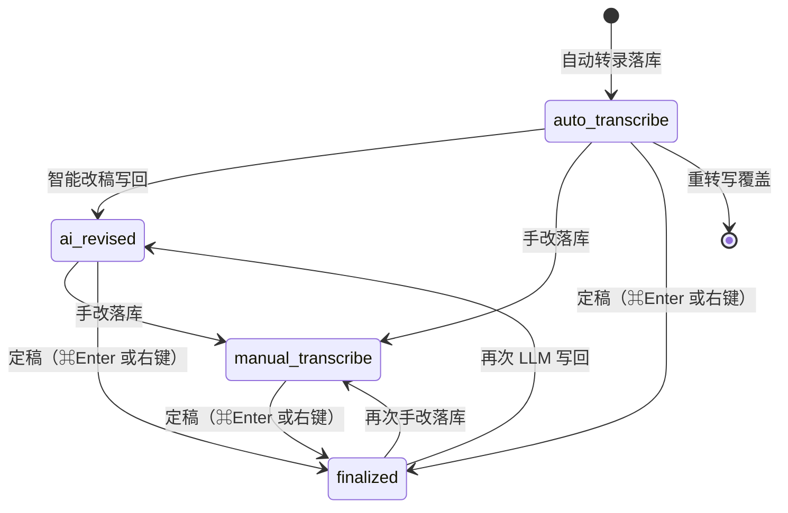

# 调研：语段编辑阶段视觉提示（四态：自动转写 / AI改稿 / 手动转写 / 定稿）

> **状态**：规划门禁（2026-06-06）  
> **关联路线图**：[`rushi-execution-roadmap.md`](../plans/rushi-execution-roadmap.md)（桌面 UI 重设计期 · 纵向薄片）  
> **关联 spec**：待 `segment-edit-stage-indicator-intent.md` / `…-acceptance.md`（编码前须链接本文）  
> **前置**：转写后 LLM 套件 [`r3t-f-post-transcribe-suite-research.md`](./r3t-f-post-transcribe-suite-research.md)；编辑历史 [`rev-loc-undo-edit-history-research.md`](./rev-loc-undo-edit-history-research.md)；协作域草案 [`collaboration-review-domain-api.md`](../../architecture/collaboration-review-domain-api.md) §TranscriptSegment.reviewStatus  
> **门禁**：未完成本文 **不得** 进入 Plan 定稿与业务编码（见 [`AGENTS.md`](../../../AGENTS.md) · `.cursor/rules/feature-research-gate.mdc`）

---

## 1. 问题陈述

| 项 | 内容 |
|----|------|
| **用户场景** | 改稿工作台中，用户需要 **一眼区分** 语段处于哪一编辑阶段：**自动转写**、**AI 改稿**、**手动转写**、**定稿**。提示放在 **语段行右侧**，用 **简短文案 + 徽标**；窄窗下仍可读。 |
| **本仓现状** | **数据**：[`SegmentDto`](../../../apps/desktop/src/tauri/projectTypes.ts) 仅有 `confidence` / `low_confidence` / `detail` / `kind`，**无** 编辑阶段或 review 状态字段；SQLite `segments` 表同构。**行为**：<br>· ASR：`project_run_transcribe` 整批替换语段（[`run_transcribe_cmd/mod.rs`](../../../apps/desktop/src-tauri/src/project/run_transcribe_cmd/mod.rs)）<br>· LLM：Stage B / 自动标点 / 段界 refine 等写回后 **不** 标记来源（[`PostTranscribeStageBDialog`](../../../apps/desktop/src/components/PostTranscribeStageBDialog.tsx)、[`useAutoPunctuateController`](../../../apps/desktop/src/pages/useAutoPunctuateController.ts)）<br>· 人工确认：⌘/Ctrl+Enter → [`confirmSegmentEditAndAdvance`](../../../apps/desktop/src/pages/useProjectSaveController.ts) 落库并跳下一条，**无** per-segment「已确认」持久标记；与普通自动保存（2s）在数据层无区别<br>· **已有 UI**：`low_confidence` 影响 [`segmentChrome.ts`](../../../apps/desktop/src/utils/segmentChrome.ts) 行底色，但 **无** 右侧阶段徽标；Stitch spec §7.3 仍写「低置信徽章」在左 gutter，与现网 [`SegmentRowTimestampColumn`](../../../apps/desktop/src/components/segmentRow/SegmentRowTimestampColumn.tsx) 仅行号+时间戳不一致<br>· **审计**：`edit_log` + `save_segments.text_changes` 可事后推断「谁改过字」，但 **不能** 高效驱动每行 UI，且不含「LLM 写回 vs 手改 vs 确认」语义 |
| **成功标准** | （1）**自动转写 / AI改稿 / 手动转写** 任一段均可 **右键或 ⌘Enter** 定为 **定稿**；（2）四态自动迁移链路正确；（3）重转写回到自动转写；（4）硬闸门通过。 |

### 1.1 与现有概念边界

| 概念 | 关系 |
|------|------|
| `low_confidence` | **ASR 质量**标记，与编辑阶段 **正交**；行底色已有提示，**不在 badge 重复**（tooltip 可带一句） |
| `segmentDraftStore` 未落库 | **会话内** transient；琥珀 **圆点** + tooltip「有未保存修改」，**不**写入 SQLite |
| `edit_log` / 撤销栈 | 历史恢复用；**不**替代 per-segment 当前阶段真源 |
| 协作域 `reviewStatus` | 未来 R8 审阅模式；本议题 **四态** 单机 transcription 字段，设计 **可前向兼容** |

---

## 2. 业内成熟路线（≥2）

| # | 路线 | 代表产品 | 核心机制 | 可验证链接 / 路径 |
|---|------|----------|----------|-------------------|
| **A** | **段落级人工勾选确认** | [Trint Editor](https://info.trint.com/knowledge/trint-editor-trint-help-center) | 每段 **右侧 checkbox**；勾选后变绿，顶栏 **「Paragraphs verified」** 计数；**不区分** ASR vs AI，仅「已审 / 未审」 | Trint Help · Reviewing your transcript |
| **B** | **CAT 工具状态列** | [memoQ](https://support.memoq.com/hc/en-us/articles/6162041844369-Status-column-in-the-translation-grid) · [LILT Translate](https://support.lilt.com/kb/segment-state-indicators) | 独立 **第三列** 展示段状态：Not started / Edited / Pre-translated / Machine translated / **Translator confirmed**（绿 + ✓）/ Reviewer confirmed（双 ✓）；可筛选跳转 | memoQ Status column；LILT segment state indicators |
| **C** | **文稿优先 · 无段级状态** | [Descript](https://help.descript.com/hc/en-us/articles/10119613609229-Correct-your-transcript) · Otter · Sonix | 改稿靠 **Correct / 搜索替换**；**不暴露** per-segment provenance 徽标；质量靠用户自行扫读 | [`r3t-f-post-transcribe-suite-research.md`](./r3t-f-post-transcribe-suite-research.md) §2.1 |
| **D** | **ASR 质量旗标（非编辑阶段）** | Gladia / Deepgram 类 QA | **词/句级 confidence**、quality flags；消费级编辑器少见「LLM 已改」标记 | Gladia confidence scores 文档 |

### 2.1 路线对照（与 Rushi 场景）

| 维度 | Rushi 目标 | A Trint | B memoQ/LILT | C Descript 系 |
|------|------------|---------|--------------|---------------|
| 阶段粒度 | **四态**：自动转写→AI改稿→手动转写→定稿 | 仅 未审/已审 | 多角色 + MT/HT/确认 | 无 |
| 位置 | **语段右侧** | 段右 checkbox | 独立状态列（右） | — |
| 文案 | 短标签 + 徽标 | 无文案（仅勾） | 图标 + 颜色 | — |
| 与 LLM 写回 | **需显式** | 不区分 | Pre-translated / MT | 不区分 |
| 持久化 | SQLite per segment | 云端文档状态 | 项目 TM 状态 | — |

**结论**：Rushi 需求更接近 **B（CAT 状态列）** 的「来源 + 确认」语义，但产品形态应对齐 **A 的轻量右侧控件**（Trint 一行一段 + 右侧确认），并 **额外** 暴露 LLM 阶段（竞品普遍缺失，属 Rushi 差异化）。

---

## 3. 可复用评估

| 路线 | 复用度 | 可直接用的部分 | 与 Rushi 约束冲突 | 进度 / 内存 / 运维 |
|------|--------|----------------|-------------------|---------------------|
| **A Trint** | **中** | 右侧窄列、顶栏/底栏 **已确认计数**、勾选即确认交互 | 仅二态不够；checkbox 与「三来源阶段」信息密度冲突 → 用 **badge 只读 + ⌘Enter 确认** 而非强制点 checkbox | 纯 UI |
| **B CAT** | **高** | 状态枚举、颜色语义、筛选未确认段 | 多角色审阅 **v1 不做**；列宽需控制以免挤正文 | 需 DB 字段 |
| **C Descript** | **低** | 不引入段级状态 | 与用户诉求相反 | — |
| **D 质量旗标** | **低** | `low_confidence` 已覆盖 ASR 质量 | 不能代替编辑阶段 | — |

**本仓已有可复用模块**（须扩展，禁止平行真源）：

| 模块 | 路径 | 说明 |
|------|------|------|
| 语段行布局 | [`SegmentTextListRow.tsx`](../../../apps/desktop/src/components/SegmentTextListRow.tsx) | 左时间戳 + 正文；**新增右列** |
| 行 chrome | [`segmentChrome.ts`](../../../apps/desktop/src/utils/segmentChrome.ts) | 选中/低置信底色；徽标色与之协调 |
| 确认改词 / 定稿 | [`segmentConfirmEligible.ts`](../../../apps/desktop/src/services/segmentConfirmEligible.ts) + [`useProjectSaveController.ts`](../../../apps/desktop/src/pages/useProjectSaveController.ts) | ⌘Enter / 右键 → `finalized` |
| 转写落库 | [`run_transcribe_cmd/mod.rs`](../../../apps/desktop/src-tauri/src/project/run_transcribe_cmd/mod.rs) | 批量设 `auto_transcribe` |
| LLM 写回 | Stage B / auto punctuate / refine 写路径 | 变更 uid → `ai_revised` |
| 手改落库 | [`file_save_segments`](../../../apps/desktop/src-tauri/src/project/segment_cmd.rs) 非 confirm 路径 | 正文相对上一里程碑变更 → `manual_transcribe` |
| 设计 token | [`tokens.ts`](../../../apps/desktop/src/config/tokens.ts) + [`DESIGN.md`](../../../DESIGN.md) | saffron / indigo / muted；禁止 hex 散落 |
| 协作前向兼容 | [`collaboration-review-domain-api.md`](../../architecture/collaboration-review-domain-api.md) | `reviewStatus` 命名对齐 |

---

## 4. 决策摘要

### 4.1 选定方案：per-segment `text_stage` 四态持久化 + 右侧只读 Badge 列

**状态枚举（v1，单机 transcription 模式）**

| 内部值 `text_stage` | 用户类目 | 进入条件 | 退出 / 覆盖 |
|---------------------|----------|----------|-------------|
| `auto_transcribe` | **自动转写** | 自动转录落库；新建语段；**重转写** 全量重置 | LLM 写回该段 → `ai_revised`；手改 **落库**（自动保存/⌘S）→ `manual_transcribe` |
| `ai_revised` | **AI 改稿** | 智能改稿 / 自动标点 / 段界 refine **写回** 且该 uid 文本变更 | 手改落库 → `manual_transcribe`；**定稿**（§4.1.2）→ `finalized` |
| `manual_transcribe` | **手动转写** | 用户改过正文且 **已落库**（自动保存或 ⌘S），尚未定稿 | **定稿**（§4.1.2）→ `finalized`；LLM 写回 → `ai_revised`；重转写 → `auto_transcribe` |
| `finalized` | **定稿** | **定稿**操作成功（§4.1.2）：⌘/Ctrl+Enter 或右键「**标记定稿**」 | 手改落库 → `manual_transcribe`；LLM 写回 → `ai_revised`；重转写 → `auto_transcribe` |
| *(transient)* `draft_dirty` | — | 有未落库 draft（[`segmentHasUnsavedText`](../../../apps/desktop/src/services/segmentConfirmEligible.ts)） | 落库后清除圆点；**不**占 SQLite 枚举 |

**状态流（主路径）**



**关键规则**

1. **手改落库 ≠ 定稿**：自动保存 / ⌘S 只升到 **手动转写**；**定稿** 仅通过 §4.1.2 两入口。  
2. **编辑中未落库**：保持当前持久态 + 琥珀圆点；**定稿** 时会先 flush draft 再判定 `finalize_via`。  
3. **定稿两入口等价**：**自动转写 / AI改稿 / 手动转写** 均可 **⌘Enter** 或 **右键「标记定稿」**；已 **定稿** 段两入口 disabled。  
4. **不允许** 手动指定其它 stage（不能改回「自动转写」等）。

#### 4.1.2 定稿操作（统一入口 · v1）

**单一写路径** [`useProjectSaveController`](../../../apps/desktop/src/pages/useProjectSaveController.ts) 内 `finalizeSegmentAt`（命名 Plan 定）；⌘Enter 与右键 **共用**，仅 `advance` 不同。

| 项 | 规格 |
|----|------|
| **入口 A** | ⌘/Ctrl+Enter（[`useSegmentKeyboard`](../../../apps/desktop/src/hooks/useSegmentKeyboard.ts) / [`confirmSegmentEditAndAdvance`](../../../apps/desktop/src/pages/useProjectSaveController.ts) **扩展**）→ `advance: true`（定稿后跳下一条） |
| **入口 B** | 语段行级右键 [`SegmentContextMenu`](../../../apps/desktop/src/components/SegmentContextMenu.tsx) ·「**标记定稿**」→ `advance: false` |
| **可用条件** | `text_stage ≠ finalized`；非 `busy`；有 `currentFileId` |
| **效果** | 一律 `text_stage → finalized`；`finalize_via` 按 **本次 flush 前** 是否有未落库正文修改判定（下表） |
| **Badge** | 仍只读，不可点击 |

**`finalize_via` 判定（两入口相同）**

| 定稿瞬间 | `finalize_via` | 纠错记忆 | 说明 |
|----------|----------------|----------|------|
| 有未落库正文修改（[`segmentHasUnsavedText`](../../../apps/desktop/src/services/segmentConfirmEligible.ts)） | `confirm_edit` | ✅ `countHits: true` | 含：边改边定稿、手动转写态再改一字后定稿 |
| 无未落库修改（零手改认可 AI 稿、听读无误直接定稿等） | `mark_only` | ❌ | 典型：AI改稿 写回后未再改字 |

**两入口唯一差异**

| | ⌘/Ctrl+Enter | 右键「标记定稿」 |
|--|----------------|------------------|
| 定稿逻辑 | 同上 | 同上 |
| 跳下一条 | ✅ | ❌（停留当前段） |
| 已有 draft | flush 后定稿 | 同左 |

**现网变更**：[`segmentCanConfirmEdit`](../../../apps/desktop/src/services/segmentConfirmEligible.ts) 扩展为 **定稿可用**（`segmentCanFinalize`）：**不再要求** 必须有未保存修改；无修改时仍可调 `finalizeSegment`，走 `mark_only`。

**撤销**：v1 不提供「撤销定稿」；再次手改落库 → `manual_transcribe`；LLM 写回 → `ai_revised`。

#### 4.1.1 文案真源（用户可见 · v1）

**四类类目名（tooltip 标题 / 设置说明）固定为**：自动转写 · AI改稿 · 手动转写 · 定稿。

| `text_stage` | 类目名 | Badge | 窄窗 `<1024px` | Tooltip / `aria-label` | 视觉 |
|--------------|--------|-------|----------------|------------------------|------|
| `auto_transcribe` | 自动转写 | **自转** | 自 | 自动转写，待改稿 | 灰字 + `notion-callout-bg` pill |
| `ai_revised` | AI改稿 | **AI改** | AI | AI 改稿已写回，待改稿或定稿 | saffron 浅底 pill |
| `manual_transcribe` | 手动转写 | **手转** | 手 | 手动转写，已保存，待确认定稿 | indigo 浅底 pill |
| `finalized` | 定稿 | **定稿** | ✓ | 见 `finalize_via`（确认改词 / 标记认可） | saffron-mid 字 + 浅 saffron pill |
| `draft_dirty` *(叠加)* | — | · | · | 有未保存修改 | 琥珀圆点 |
| `low_confidence` *(叠加)* | — | — | — | 识别置信度较低 | 行底色；tooltip 可追加 |

**文案原则**

1. **类目四字**（自动转写 / AI改稿 / 手动转写 / 定稿）用于 tooltip、设置、底栏统计；**Badge ≤2 字**（自转 / AI改 / 手转 / 定稿）或窄窗单字/✓。  
2. **「自转」「手转」** 为「自动转写」「手动转写」的并列缩写（同语素「转写」），**不是** ASR/机转 等内部词。  
3. **「定稿」** = 本段已 ⌘Enter 确认改词 **或** 已标记定稿；**不是** 导出终稿。  
4. **「AI改」** 对应工具条「智能改稿」写回。  
5. 未保存 **只用圆点**。  
6. 底栏（P2）：**已定稿 12 / 共 48**；可选 **待处理 36**（非定稿段数）。

**实现落位**：文案常量集中在 `segmentTextStage.ts`（enum + `STAGE_LABELS`），UI 禁止硬编码。

### 4.2 UI 规格（语段右侧）

```
┌──────────┬─┬────────────────────────────┬──────────┐
│ # / 时间 │↔│ 正文（serif）               │ · 手转   │
│          │ │                            │          │
└──────────┴─┴────────────────────────────┴──────────┘
                                      ↑ ~3.5–4rem
                                      （· = 未保存；手转 = 手动转写）
```

| 规则 | 说明 |
|------|------|
| 位置 | [`SegmentTextListRow`](../../../apps/desktop/src/components/SegmentTextListRow.tsx) 正文 [`SegmentRowTextField`](../../../apps/desktop/src/components/segmentRow/SegmentRowTextField.tsx) **右侧** 新组件 `SegmentRowStageBadge` |
| 层级 | Badge **只读**；**定稿** 仅 ⌘Enter 与右键「标记定稿」（§4.1.2）；不做 checkbox |
| 样式 | `label-caps` 级 10–11px；圆角 pill；背景 `notion-callout-bg` / saffron tint；**不加第三层 border**（Jieyu 面板规则） |
| 组合 | 未保存圆点可与任意 stage badge 叠加；`low_confidence` **不**在 badge 重复出字 |
| 窄窗 | `<1024px`：自 / AI / 手 / ✓；tooltip 仍用四字类目名 |
| 底栏/统计 | P2：**已定稿 n / 共 m** 接入 [`EditorStatusFooter`](../../../apps/desktop/src/components/editor/EditorStatusFooter.tsx) |

### 4.3 数据层

| 项 | 结论 |
|----|------|
| 存储 | `segments.text_stage` + 可选 **`finalize_via`**（`confirm_edit` \| `mark_only`，仅 `finalized` 时有值；否则 NULL） |
| DTO | `SegmentDto.text_stage` + `finalize_via?` |
| 写路径 | [`file_save_segments_inner`](../../../apps/desktop/src-tauri/src/project/segment_cmd.rs) 持久化；前端 **禁止** localStorage 第二套 |
| 重转写 | 全文件 → `auto_transcribe`；清空 `finalize_via` |
| LLM 写回 | 变更 uid → `ai_revised`；清空 `finalize_via` |
| 手改落库 | 非 finalize 的 save：文本相对 save 前已变 → `manual_transcribe`；清空 `finalize_via` |
| 定稿 | [`useProjectSaveController`](../../../apps/desktop/src/pages/useProjectSaveController.ts)（⌘Enter / 右键共用）：→ `finalized`；有 draft 差异 → `confirm_edit` + `countHits`；否则 → `mark_only` |

### 4.4 不做什么

| # | 排除项 |
|---|--------|
| 1 | **不** 用 `edit_log` 回放推导当前 stage（性能与语义不足） |
| 2 | **不** 做 Descript 式 edit boundary 竖线 |
| 3 | **不** 做 memoQ 多角色（Reviewer1/2）— 留协作域 R8 |
| 4 | **不** 在 v1 做「按阶段筛选语段」列表（可 P2）；先做 **逐行提示 + 可选底栏计数** |
| 5 | **不** 把自动保存/⌘S 等同于 **定稿**（只到 **手动转写**） |
| 6 | **不** 在 badge 上叠第三层容器 border |
| 7 | **不** 做四态任意手动下拉 / 批量改 stage（v1 仅 **定稿** 两入口） |
| 8 | **不** 在「零 diff 定稿」路径写纠错记忆（`mark_only`） |

### 4.5 风险

| 风险 | 缓解 |
|------|------|
| **R1** 历史项目全显示「自动转写」 | v1 backfill `auto_transcribe` |
| **R5** 「定稿」误解为导出终稿 | tooltip 区分「确认改词 / 标记认可」 |
| **R6** 两入口语义 | 设置页 / 快捷键 hint：定稿=改稿确认或认可；有无未保存修改决定是否写记忆 |
| **R2** LLM 写回漏标 uid | 集中 `applySegmentTextStagePatch(uids, 'ai_revised')` |
| **R3** 合并/拆分 stage 继承 | split：左继承 parent；右 `auto_transcribe`（Plan 定）；merge：左 stage |
| **R4** 与 `low_confidence` 视觉打架 | 阶段 badge 右列；低置信保留行底/左时间戳 secondary 提示 |
| **Spike（≤0.5d）** | 静态 3 行 mock（`SegmentRowStageBadge` + CSS only）确认右列宽度与窄窗 |

### 4.6 与 ADR / architecture

- 语段 uid 真源不变；stage 随 segment 行持久化，波形 overlay **不** 重复展示（避免双真源）
- 协作域未来映射：`finalized` → `approved`；`manual_transcribe` / `ai_revised` → `in_review`（草案）

---

## 5. 分阶段落位（推荐纵向薄片）

| 薄片 | 范围 | 工作量 | 验证 |
|------|------|--------|------|
| **S1 数据** | 迁移 + 四枚举 DTO + load/save + backfill | 0.5–1d | Rust 单测 |
| **S2 写路径** | 四态自动迁移 + `finalizeSegment` + ⌘Enter/右键 | 1–1.5d | 三态均可两入口定稿；有/无 draft 各测一条 |
| **S3 UI** | Badge 四态 + 圆点 + tooltip | 0.5–1d | 1280 / 1024 |
| **S4 统计（P2）** | 已定稿 n/共 m；跳转下一非定稿 | 0.5d | footer 手测 |

| 层 | 文件 / 模块 | 变更类型 |
|----|-------------|----------|
| Rust / DB | `db.rs` migration、`types.rs`、`segment_cmd.rs` | 新列 read/write |
| Rust | `run_transcribe_cmd.rs` | 转写后 reset stage |
| TS 写路径 | LLM 写回 controllers、`finalizeSegment`、`useProjectSaveController` | stage / finalize_via |
| TS 服务 | `useProjectSaveController.ts`、`segmentTextStage.ts` | 定稿 + 枚举 |
| UI | `SegmentRowStageBadge`、`SegmentTextListRow`、`SegmentContextMenu` | 右列 + 右键 |
| 样式 | `workspace.css` 或 `segment-row.css` | pill token |
| 文档 | `DESIGN.md` §Components、`04-stitch-work-page-spec.md` §7.3 | 右列 stage 说明 |
| 测试 | `segmentTextStage.test.ts`、`segment_cmd` stage 测试 | 回归 |

---

## 6. 能力—UI 状态矩阵（acceptance 必填预览）

| 能力 / 数据 | UI 表现 |
|-------------|---------|
| `text_stage=auto_transcribe` | Badge **自转**；tooltip「自动转写，待改稿」 |
| `text_stage=ai_revised` | Badge **AI改**；tooltip「AI改稿，待改稿或定稿」 |
| `text_stage=manual_transcribe` | Badge **手转**；tooltip「手动转写，已保存，待确认定稿」 |
| 非 `finalized` 段 + ⌘Enter | 定稿；有 draft → 写记忆并跳下一条；无 draft → `mark_only` 并跳下一条 |
| 非 `finalized` 段 + 右键「标记定稿」 | 同上，**不**跳下一条 |
| 已 `finalized` | 两入口 disabled / 无菜单项 |
| `text_stage=finalized` + `finalize_via=confirm_edit` | Badge **定稿**；tooltip「已定稿（已确认改词）」 |
| `text_stage=finalized` + `finalize_via=mark_only` | Badge **定稿**；tooltip「已定稿（已标记认可）」 |
| 有 draft 未落库 | 琥珀圆点 + 当前态 badge |
| `low_confidence=true` | 行底色 + tooltip 可追加低置信说明 |
| busy / 无文件 | badge 列 `opacity-50` 或隐藏 |
| 重转写完成 | 全段 **自动转写** |

---

## 7. 签收

- [x] 调研 brief 完成（2026-06-06）
- [ ] intent / plan / acceptance 已链接本文
- [ ] 用户或路线图确认可进入编码

**变更记录**

| 日期 | 说明 |
|------|------|
| 2026-06-06 | 初版：竞品对照（Trint / memoQ / LILT / Descript）、三阶段 + 确认态、`text_stage` 持久化与右侧 Badge 列分薄片 |
| 2026-06-06 | 文案真源 §4.1.1：转写 / AI改 / 定稿 |
| 2026-06-06 | **四态** + 手改落库与定稿分离 |
| 2026-06-06 | **定稿统一**：任意非定稿段 · ⌘Enter 或右键；共用 `finalizeSegment`；无 draft 亦可定稿 |
