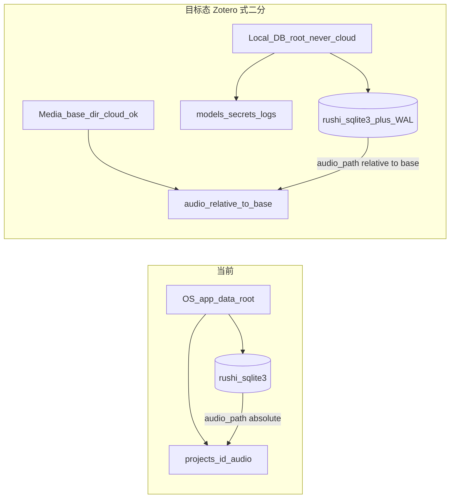

# 调研：用户库位置与跨设备同步 — 可迁移媒体 + 本地 DB 真源（Zotero 式二分）

> **状态**：已采纳（2026-07-17 用户签收）· 下一薄片写 intent/acceptance · 本轮不做业务编码
> **关联路线图**：[`rushi-execution-roadmap.md`](../plans/rushi-execution-roadmap.md)（新薄片，待编号）
> **关联 spec**：[`user-library-location-intent.md`](./user-library-location-intent.md) · [`user-library-location-acceptance.md`](./user-library-location-acceptance.md)
> **关联 ADR**：[`0001` 独立仓 + 默认 SQLite + Python ASR](../../adr/0001-independent-repo-default-sqlite-python-asr.md)、[`0002` 本地独立与联机协作双轨](../../adr/0002-local-collab-dual-source-review-mode.md)、[`0008` 原生音频播放](../../adr/0008-native-audio-playback-transport.md)
> **门禁**：未完成本文 **不得** 进入 Plan 定稿与业务编码（见 [`AGENTS.md`](../../../AGENTS.md) · [`.cursor/rules/feature-research-gate.mdc`](../../../.cursor/rules/feature-research-gate.mdc)）

---

## 0. 一句话结论

**媒体可上网盘（相对路径），数据库不行（本地真源 + 项目包 / 服务端换机）。**

采用 **Zotero 式二分**：`rushi.sqlite3`（+ WAL/SHM）及 models/secrets/logs 强制留本地、不受消费级同步管理；新增「媒体基准目录（Media base directory）」，`files.audio_path` 存**相对该基准**的路径，基准目录可放 OneDrive / iCloud / 坚果云等；换机时 DB 走项目包导入或未来服务端协作轨，媒体靠网盘同步 + 相对路径重定位。

---

## 1. 问题陈述

| 项 | 内容 |
|----|------|
| 用户场景 | 用户想自定义项目/文件落盘位置，并把内容放到网盘目录，以便在多台设备上使用同一批录音与转写。 |
| 本仓现状 | 真源固定在 Tauri `app_data_dir`（[`app_data_paths.rs`](../../../apps/desktop/src-tauri/src/project/app_data_paths.rs) `resolve_app_data_root`）：`rushi.sqlite3` + `projects/{id}/` + `models/` + `secrets/` + `logs/` 同处一根。导入音频 **copy** 进 `projects/{id}/`；[`files.audio_path`](../../../apps/desktop/src-tauri/src/db/schema.rs) 存**绝对 canonicalize 路径**；读路径必须经 [`resolve_audio_path_under_root`](../../../apps/desktop/src-tauri/src/project/utils.rs)（**拒 symlink、拒 app_data 根外路径**）。已有交换层：项目包 zip（[`project_bundle_cmd.rs`](../../../apps/desktop/src-tauri/src/project/project_bundle_cmd.rs)）。 |
| 成功标准（调研层） | (1) 路径可迁移：媒体换机后无需改绝对路径即可重定位；(2) DB 真源明确留本地、不进消费级同步盘；(3) 同步风险与手测边界写清；(4) 决策与 ADR-0001/0002 无冲突，并点名可复用模块。 |

---

## 2. 业内成熟路线（≥3）

| # | 路线 | 代表实现 / 产品 | 核心机制 | 链接或路径 |
|---|------|-----------------|----------|------------|
| A（**选定**） | DB 本地 + 媒体基准目录相对路径二分 | **Zotero** data directory + Linked Attachment Base Directory | data directory（含 `zotero.sqlite`+`storage/`）官方**绝不允许**放云同步盘；仅 **Linked Attachment Base Directory** 让链接附件用「基准目录 + 相对路径」跨机解析 | [Zotero data dir](https://www.zotero.org/support/zotero_data/)、[Advanced/Files & Folders](https://www.zotero.org/support/preferences/advanced) |
| B | 用户可选整库根（文件夹即库） | **Obsidian** Open folder as vault | 任意文件夹作 vault，可放网盘；但官方明确对 OneDrive/iCloud/Dropbox **谨慎/不推荐**（Files On-Demand offload、`workspace.json` 冲突副本），并建议改用 Obsidian Sync | [Obsidian Sync/switch](https://obsidian.md/help/sync/switch)、[Sync notes across devices](https://github.com/obsidianmd/obsidian-help/blob/5fb785ac/en/Getting%20started/Sync%20your%20notes%20across%20devices.md) |
| C | 便携项目包 / 归档交换 | 本仓 zip bundle；Resolve/FCP 类 project folder | 单项目迁移/换机强，非实时多写；本仓已实现 | [`project_bundle_cmd.rs`](../../../apps/desktop/src-tauri/src/project/project_bundle_cmd.rs) |
| D | 自建同步 / 服务端真源 | ADR-0002 + collab schema 草案；Obsidian Sync | 适合真·多设备协作，服务端 PG + 对象存储；复杂度高，非本轮 | [`collaboration-storage-schema.md`](../../architecture/collaboration-storage-schema.md) |

**反面证据（写入「不做」的依据）**：Zotero、RootsMagic、Tap Forms、SQLite 官方 [`useovernet.html`](https://www.sqlite.org/useovernet.html) 一致——消费级网盘/网络盘按**文件粒度乱序**同步 `.db` / `-wal` / `-shm`，叠加**冲突副本**（`xxx (1).db-wal`）会损坏数据库；**WAL 让情况更糟**，且**与单写/多写无关**（换机、下一早再打开即可损坏）。缓解如 Quilltap 将 journal mode 由 WAL 改 TRUNCATE 降低多文件风险，但仍标注「仅在**非同步**本地 SSD 才建议开 WAL」。→ 结论：**live DB 不上云**，本仓不做「整库（含 DB）放网盘」。

---

## 3. 可复用评估

| 路线 | 复用度 | 可直接用的部分 | 与 Rushi 约束冲突 | 进度 / 内存 / 运维 |
|------|--------|----------------|-------------------|---------------------|
| A Zotero 式二分 | **高** | `canonicalize` + `strip_prefix`、`DbState.root`、`resolve_app_data_root`、导入 copy 流程 | 需放宽 `resolve_audio_path_under_root`（app_data 根内 → 媒体基准内）；需处理网盘 symlink/占位文件；`audio_path` 由绝对改相对需一次性迁移 | 迁移一次性；媒体上云同步由第三方负责；无常驻内存新增 |
| B 整库放网盘 | **低** | 同上 pref 机制 | **与业内共识冲突**：live SQLite 上云损坏风险；models/secrets 不宜上云 | 冲突副本/损坏运维成本高 |
| C 项目包换机 | **高** | 现成 `project_bundle_cmd` 导出/导入 | 无（本就是交换层） | 手动/半自动；非实时 |
| D 服务端协作 | 中（远期） | collab schema/API 草案 | ADR-0002 已规划为独立轨 | 需服务器；非本轮 |

**本仓已有可复用模块**（先列再决定扩展）：

- [`resolve_app_data_root`](../../../apps/desktop/src-tauri/src/project/app_data_paths.rs) / `DbState { root, db_path, pool }`
- [`canonicalize_audio_storage_path`](../../../apps/desktop/src-tauri/src/project/utils.rs) + [`resolve_audio_path_under_root`](../../../apps/desktop/src-tauri/src/project/utils.rs)（`canonicalize` + `strip_prefix`）
- `project_storage` / `project_bundle_cmd`（copy/move/delete 媒体 + peaks；zip 导入导出）
- 密钥分层：[`postprocess_secret_store.rs`](../../../apps/desktop/src-tauri/src/postprocess_secret_store.rs) / [`stt_online_secret_store.rs`](../../../apps/desktop/src-tauri/src/stt_online_secret_store.rs)（secrets 留本地的既有纪律）
- ADR-0001（本地 SQLite 真源）、ADR-0002（禁止共享 SQLite/共享目录充当协作真源）、ADR-0008（禁任意路径播放，须 scoped resolve）

**冲突点清单**：绝对 `audio_path`；`resolve_audio_path_under_root` 硬编码「app_data 根内」；一律拒 symlink（与网盘占位/链接文件冲突）；models/secrets 与媒体同根；WAL 多文件不可上云。

---

## 4. 决策摘要

| 问题 | 结论 |
|------|------|
| 选定方案 | **A：Zotero 式二分**。DB + models/secrets/logs 强制本地；新增「媒体基准目录」，`audio_path` 存相对该基准路径，基准目录可上网盘。 |
| DB 位置 | `rushi.sqlite3`（+WAL/SHM）始终本地。默认 app_data；**即使**日后允许用户改「本地库根」，UI 也须**明确警告不要选网盘文件夹**。 |
| 媒体位置 | 用户可指定媒体基准目录（可为网盘已「始终保留在此设备」的文件夹）；运行时 join 基准目录 resolve 为绝对路径并继续 scoped 校验。 |
| scoped 校验 | 把 `resolve_audio_path_under_root` 的「必须在 app_data 根内」放宽为「在媒体基准目录内」；处理网盘占位（Files On-Demand）与 symlink 判定，不再一律拒 symlink（改为受控允许 + 回源）。 |
| 换机 DB | 项目包导出/导入（现有 `project_bundle_cmd`）或未来 ADR-0002 服务端协作轨；**不靠网盘同步 live DB**。 |
| 不做什么 | 见 §5。 |
| 与 ADR 关系 | 遵循 ADR-0001（本地 SQLite 真源不变）、ADR-0002（不以共享目录充当协作真源）、ADR-0008（仍走 scoped resolve）；本方案不修改这些 ADR，仅在媒体路径层做相对化 + 基准目录扩展。 |
| 风险与 spike 项 | (1) 网盘占位/离线文件（Files On-Demand）导致 `canonicalize`/`is_file` 失败 → 需 UX 提示「等待同步/始终保留本地」；(2) 相对路径一次性迁移的回滚与幂等；(3) peaks 缓存放本地 vs 随媒体（建议派生缓存留本地）；(4) Windows 盘符/UNC 与 macOS 卷路径差异下的相对化。 |

---

## 5. 明确不做什么

- **不**把含 `rushi.sqlite3` 的目录放网盘（与 A 决策核心冲突；业内共识 live DB 上云损坏）。
- **不**实现 Obsidian Sync 式自研同步 / P2P / live DB 云同步。
- **不**把 ASR 权重（models）与 API secrets 同步进网盘。
- **不**绕过 ADR-0002 用共享目录充当协作真源；**不**把 zip 项目包升格为实时协作协议。
- **不**引入第二套媒体/路径真源（仍以 SQLite `audio_path` + 媒体基准目录为唯一定位真源）。

---

## 6. 落位预告（非最终实现）

| 层 | 文件 / 模块 | 变更类型 |
|----|-------------|----------|
| Pref/DB | `media_base_dir` pref（默认 = app_data `projects/` 上级）；`files.audio_path` 改存相对媒体基准；一次性迁移脚本/迁移列 | 新增 + 迁移 |
| Rust | [`utils.rs`](../../../apps/desktop/src-tauri/src/project/utils.rs) `resolve_audio_path_under_root`（放宽到媒体基准 + 占位/symlink 处理）、`canonicalize_audio_storage_path`（相对化）；[`project_storage.rs`](../../../apps/desktop/src-tauri/src/project/project_storage.rs) 媒体落位改基准目录 | 修改 |
| Rust | 媒体基准目录选择/迁移向导命令（把现有 `projects/` 媒体搬入基准并回填相对路径，幂等 + 可回滚） | 新增 |
| UI | 设置页「内容库位置」区：媒体基准目录选择 + DB 本地位置说明 + **网盘警告**文案（能力—UI 对齐：媒体基准维度独立于 DB 位置维度） | 新增 |
| 文档 | ADR（若确定引入「媒体基准目录」为长期契约）；[`desktop-project-file-lifecycle.md`](../../architecture/desktop-project-file-lifecycle.md) 补媒体基准与相对路径 | 新增/更新 |
| 测试 | Rust 单元（相对化、放宽 scoped resolve、占位文件分支）；手测矩阵：改媒体基准、换机（项目包 + 网盘媒体已同步）打开、网盘占位文件回源、DB 仍本地不上云验证 | 新增 |

---

## 7. 签收

- [x] 调研 brief 完成
- [x] intent / acceptance 已链接本文（薄片 1）
- [x] 用户确认可进入 intent（2026-07-17；选定 A：Zotero 式二分）

**变更记录**

| 日期 | 说明 |
|------|------|
| 2026-07-17 | 初版；选定 A（Zotero 式二分），业内对照 + 反面证据 + 落位预告 |
| 2026-07-17 | 用户签收：可进入 intent/acceptance；编码仍须等三件套 |
